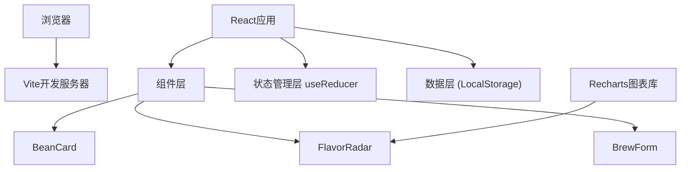

## 1. 架构设计
纯前端单页应用，使用React + TypeScript + Vite构建，数据本地存储，无需后端服务。



## 2. 技术描述
- **前端框架**：React@18 + TypeScript
- **构建工具**：Vite@5 + @vitejs/plugin-react
- **图表库**：Recharts（雷达图）
- **状态管理**：React useReducer（轻量级全局状态）
- **数据持久化**：LocalStorage
- **样式方案**：CSS Modules / 内联样式（按用户要求不使用Tailwind）
- **路由**：React Router（轻量级页面切换）

## 3. 目录结构
```
src/
├── main.tsx          # 应用入口
├── App.tsx           # 主组件，路由和状态管理
├── types.ts          # 类型定义和模拟数据
├── components/
│   ├── BeanCard.tsx      # 咖啡豆卡片
│   ├── FlavorRadar.tsx   # 风味雷达图
│   └── BrewForm.tsx      # 冲煮表单
└── pages/
    ├── BeanLibrary.tsx   # 豆库页
    ├── BrewRecords.tsx   # 记录页
    └── RadarChart.tsx    # 雷达图页
```

## 4. 类型定义
```typescript
// 处理法
type ProcessMethod = '日晒' | '水洗' | '蜜处理' | '厌氧';

// 烘焙度
type RoastLevel = '浅' | '中浅' | '中' | '中深' | '深';

// 注水方式
type PourMethod = '一刀流' | '三段式' | '搅拌法' | '冰冲';

// 咖啡豆
interface CoffeeBean {
  id: string;
  name: string;
  origin: string;
  processMethod: ProcessMethod;
  roastLevel: RoastLevel;
  createdAt: number;
}

// 风味评分
interface FlavorProfile {
  acidity: number;     // 酸度 1-10
  sweetness: number;   // 甜度 1-10
  bitterness: number;  // 苦味 1-10
  body: number;        // 醇厚度 1-10
  aftertaste: number;  // 回甘 1-10
  cleanliness: number; // 干净度 1-10
}

// 冲煮记录
interface BrewRecord {
  id: string;
  beanId: string;
  coffeeAmount: number;    // 粉量 15-30g
  waterTemp: number;       // 水温 85-96℃
  grindSize: number;       // 研磨度 1-10
  pourMethod: PourMethod;
  totalTime: number;       // 总时长 秒
  flavor: FlavorProfile;
  createdAt: number;
}

// 应用状态
interface AppState {
  beans: CoffeeBean[];
  records: BrewRecord[];
  currentPage: 'library' | 'records' | 'radar';
  selectedBeanId: string | null;
}
```

## 5. 路由定义
| 路由 | 页面 | 功能 |
|------|------|------|
| / | 豆库页 | 咖啡豆列表，添加/编辑咖啡豆 |
| /records | 记录页 | 冲煮记录列表，添加冲煮记录 |
| /radar | 雷达图页 | 风味分析，最佳方案推荐 |

## 6. 核心组件说明

### BeanCard 咖啡豆卡片
- **Props**：`bean: CoffeeBean`, `onClick: () => void`
- **功能**：根据烘焙度渲染渐变背景，悬停上浮动画，点击放大展开过渡
- **样式**：background: linear-gradient(135deg, 浅/中/深焙色), border-radius, box-shadow

### FlavorRadar 风味雷达图
- **Props**：`data: FlavorProfile`, `onDimensionClick: (dim: keyof FlavorProfile) => void`
- **功能**：使用Recharts RadarChart渲染六边形雷达图，六色半透明填充，点击顶点触发回调
- **性能**：使用React.memo优化，避免不必要重绘

### BrewForm 冲煮表单
- **Props**：`beanId: string`, `onSubmit: (record: BrewRecord) => void`
- **功能**：所有参数滑块和下拉选择，表单校验，滑块数值实时显示，轨道红到绿渐变

## 7. 性能优化策略
1. 使用React.memo包装展示组件
2. 滑块更新使用useCallback防抖
3. 雷达图数据使用useMemo缓存
4. 列表渲染使用唯一key
5. CSS动画使用transform和opacity避免重排
6. Vite构建启用代码分割和Tree Shaking

## 8. 模拟数据生成
在types.ts中提供generateMockData函数，生成3-5个咖啡豆和每个豆子2-3条冲煮记录，确保应用启动即可看到效果。
