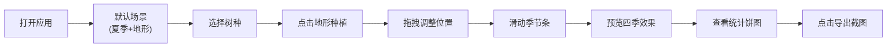

## 1. 产品概述

本产品是一款面向景观设计师的浏览器端3D景观四季预览应用，解决方案汇报时无法让客户直观感受四季更替对景观风貌影响的痛点。设计师可快速搭建地形、种植不同树种，并通过季节切换实时预览植被颜色变化、落叶效果和积雪覆盖，提升方案展示的沉浸感和说服力。

## 2. 核心功能

### 2.1 用户角色
| 角色 | 注册方式 | 核心权限 |
|------|----------|----------|
| 景观设计师 | 无需注册，直接使用 | 地形编辑、树种种植、季节切换、数据统计、场景导出 |

### 2.2 功能模块
1. **3D场景模块**：50x50单位缓坡地形生成、树木种植与拖拽、季节视觉效果
2. **季节控制模块**：四季节滑动条切换、树冠颜色平滑过渡、落叶粒子系统、积雪覆盖
3. **数据统计模块**：实时树冠颜色占比饼图、动画过渡效果
4. **导出模块**：场景截图导出、新标签页预览

### 2.3 页面详情
| 页面名称 | 模块名称 | 功能描述 |
|---------|----------|----------|
| 主场景页 | 3D地形渲染 | 生成带海拔0-8单位的缓坡地形，草地到裸土渐变着色 |
| 主场景页 | 树木种植系统 | 支持枫树、银杏、松树三种预设树种，点击种植，拖拽移动，选中高亮动画 |
| 主场景页 | 季节切换控制 | 顶部四季节滑动条，切换时2s颜色过渡，秋季落叶，冬季积雪 |
| 主场景页 | 粒子系统 | 秋季非松树产生落叶粒子，随机摇摆旋转，落地5s消失 |
| 主场景页 | 数据统计面板 | 左下角半圆饼图，实时统计红黄绿树冠占比，0.3s动画过渡 |
| 主场景页 | 导出功能 | 右下角圆形按钮，点击生成截图并在新标签页打开 |

## 3. 核心流程

用户打开应用 → 默认呈现夏季场景与地形 → 选择树种点击地形种植 → 拖拽调整树木位置 → 滑动季节条预览四季变化 → 查看饼图统计 → 点击导出按钮保存截图

## 4. 用户界面设计

### 4.1 设计风格
- **主色调**：暗色森林背景 #1B2A2A，营造沉浸式自然氛围
- **半透明面板**：rgba(0,0,0,0.4) 配合 backdrop-filter: blur(8px) 毛玻璃效果
- **树种颜色**：枫树#D32F2F、银杏#FDD835、松树#388E3C
- **季节颜色**：春季淡绿#A5D6A7、夏季深绿#2E7D32、秋季红/黄、冬季灰色
- **按钮样式**：圆形导出按钮 #546E7A，悬停变为 #78909C，0.2s过渡动画
- **字体**：使用现代无衬线字体，清晰易读
- **动效**：树冠颜色2s平滑过渡、饼图0.3s动画、选中树木0.5s脉动光晕

### 4.2 页面设计概述
| 页面名称 | 模块名称 | UI元素 |
|---------|----------|--------|
| 主场景页 | 3D场景 | 居中全屏Canvas，OrbitControls相机控制 |
| 主场景页 | 顶部操作栏 | 半透明毛玻璃背景，四季节滑动条（春/夏/秋/冬） |
| 主场景页 | 左侧树种选择 | 三种树木颜色按钮，点击选中后可种植 |
| 主场景页 | 左下角统计 | 透明半圆饼图，显示红、黄、绿占比百分比 |
| 主场景页 | 右下角导出 | 圆形按钮，悬停变色，点击导出截图 |

### 4.3 响应式
- 桌面端优先设计，全屏沉浸式体验
- 操作栏和统计面板固定定位，不随3D场景滚动
- 触控设备支持手势旋转场景

### 4.4 3D场景指引
- **环境**：暗色森林风格背景 #1B2A2A，柔和环境光+方向光模拟自然光照
- **光照**：AmbientLight + DirectionalLight，阴影开启提升真实感
- **相机**：PerspectiveCamera，初始位置俯视地形，可通过OrbitControls旋转缩放
- **地形**：50x50平面，顶点高度随机生成0-8单位缓坡，顶点颜色从绿到棕渐变
- **树木**：简化几何体（圆柱体树干+圆锥体树冠），不同树种不同比例
- **动效**：颜色过渡使用lerp插值，落叶粒子使用物理模拟，选中高亮使用emissive材质脉动
- **后处理**：保持简洁，不添加复杂后处理，确保FPS稳定30以上
- **性能**：树木使用instancedMesh优化，粒子系统对象池复用，避免频繁GC

## 5. 性能要求
- 场景渲染FPS稳定在30以上
- 支持至少50棵树木同时渲染
- 落叶粒子最多200个，超出自动回收
- 颜色过渡动画流畅无卡顿
