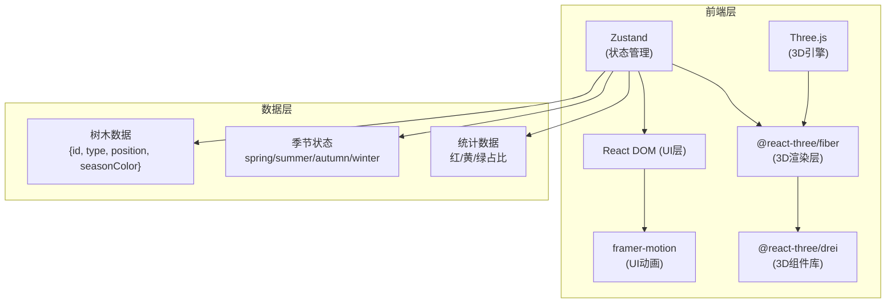

## 1. 架构设计



## 2. 技术描述

- **前端框架**：React 18 + TypeScript 5
- **构建工具**：Vite 5（Node.js 18+）
- **3D引擎**：Three.js 0.160 + @react-three/fiber 8 + @react-three/drei 9
- **状态管理**：Zustand 4
- **UI动画**：framer-motion 11
- **开发语言**：TypeScript（strict模式）

## 3. 目录结构

```
auto341/
├── package.json
├── vite.config.ts
├── tsconfig.json
├── index.html
├── src/
│   ├── main.tsx          # React入口，挂载Canvas和UI
│   ├── App.tsx           # 主场景组件，3D渲染逻辑
│   ├── UI.tsx            # UI组件（季节条、饼图、导出按钮）
│   └── store.ts          # Zustand状态管理
└── .trae/
    └── documents/
        ├── PRD.md
        └── 技术架构.md
```

## 4. 核心数据模型

### 4.1 树木数据结构
```typescript
type TreeType = 'maple' | 'ginkgo' | 'pine';

interface Tree {
  id: string;
  type: TreeType;
  position: [number, number, number];
  seasonColor: string;
}
```

### 4.2 季节类型
```typescript
type Season = 'spring' | 'summer' | 'autumn' | 'winter';
```

### 4.3 统计数据
```typescript
interface PieData {
  red: number;      // 枫树占比
  yellow: number;   // 银杏占比
  green: number;    // 松树占比
}
```

### 4.4 Store状态
```typescript
interface AppState {
  trees: Tree[];
  selectedTreeId: string | null;
  currentSeason: Season;
  pieData: PieData;
  
  addTree: (type: TreeType, position: [number, number, number]) => void;
  removeTree: (id: string) => void;
  updateTreePosition: (id: string, position: [number, number, number]) => void;
  selectTree: (id: string | null) => void;
  setSeason: (season: Season) => void;
  updatePieData: () => void;
}
```

## 5. 核心模块说明

### 5.1 App.tsx - 主场景组件
- **Canvas**：@react-three/fiber 渲染容器，设置相机和阴影
- **OrbitControls**：drei提供的相机控制，支持旋转缩放
- **Terrain**：自定义地形组件，50x50平面，顶点高度扰动，顶点颜色渐变
- **TreeGroup**：树木渲染组件，遍历store中的trees数组
- **Tree**：单棵树木组件，支持拖拽、选中高亮、颜色过渡
- **LeafParticles**：落叶粒子系统，秋季时非松树产生粒子
- **SnowCover**：积雪覆盖层，冬季显示半透明白色mesh

### 5.2 UI.tsx - UI层组件
- **SeasonSlider**：四季滑动条，拖拽切换季节，framer-motion动画
- **PieChart**：半圆饼图组件，SVG绘制，framer-motion过渡动画
- **ExportButton**：圆形导出按钮，hover效果，点击调用canvas toDataURL
- **TreeSelector**：树种选择按钮，点击切换当前种植的树种类型

### 5.3 store.ts - Zustand状态管理
- **trees**：树木列表数组
- **currentSeason**：当前季节状态
- **selectedTreeId**：当前选中的树木ID
- **pieData**：统计饼图数据
- **addTree**：添加树木动作，自动计算季节颜色
- **updateTreePosition**：更新树木位置
- **setSeason**：切换季节，更新所有树木颜色，触发pieData更新
- **updatePieData**：根据当前树木类型和季节重新计算占比

## 6. 关键技术实现

### 6.1 颜色平滑过渡
使用Three.js Color.lerp方法在2秒内从当前颜色插值到目标季节颜色，在useFrame中逐帧更新。

### 6.2 落叶粒子系统
- 秋季每帧从非松树树冠随机位置生成1-3个粒子
- 粒子使用对象池复用，避免频繁创建销毁
- 运动轨迹：y轴匀速下落，x/z轴正弦波动模拟摇摆，自身旋转
- 落地后5秒透明度渐变至0，然后回收到对象池

### 6.3 树木选中高亮
- 选中时材质emissive设为白色，强度在0.5秒内脉动变化
- 使用useFrame更新emissiveIntensity，Math.sin(time * 10) * 0.5 + 0.5

### 6.4 饼图动画过渡
使用framer-motion的AnimatePresence和motion.path，strokeDasharray动画实现0.3s平滑过渡。

### 6.5 截图导出
使用HTMLCanvasElement.toDataURL('image/png')获取canvas数据，window.open在新标签页打开。

## 7. 性能优化策略

1. **InstancedMesh**：同类型树木使用InstancedMesh批量渲染，减少draw call
2. **粒子对象池**：落叶粒子预分配200个，循环复用
3. **材质复用**：相同颜色的树木共享材质实例
4. **几何体复用**：树干和树冠几何体预创建，所有树木复用
5. **LOD**：远处树木简化为平面精灵（可选优化）
6. **节流更新**：饼图统计数据每200ms更新一次，避免频繁计算
