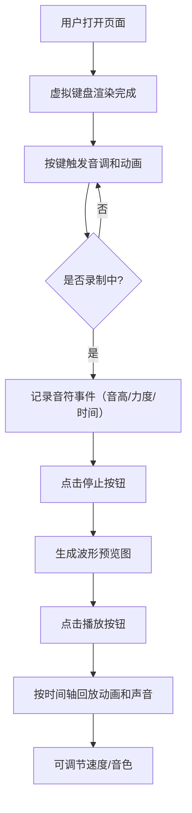

## 1. 产品概述

键盘音效与节奏生成器是一款面向音乐爱好者和程序员的浏览器互动应用，通过将键盘敲击转化为音乐音调，让日常打字变得更富有趣味和创造力。用户可以录制、回放并分享自己的节奏创作。

- **目标用户**：音乐爱好者、程序员、创意工作者
- **核心价值**：将枯燥的键盘输入转化为音乐创作体验，降低音乐创作门槛

## 2. 核心功能

### 2.1 功能模块

1. **虚拟键盘区**：QWERTY布局的仿机械键盘，按键动画与实时音效
2. **录制控制面板**：录制、停止、播放、速度调节、音色切换
3. **波形预览区**：可视化展示录制音符序列，支持悬停查看详情
4. **音符信息展示**：实时显示当前按下的音符名和频率

### 2.2 页面详情

| 页面名称 | 模块名称 | 功能描述 |
|-----------|-------------|---------------------|
| 主页面 | 虚拟键盘 | QWERTY布局，12个音高映射，按键下压动画，Web Audio实时发音 |
| 主页面 | 录制控制 | 录制开始/停止，播放/暂停，速度滑块（0.5x-2.0x），音色切换（钢琴/合成/木琴） |
| 主页面 | 波形预览 | 彩色垂直条显示音符（高度=力度，颜色=音高，宽度=时长），悬停显示详情，播放光标指示 |
| 主页面 | 音符信息 | 实时显示当前音符名（如C4）和频率值（如261.63Hz） |

## 3. 核心流程

用户打开页面 → 按下键盘按键触发音调和动画 → 点击录制按钮开始记录 → 继续按键产生音符序列 → 点击停止结束录制 → 波形区展示节奏序列 → 点击播放回放录制内容 → 可调节速度和音色重新体验 → （可选）导出MIDI

## 4. 用户界面设计

### 4.1 设计风格

- **主色调**：暗色背景 #1c1c1c，键盘底板 #2d2d2d，键帽 #3a3a3a
- **渐变色系**：低音 #64B5F6（蓝）→ 高音 #E57373（红）的12阶音高渐变
- **强调色**：录制按钮 #FF5722，播放按钮 #4CAF50，播放光标 #FF5722
- **按钮风格**：圆角2px，点击时0.15s缩放脉冲反馈
- **键帽样式**：2px圆角，按下时缩放至0.95并添加阴影，0.2s淡出恢复
- **字体**：等宽字体用于音符和频率显示，现代无衬线字体用于界面文本

### 4.2 页面设计概览

| 页面名称 | 模块名称 | UI要素 |
|-----------|-------------|-------------|
| 主页面 | 虚拟键盘 | 网格布局QWERTY排列，键帽音高渐变色，按下动画，阴影反馈 |
| 主页面 | 录制面板 | 垂直排列控制按钮，速度滑块横向布局，音色按钮组，状态指示 |
| 主页面 | 波形预览 | 横向时间轴，彩色垂直条，悬停tooltip，橙色播放光标线 |
| 主页面 | 音符信息 | 居中大字显示音符名，小字显示频率值，按下时高亮 |

### 4.3 响应式设计

- **1920x1080及以上**：完整尺寸展示，键盘100%大小
- **1366x768及以下**：键盘缩小至80%并居中，整体布局自适应
- **性能指标**：按键延迟 ≤30ms，回放时间精度误差 ≤10ms
