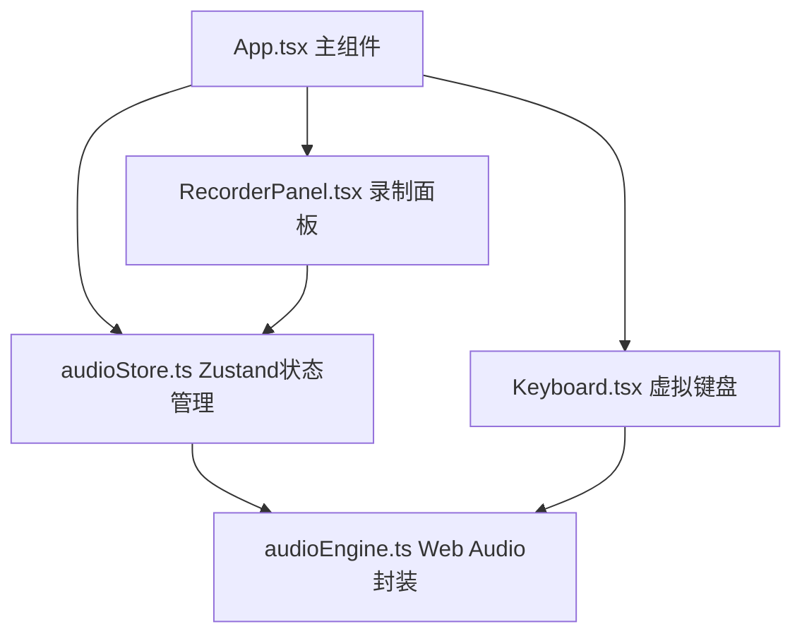

## 1. 架构设计



## 2. 技术描述

- **前端框架**：React 18 + TypeScript
- **构建工具**：Vite
- **状态管理**：Zustand
- **音频引擎**：Web Audio API（原生）
- **样式方案**：CSS Modules + 内联样式（动态颜色）
- **无后端、无数据库**：纯前端单页应用

## 3. 目录结构

```
src/
├── App.tsx                    # 主组件，布局和状态分发
├── stores/
│   └── audioStore.ts          # Zustand store：音阶、录制、播放状态
├── components/
│   ├── Keyboard.tsx           # 虚拟键盘渲染和按键事件
│   └── RecorderPanel.tsx      # 录制控制面板和波形预览
└── utils/
    └── audioEngine.ts         # Web Audio API封装
```

## 4. 核心数据模型

### 4.1 音符数据结构

```typescript
interface NoteEvent {
  note: string;           // 音符名，如 'C4'
  frequency: number;      // 频率 Hz
  keyCode: string;        // 键盘按键编码
  velocity: number;       // 力度 0-1
  startTime: number;      // 起始时间戳 (ms)
  duration: number;       // 持续时间 (ms)
}
```

### 4.2 Store状态

```typescript
interface AudioState {
  isRecording: boolean;
  isPlaying: boolean;
  playbackSpeed: number;      // 0.5 - 2.0
  currentTone: ToneType;      // 'piano' | 'synth' | 'xylophone'
  recordedNotes: NoteEvent[];
  currentNote: { note: string; frequency: number } | null;
  activeKeys: Set<string>;
  playbackPosition: number;   // 当前播放位置 ms
}
```

### 4.3 音高映射

12个半音从C4到B4映射到QWERTY主键区：
```
C4(261.63) -> 'A'
C#4(277.18) -> 'W'
D4(293.66) -> 'S'
D#4(311.13) -> 'E'
E4(329.63) -> 'D'
F4(349.23) -> 'F'
F#4(369.99) -> 'T'
G4(392.00) -> 'G'
G#4(415.30) -> 'Y'
A4(440.00) -> 'H'
A#4(466.16) -> 'U'
B4(493.88) -> 'J'
```

## 5. 音色参数

### 5.1 钢琴 (Piano)
- 波形：正弦波 + 轻微泛音
- 包络：Attack 5ms, Decay 200ms, Sustain 0.3, Release 300ms
- 低通滤波：截止频率 5000Hz

### 5.2 电子合成音 (Synth)
- 波形：锯齿波
- 包络：Attack 10ms, Decay 100ms, Sustain 0.5, Release 200ms
- 低通滤波：截止频率 3000Hz，带轻微共鸣

### 5.3 木琴 (Xylophone)
- 波形：三角波
- 包络：Attack 1ms, Decay 150ms, Sustain 0.1, Release 100ms
- 高通滤波：截止频率 1000Hz

## 6. 性能策略

- **音频延迟优化**：使用AudioContext.currentTime进行精确时间调度，避免setTimeout漂移
- **按键去抖**：keydown事件防止OS重复触发，使用Set跟踪已按下按键
- **动画优化**：CSS transform/opacity动画触发GPU加速，避免重排重绘
- **内存管理**：及时释放OscillatorNode和GainNode，录制序列设上限（如1000条）
