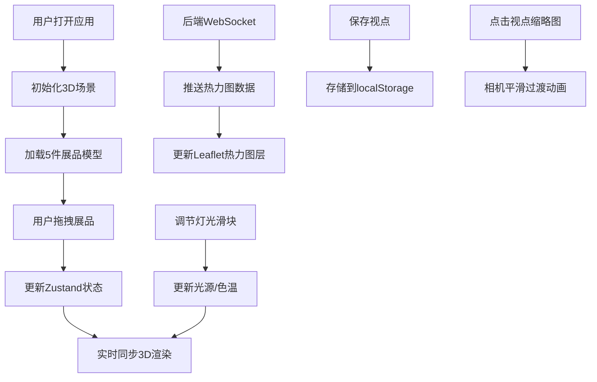
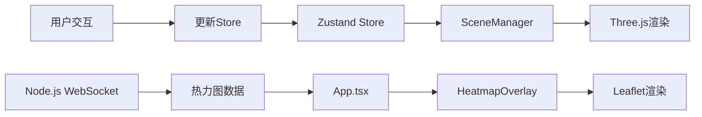

## 1. 产品概述

3D博物馆展品陈列预览与动线规划应用，为策展团队提供虚拟展厅预览工具，支持在线评估展台布局、照明效果和参观动线，避免实地搭建后发现视觉不协调问题。

- 核心目标：降低策展成本，提升陈列方案决策效率
- 目标用户：博物馆策展团队、展览设计师
- 产品价值：通过数字化预览减少实体搭建试错成本

## 2. 核心特性

### 2.1 功能模块

1. **3D展厅场景**：展品陈列预览、拖拽布局、实时渲染
2. **灯光控制面板**：光源角度调节、色温调节
3. **动线热力图**：Leaflet微型地图、实时人流热点展示
4. **视点管理**：保存相机视角、快速切换预览

### 2.2 页面详情

| 页面名称 | 模块名称 | 功能描述 |
|-----------|-------------|---------------------|
| 主应用页面 | 3D场景模块 | 渲染虚拟展厅，支持展品拖拽摆放，地板网格材质，展品带阴影提示 |
| 主应用页面 | 控制面板模块 | 右侧半透明面板，滑块调节光源旋转角度(0-360°)和色温(2700K-6500K) |
| 主应用页面 | 热力图模块 | 左下角200x200微型地图，实时展示参观人流聚集区域热力图 |
| 主应用页面 | 工具栏模块 | 顶部视点保存与切换，最多4个视点，带缩略图预览，1.5秒平滑动画过渡 |

## 3. 核心流程

用户打开应用 → 3D展厅自动渲染5件彩色展品 → 拖拽展品调整布局（位置实时同步）→ 通过右侧面板调节灯光效果 → 观察左下角热力图了解人流聚集区域 → 保存多个视点以便快速对比不同方案

## 4. 用户界面设计

### 4.1 设计风格

- **主题**：深色科技风，背景色#1a1a2e
- **主色调**：#4FC3F7（科技蓝）
- **配色方案**：
  - 展品1：#64B5F6（蓝）
  - 展品2：#E57373（红）
  - 展品3：#81C784（绿）
  - 展品4：#FFD54F（黄）
  - 展品5：#BA68C8（紫）
  - 热力渐变：#00BCD4 → #FF5722

- **按钮样式**：圆角6px，背景#333，悬停#555，0.2s过渡
- **滑块样式**：轨道高4px圆角，滑块直径16px带白色边框，激活轨道色#4FC3F7
- **字体**：选用现代感无衬线字体，层级清晰

### 4.2 页面设计

| 页面名称 | 模块名称 | UI元素 |
|-----------|-------------|-------------|
| 主应用 | 3D场景 | 半透明网格地板、彩色几何体展品、圆形阴影、点光源实时照明 |
| 主应用 | 右侧控制面板 | 毛玻璃背景(backdrop-filter:blur(6px))、圆角8px、rgba(255,255,255,0.12)、两个带标签滑块 |
| 主应用 | 左下角热力图 | 200x200像素、1px #444边框、动态热力点、不可拖动 |
| 主应用 | 顶部工具栏 | 保存视点按钮、最多4个视点缩略图按钮 |

### 4.3 响应式

- Desktop-first设计
- 屏幕宽度<768px时隐藏所有UI元素，仅保留3D场景全屏渲染

### 4.4 3D场景指导

- **环境**：深色背景#1a1a2e，营造沉浸式体验
- **灯光**：单一点光源，支持角度旋转和色温调节，产生真实高光阴影
- **相机**：OrbitControls环绕观察，支持保存position和target
- **交互**：展品拖拽（水平方向）、落点阴影提示、平滑动画
- **性能**：稳定30FPS+，拖拽无卡顿

## 5. 数据流向

