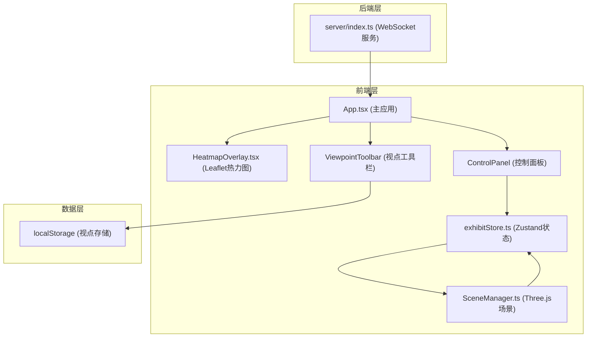
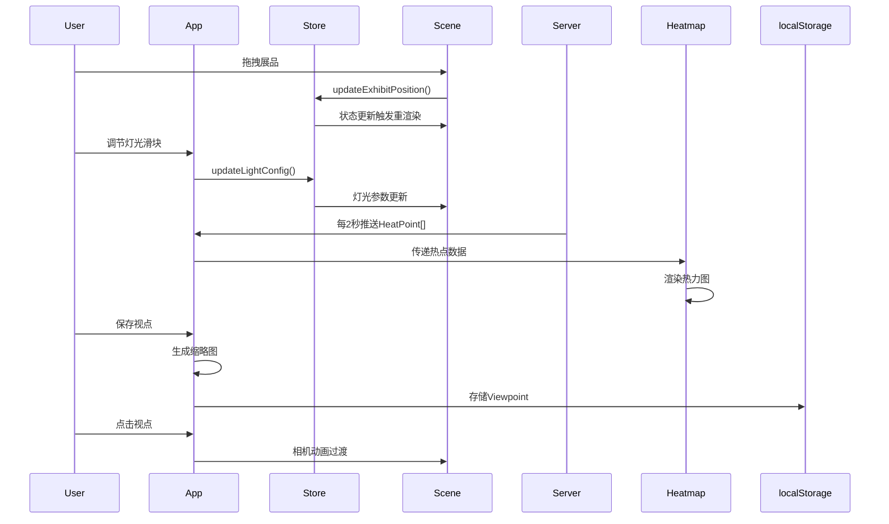

## 1. 架构设计



## 2. 技术描述

### 2.1 技术栈
- **前端**：React 18 + TypeScript + Vite
- **3D渲染**：Three.js + @react-three/fiber + @react-three/drei
- **状态管理**：Zustand
- **实时通信**：socket.io-client
- **地图组件**：Leaflet + react-leaflet
- **后端**：Node.js + Express + Socket.io

### 2.2 依赖清单
```json
{
  "react": "^18.2.0",
  "react-dom": "^18.2.0",
  "vite": "^5.0.0",
  "@vitejs/plugin-react": "^4.2.0",
  "typescript": "^5.3.0",
  "@types/react": "^18.2.0",
  "@types/react-dom": "^18.2.0",
  "zustand": "^4.4.0",
  "three": "^0.160.0",
  "@react-three/fiber": "^8.15.0",
  "@react-three/drei": "^9.92.0",
  "@types/three": "^0.160.0",
  "socket.io-client": "^4.6.0",
  "leaflet": "^1.9.0",
  "react-leaflet": "^4.2.0",
  "@types/leaflet": "^1.9.0",
  "express": "^4.18.0",
  "socket.io": "^4.6.0",
  "cors": "^2.8.5"
}
```

## 3. 目录结构

```
auto344/
├── package.json
├── vite.config.js
├── tsconfig.json
├── index.html
├── src/
│   ├── App.tsx                    # 主应用组件
│   ├── main.tsx                   # 入口文件
│   ├── index.css                  # 全局样式
│   ├── three/
│   │   └── SceneManager.ts        # Three.js场景管理器
│   ├── store/
│   │   └── exhibitStore.ts        # Zustand状态仓库
│   ├── heatmap/
│   │   └── HeatmapOverlay.tsx     # Leaflet热力图组件
│   └── components/
│       ├── ControlPanel.tsx       # 灯光控制面板
│       └── ViewpointToolbar.tsx   # 视点工具栏
└── server/
    ├── index.ts                   # Node.js WebSocket服务
    └── tsconfig.json              # 后端TypeScript配置
```

## 4. 数据模型

### 4.1 展品模型 (Exhibit)
```typescript
interface Exhibit {
  id: string;
  position: { x: number; y: number; z: number };
  rotation: { x: number; y: number; z: number };
  scale: { x: number; y: number; z: number };
  color: string;
  name: string;
}
```

### 4.2 灯光参数 (LightConfig)
```typescript
interface LightConfig {
  position: { x: number; y: number; z: number };
  angle: number;       // 水平旋转角度 0-360
  colorTemp: number;   // 色温 2700K-6500K
  intensity: number;   // 强度
  color: string;       // RGB颜色值
}
```

### 4.3 视点数据 (Viewpoint)
```typescript
interface Viewpoint {
  id: string;
  name: string;
  position: { x: number; y: number; z: number };
  target: { x: number; y: number; z: number };
  thumbnail?: string;  // base64缩略图
  createdAt: number;
}
```

### 4.4 热力图数据 (HeatPoint)
```typescript
interface HeatPoint {
  x: number;  // 0-50 展厅X坐标
  z: number;  // 0-50 展厅Z坐标
  intensity: number;  // 热度 0-1
}
```

## 5. API 定义

### 5.1 WebSocket 事件
```typescript
// 服务端 -> 客户端
interface ServerToClientEvents {
  'heatmap:update': (points: HeatPoint[]) => void;
}

// 客户端 -> 服务端
interface ClientToServerEvents {
  'client:connect': () => void;
}
```

## 6. 核心模块说明

### 6.1 SceneManager.ts
- **职责**：初始化Three.js场景、相机、渲染器、OrbitControls
- **功能**：加载展品模型、管理点光源、处理拖拽交互
- **数据流**：订阅exhibitStore变化 → 更新场景中展品position和rotation → 更新灯光参数

### 6.2 exhibitStore.ts
- **职责**：集中管理展品列表、灯光配置
- **方法**：updateExhibitPosition()、updateLightConfig()、getExhibits()、getLightConfig()
- **订阅**：SceneManager订阅store变化进行实时渲染

### 6.3 HeatmapOverlay.tsx
- **职责**：在Leaflet地图上渲染动态热力图
- **功能**：接收HeatPoint数组，使用canvas绘制渐变色热力点
- **性能**：每批新点渲染延迟<100ms

### 6.4 server/index.ts
- **职责**：启动Express服务 + WebSocket服务
- **功能**：每2秒随机生成5-10个HeatPoint，通过socket.io广播给所有客户端
- **模拟**：模拟传感器数据，生成参观者聚集区域热点

## 7. 调用关系图



## 8. 性能约束

- Three.js渲染帧率 ≥ 30FPS
- 展品拖拽响应延迟 < 16ms
- 热力图渲染延迟 < 100ms
- 相机过渡动画帧率 ≥ 60FPS
