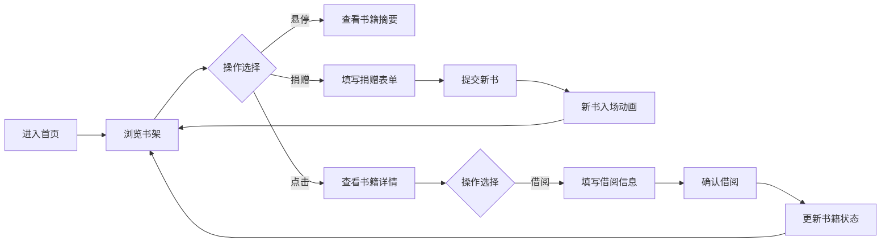

## 1. 产品概述

漂流书架是一个线上模拟二手书漂流体验的Web应用，让用户在虚拟环境中体验现实中咖啡厅角落书架的随意取阅和捐赠图书的乐趣。

- **核心价值**：将线下图书漂流的温暖体验搬到线上，营造社区共享阅读的氛围
- **目标用户**：热爱阅读、喜欢分享书籍的用户群体
- **解决问题**：打破地域限制，让更多人体验图书漂流的乐趣

## 2. 核心功能

### 2.1 用户角色
| 角色 | 注册方式 | 核心权限 |
|------|----------|----------|
| 普通用户 | 无需注册，借阅时填写信息 | 浏览书架、查看书籍详情、借阅书籍、捐赠书籍 |

### 2.2 功能模块
1. **首页书架**：三层虚拟书架展示、书籍悬停动画、书籍详情弹层
2. **捐赠功能**：捐赠按钮、书籍信息表单、新书记入场动画
3. **借阅功能**：借阅确认窗口、借阅者信息表单、借阅状态更新

### 2.3 页面详情
| 页面名称 | 模块名称 | 功能描述 |
|---------|---------|---------|
| 首页 | 虚拟书架 | 三层书架展示，每层5本书，书脊朝外，暖色调随机 |
| 首页 | 悬停交互 | 鼠标悬停书本滑出并旋转，显示书名、捐赠者、状态 |
| 首页 | 详情弹层 | 点击书本弹出毛玻璃效果浮层，展示封面、简介、借阅历史 |
| 首页 | 捐赠按钮 | 书架上方绿色+按钮，点击展开捐赠表单 |
| 首页 | 借阅功能 | 借阅确认窗口，输入姓名邮箱后完成借阅 |

## 3. 核心流程

### 3.1 浏览书籍流程
用户进入首页 → 看到三层虚拟书架 → 鼠标悬停查看书籍信息 → 点击查看详情

### 3.2 捐赠书籍流程
点击捐赠按钮 → 填写书籍信息表单 → 提交 → 新书从右侧飞入书架最右侧

### 3.3 借阅书籍流程
选择书籍 → 点击借阅按钮 → 填写姓名和邮箱 → 确认借阅 → 书籍状态变为借出中

## 4. 用户界面设计

### 4.1 设计风格
- **主色调**：木质暖色调，深棕色书架（#5D4037 到 #795548 渐变）
- **背景色**：浅米色 #F5F0E6
- **书脊配色**：暖色调组 #B71C1C, #E65100, #F9A825, #2E7D32, #1565C0
- **强调色**：绿色 #4CAF50（捐赠按钮）
- **按钮风格**：圆角设计，捐赠按钮圆角24px
- **卡片风格**：圆角8px，淡淡阴影 box-shadow: 0 2px 8px rgba(0,0,0,0.1)
- **特殊效果**：毛玻璃效果 backdrop-filter: blur(10px)
- **字体**：优雅的中文衬线字体配合无衬线字体，营造书香氛围

### 4.2 页面设计概览
| 页面名称 | 模块名称 | UI元素 |
|---------|---------|-------|
| 首页 | 虚拟书架 | 三层木质书架、书脊彩色书籍、悬停滑出动画、旋转效果 |
| 首页 | 详情弹层 | 毛玻璃背景、封面大图、书籍简介、借阅按钮、借阅历史头像列表 |
| 首页 | 捐赠表单 | 绿色圆角按钮、表单输入框、提交按钮、入场动画 |
| 首页 | 借阅弹窗 | 姓名输入、邮箱输入、确认按钮、取消按钮 |

### 4.3 响应式设计
- **设计原则**：桌面优先，移动端自适应
- **宽屏（1920px）**：每层5本书，三行排列
- **窄屏（768px）**：每层2本书，垂直排列
- **触摸优化**：移动端点击触发详情，增加点击区域

### 4.4 动效设计
- **悬停动画**：书本向前滑出0.5s + 旋转10度
- **入场动画**：新书从右侧飞入 translateX(100%) → 0，时长0.3s，ease-out
- **状态变化**：借出中书籍半透明 opacity: 0.6
- **过渡效果**：所有交互均有平滑过渡

## 5. 性能要求
- 书架滚动和动画帧率稳定在50fps以上
- 加载100本书时首屏渲染不超过1秒
- 动画使用硬件加速属性（transform, opacity）
