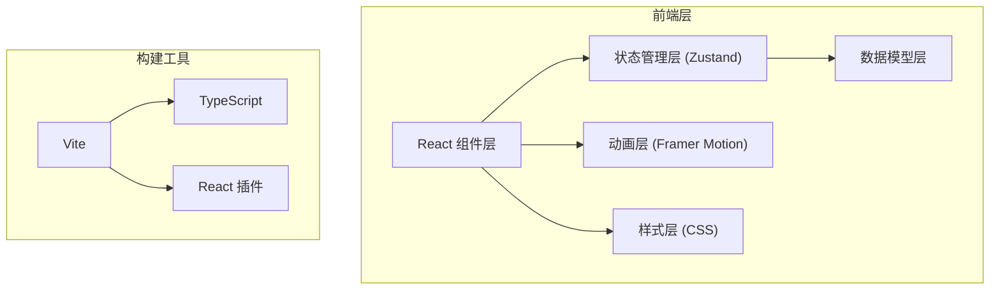

## 1. 架构设计



## 2. 技术描述

- **前端框架**：React 18 + TypeScript
- **构建工具**：Vite 5 + @vitejs/plugin-react
- **状态管理**：Zustand 4
- **动画库**：Framer Motion 11
- **工具库**：uuid（生成唯一ID）
- **开发模式**：纯前端，数据存储在内存中（Zustand store）

## 3. 目录结构

```
src/
├── main.tsx          # React 入口文件
├── App.tsx           # 主页面组件
├── store.ts          # Zustand 全局状态管理
├── BookShelf.tsx     # 虚拟书架组件
├── BookDetail.tsx    # 书籍详情弹层组件
├── DonateForm.tsx    # 捐赠表单组件
└── styles.css        # 全局样式
```

## 4. 数据模型

### 4.1 Book 接口定义

```typescript
interface Book {
  id: string;
  title: string;
  author: string;
  coverUrl: string;
  description: string;
  color: string;
  status: 'available' | 'borrowed';
  donor: string;
  borrowHistory: BorrowRecord[];
  dueDate?: string;
}

interface BorrowRecord {
  id: string;
  borrowerName: string;
  borrowerEmail: string;
  borrowDate: string;
  avatar?: string;
}
```

### 4.2 Store 状态定义

```typescript
interface BookStore {
  books: Book[];
  hoveredBookId: string | null;
  selectedBookId: string | null;
  showDonateForm: boolean;
  addBook: (book: Omit<Book, 'id' | 'status' | 'borrowHistory' | 'color'> & { color?: string }) => void;
  borrowBook: (bookId: string, borrowerName: string, borrowerEmail: string) => void;
  setHoveredBook: (bookId: string | null) => void;
  setSelectedBook: (bookId: string | null) => void;
  toggleDonateForm: () => void;
}
```

## 5. 核心组件说明

### 5.1 BookShelf 组件
- 职责：渲染三层书架，每层5本书
- 依赖：Zustand store、framer-motion
- 功能：书籍悬停动画、点击选中、响应式布局

### 5.2 BookDetail 组件
- 职责：展示书籍详情浮层
- 依赖：Zustand store、framer-motion
- 功能：封面展示、简介、借阅按钮、借阅历史、借阅表单

### 5.3 DonateForm 组件
- 职责：捐赠书籍表单
- 依赖：Zustand store
- 功能：书名、作者、封面URL、简介输入，提交后添加新书

### 5.4 App 组件
- 职责：整体布局、捐赠按钮、组件组合
- 功能：页面框架、书架布局、模态框管理

## 6. 动画实现方案

### 6.1 悬停动画
- 使用 framer-motion 的 whileHover
- 动画属性：translateY(-10px)、rotateZ(-10deg)
- 时长：0.5s，ease-out

### 6.2 入场动画
- 使用 framer-motion 的 AnimatePresence
- 初始状态：translateX(100%)，opacity: 0
- 结束状态：translateX(0)，opacity: 1
- 时长：0.3s，ease-out

### 6.3 弹层动画
- 使用 framer-motion 的 modal 动画
- 背景淡入：opacity 0 → 1
- 内容缩放：scale(0.9) → scale(1)

## 7. 响应式设计方案

- 使用 CSS flex-wrap 实现书架响应式
- 媒体查询断点：768px
- 桌面端：每层5本书，使用 justify-content: space-around
- 移动端：每层2本书，使用 justify-content: center

## 8. 性能优化策略

- 使用 CSS transform 和 opacity 动画（硬件加速）
- 书籍列表使用 React.memo 优化重渲染
- Zustand 选择器优化订阅范围
- 初始数据预置8本模拟图书
- 首屏渲染控制在1秒内
