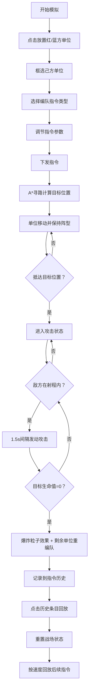

## 1. 产品概述
银河帝国舰队战术模拟器是一款即时战略（RTS）战术测试工具，面向游戏策划与AI开发者，用于可视化测试编队指令（包围、分散、列阵）对AI单位寻路路径与阵型保持效果的影响，降低正式上线后发现寻路与协同逻辑Bug的风险。

- 核心目标：提供直观的实时战场模拟，支持手动放置单位、下发编队指令、观察A*寻路与阵型保持逻辑，并支持历史回放。
- 目标用户：游戏策划、AI工程师、战术设计师。

## 2. 核心功能

### 2.1 功能模块
1. **战场画布模块**：深空背景800x600平面战场，Canvas绘制，半透明网格分区，支持点击放置红/蓝方单位。
2. **单位系统**：独立ID、生命值、移动速度、攻击力，选中脉动高亮，悬停显示属性tooltip，生命值渐变色条。
3. **编队指令系统**：框选己方单位后下发包围/分散/列阵指令，参数调节（阵型宽度等），A*寻路避障，实时路径绘制。
4. **实时战斗模拟**：射程内自动攻击（1.5s间隔），攻击闪现白线，伤害数字飘落，单位爆炸粒子效果。
5. **阵型保持与动态修正**：移动中保持相对位置（容差10px），偏移自动修正，单位被击毁后剩余单位重新编队。
6. **指令历史与回放**：左侧可滚动历史列表，点击重置战场并按可调速度（0.5x/1x/2x）回放后续指令。
7. **AI对手策略**：后端每15s自动生成敌方指令，模拟对手行为。

### 2.2 页面详情
| 页面名称 | 模块名称 | 功能描述 |
|---------|---------|---------|
| 主界面 | 战场画布 | 800x600 Canvas，深空背景，网格线，单位绘制与交互 |
| 主界面 | 右侧指令面板 | 指令类型选择（包围/分散/列阵），参数滑块，选中单位属性展示 |
| 主界面 | 左侧历史面板 | 指令时间戳、类型、单位数量列表，点击回放，速度调节 |
| 主界面 | 顶栏信息 | 当前战场状态、单位统计、回放控制 |

## 3. 核心流程
用户在战场上点击放置红蓝双方单位 → 框选己方单位 → 在右侧面板选择编队指令类型并调节参数 → 点击下发指令 → 单位通过A*寻路移动，实时显示路径 → 抵达后自动进入攻击状态，战斗循环 → 所有操作记录到左侧历史面板 → 点击任意历史条目可重置战场并回放后续指令。

## 4. 用户界面设计

### 4.1 设计风格
- **主题**：科幻暗色主题（深空风格）
- **背景色**：#0b0c10
- **主文字色**：#c5c7c7
- **强调色**：#45a29e
- **红方单位色**：#ff4444（三角形）
- **蓝方单位色**：#4488ff（圆形）
- **生命值色阶**：>75% #4caf50（绿），25%-75% #ffeb3b（黄），<25% #f44336（红）
- **面板效果**：半透明磨砂玻璃（backdrop-filter: blur(8px)）
- **按钮反馈**：按下0.2s缩放动画（1→0.95）
- **面板切换**：0.3s水平滑动动画

### 4.2 排版与布局
- **字体**：使用 Orbitron（科幻标题）+ JetBrains Mono（数据展示）搭配
- **布局**：三栏布局，左侧历史面板200px，中间战场画布800x600，右侧指令面板240px
- **面板分隔**：1px实线 #45a29e 透明度0.3
- **响应式**：viewport < 900px 时切换为上下布局，指令面板折叠为汉堡图标

### 4.3 响应式设计
- 桌面端（≥900px）：三栏水平布局，历史-战场-指令
- 移动端（<900px）：垂直堆叠布局，战场居上，指令面板折叠为汉堡按钮浮层展开

## 5. 性能指标
- 指令下发到单位开始移动响应时间 ≤ 500ms
- 单位总数 ≤ 60 时，战场帧率 ≥ 50fps
