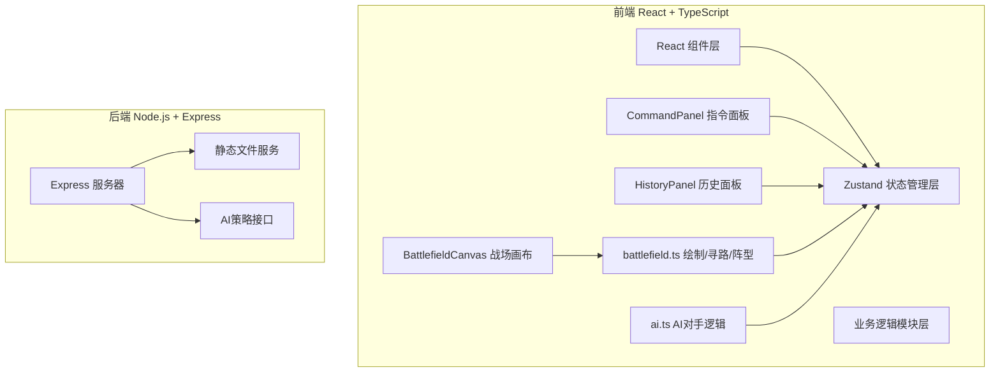

## 1. 架构设计



## 2. 技术描述
- **前端**：React 18 + TypeScript + Vite 5
- **状态管理**：Zustand 4（统一管理战场状态、单位属性、指令历史）
- **渲染层**：HTML5 Canvas 2D（战场绘制、路径、粒子效果）
- **寻路算法**：A*（网格空间寻路，避障与边界检测）
- **后端**：Express 4 + TypeScript（静态服务 + AI策略模拟）
- **样式**：原生CSS + CSS变量（科幻暗色主题，磨砂玻璃效果）

## 3. 项目文件结构

| 文件路径 | 作用 |
|---------|-----|
| `package.json` | 项目依赖与脚本（react, react-dom, vite, zustand, express, cors等） |
| `vite.config.ts` | Vite构建配置（端口3000，React插件） |
| `tsconfig.json` | TypeScript配置（严格模式，target ES2020） |
| `index.html` | HTML入口文件 |
| `src/main.tsx` | React应用入口渲染 |
| `src/store/index.ts` | Zustand全局状态Store |
| `src/modules/battlefield.ts` | 战场绘制引擎、A*寻路、阵型计算 |
| `src/modules/ai.ts` | AI对手策略逻辑 |
| `src/components/CommandPanel.tsx` | 右侧指令与单位属性面板 |
| `src/components/HistoryPanel.tsx` | 左侧指令历史与回放面板 |
| `src/server/index.ts` | Express后端服务 |

## 4. API 定义

### 4.1 AI策略接口
```typescript
// GET /api/ai/command
// 请求参数：
interface AICommandRequest {
  enemyUnits: Unit[];      // 敌方单位状态
  allyUnits: Unit[];       // 己方单位状态
  battlefieldSize: { width: number; height: number };
}

// 响应：
interface AICommandResponse {
  type: 'surround' | 'disperse' | 'formation';
  unitIds: string[];
  target: { x: number; y: number };
  params: {
    radius?: number;
    width?: number;
    arc?: boolean;
  };
  timestamp: number;
}
```

## 5. 数据模型

### 5.1 核心类型定义
```typescript
type Team = 'red' | 'blue';
type CommandType = 'surround' | 'disperse' | 'formation';
type UnitState = 'idle' | 'moving' | 'attacking' | 'dead';

interface Unit {
  id: string;
  team: Team;
  x: number;
  y: number;
  targetX: number;
  targetY: number;
  path: { x: number; y: number }[];
  maxHp: number;
  hp: number;
  speed: number;           // 1-3 像素/帧
  attack: number;          // 5-15
  attackRange: number;     // 默认150
  lastAttackTime: number;
  state: UnitState;
  groupId?: string;        // 所属编队组
  formationOffset?: { x: number; y: number }; // 阵型相对偏移
}

interface Command {
  id: string;
  timestamp: number;
  type: CommandType;
  team: Team;
  unitIds: string[];
  target: { x: number; y: number };
  params: {
    radius?: number;       // 分散/包围半径
    width?: number;        // 列阵宽度
    arc?: boolean;         // 列阵是否弧形
  };
  snapshot?: Unit[];       // 指令下发前的战场快照（用于回放）
}

interface FloatingText {
  id: string;
  x: number;
  y: number;
  text: string;
  color: string;
  startTime: number;
  duration: number;
}

interface Particle {
  id: string;
  x: number;
  y: number;
  vx: number;
  vy: number;
  color: string;
  startTime: number;
  duration: number;
}

interface AttackFlash {
  id: string;
  fromX: number;
  fromY: number;
  toX: number;
  toY: number;
  startTime: number;
  duration: number;
}

interface BattlefieldState {
  units: Unit[];
  commands: Command[];
  selectedUnitIds: string[];
  hoveredUnitId: string | null;
  floatingTexts: FloatingText[];
  particles: Particle[];
  attackFlashes: AttackFlash[];
  isPlaying: boolean;
  isReplaying: boolean;
  replaySpeed: number;     // 0.5 / 1 / 2
  replayFromIndex: number;
  placingTeam: Team | null; // 当前点击放置的阵营
}
```

### 5.2 Zustand Store Actions
```typescript
interface BattlefieldActions {
  placeUnit: (team: Team, x: number, y: number) => void;
  selectUnit: (id: string, additive?: boolean) => void;
  selectUnitsInRect: (x1: number, y1: number, x2: number, y2: number, team: Team) => void;
  clearSelection: () => void;
  setHoveredUnit: (id: string | null) => void;
  issueCommand: (type: CommandType, unitIds: string[], target: {x:number;y:number}, params: any) => void;
  updateUnits: (deltaTime: number) => void;
  startReplay: (commandIndex: number) => void;
  setReplaySpeed: (speed: number) => void;
  stopReplay: () => void;
  resetBattlefield: () => void;
  addFloatingText: (text: FloatingText) => void;
  addParticle: (particle: Particle) => void;
  addAttackFlash: (flash: AttackFlash) => void;
}
```

## 6. 关键算法说明

### 6.1 A* 寻路算法
- 战场划分为 20x15 的网格（每格40x40像素）
- 障碍物：敌方单位所在格子 + 边界缓冲5px
-启发函数：曼哈顿距离
- 每帧最多推进3个节点，分摊计算量保证帧率

### 6.2 阵型计算
- **包围（surround）**：以目标点为圆心，按单位数量均分角度，计算圆周上均匀分布点
- **分散（disperse）**：以目标点为中心，每个单位在指定半径内随机取点，避免重叠
- **列阵（formation）**：沿目标方向直线/弧形排列，宽度参数控制总跨度

### 6.3 阵型保持逻辑
- 每个单位记录相对于组中心的 formationOffset
- 每帧计算当前相对偏移与目标偏移的差
- 差值 > 10px 时，在移动方向上叠加修正向量
- 单位被击毁时，重新计算剩余单位的 formationOffset
