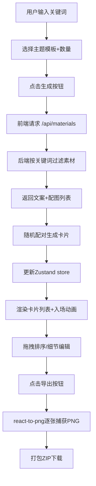

## 1. 产品概述

面向在线教育平台讲师的知识卡片批量生成与编辑排版工具，通过输入主题关键词自动检索素材库，一键生成多张风格统一的图文卡片，支持局部编辑调整与PNG批量导出，用于社交媒体推广和课程海报制作。

- 核心用户：在线教育平台讲师、内容创作者
- 核心价值：降低知识卡片制作门槛，提升内容生产效率与视觉一致性

## 2. 核心功能

### 2.1 用户角色

| 角色 | 注册方式 | 核心权限 |
|------|---------|----------|
| 讲师/创作者 | 无需注册（本地工具） | 输入关键词、生成卡片、编辑卡片、导出PNG |

### 2.2 功能模块

1. **生成控制面板**：关键词输入、主题模板多选、卡片数量选择器、生成按钮
2. **卡片预览区域**：横向滚动瀑布流、卡片拖拽排序、卡片悬停动画
3. **细节编辑面板**：右侧滑入覆盖层、文案编辑、图片替换抽屉、保存/关闭
4. **导出操作栏**：卡片计数显示、批量导出按钮、加载提示、ZIP下载

### 2.3 页面细节

| 页面名称 | 模块名称 | 功能描述 |
|---------|---------|----------|
| 主页面 | 生成控制面板 | 输入关键词（占位符：输入关键词）、主题模板多选下拉（3套可选）、卡片数量滑动条（4-12张）、生成按钮 |
| 主页面 | 卡片预览区域 | 240x320px卡片、12px间距、横向滚动瀑布流、拖拽排序、进入/悬停动画 |
| 主页面 | 细节编辑面板 | 右侧滑入占40%、卡片预览、文案编辑区、图片替换区、关闭/保存按钮 |
| 主页面 | 导出操作栏 | 底部固定栏、卡片总数、导出按钮、逐张导出加载提示 |

## 3. 核心流程

用户在右侧输入关键词并选择主题模板与卡片数量 → 点击生成按钮 → 前端调用后端/素材API按关键词过滤素材 → 随机抽取文案与图片配对生成卡片对象 → Zustand store更新卡片数组 → 左侧卡片列表渲染并执行入场动画 → 用户拖拽调整顺序/点击编辑文案与图片 → 点击底部导出按钮 → react-to-png逐张捕获为1280x720 PNG → 打包为ZIP下载到本地。

## 4. 用户界面设计

### 4.1 设计风格

- **主色调**：#6c63ff（主按钮）、#5a52d5（悬停）、#f5f5f5（左侧背景）、#ffffff（右侧背景）
- **三套卡片主题**：
  - 简约白底：#ffffff 背景 + #333333 文案
  - 深色商务：#1a1a2e 背景 + #eaeaea 文案 + #d4af37 金色点缀
  - 手绘卡通：#fff8e1 背景 + #5d4037 文案 + 手写风格字体
- **按钮样式**：圆角8px、主色填充、悬停变深、点击缩放0.95 + 0.1s ease-out 过渡
- **字体搭配**：标题使用优雅衬线/手写字体，正文使用清晰易读无衬线字体
- **布局结构**：左右两栏（左60%/右40%）、底部固定导出栏
- **图标风格**：Lucide 线性图标，保持简洁统一

### 4.2 页面设计总览

| 页面名称 | 模块名称 | UI 元素与动效 |
|---------|---------|--------------|
| 主页面 | 生成控制面板 | 关键词输入框（聚焦高亮）、多选下拉（选中标签）、滑动条（渐变轨道）、生成按钮（脉冲提示） |
| 主页面 | 卡片预览区域 | 瀑布流横向滚动、卡片入场（从下滑入+淡入0.3s）、悬停（上浮2px+4px阴影）、拖拽（跟随鼠标+归位动画） |
| 主页面 | 细节编辑面板 | 右侧滑入过渡（0.25s ease）、半透明遮罩、卡片预览、文案多行输入框、图片缩略图网格、保存按钮 |
| 主页面 | 导出操作栏 | 固定底部、卡片计数徽章、导出主按钮、导出进度条提示 |

### 4.3 响应式设计

- 桌面端（≥900px）：左右两栏布局，左60%右40%
- 移动端/窄屏（<900px）：右侧面板折叠为底部横条，点击展开按钮从底部滑出，卡片列表自适应单列滚动
- 触控优化：拖拽区域加大触摸反馈，关键按钮最小高度44px

### 4.4 视觉细节

- 卡片左下角主题徽章：圆角小标签，显示"简约"/"商务"/"卡通"
- 加载状态：生成时显示骨架占位，导出时逐张显示"正在导出第x张"
- 过渡曲线：统一使用 ease-out 曲线，时长0.1-0.3s
- 装饰元素：细微噪点纹理叠加、柔和阴影层次、精致间距节奏
