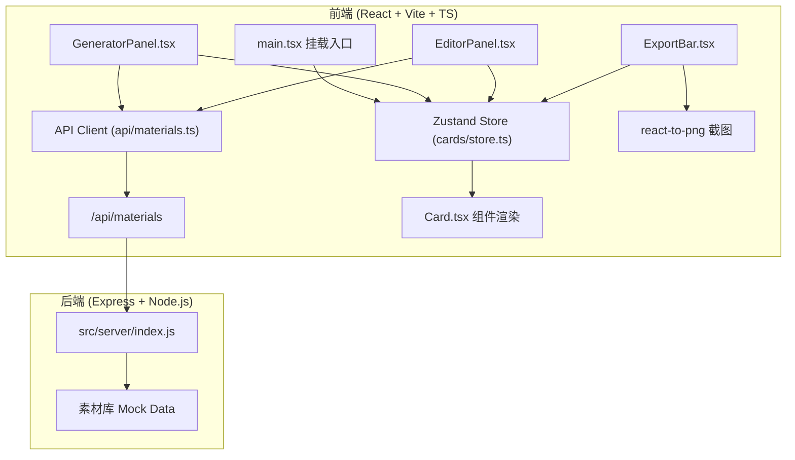
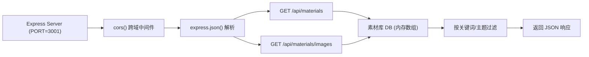
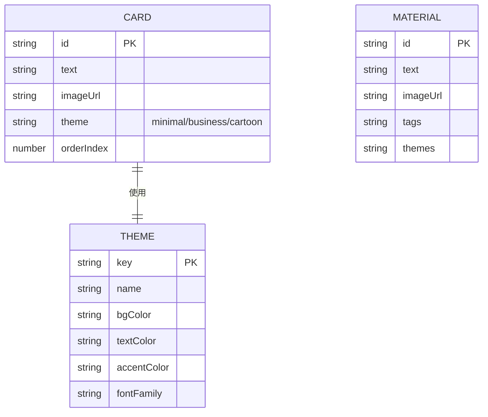

## 1. 架构设计



## 2. 技术选型说明

- **前端框架**：React 18 + TypeScript 5（strict 模式）
- **构建工具**：Vite 5 + @vitejs/plugin-react，构建输出 `dist/`
- **状态管理**：Zustand 4（卡片数组、选中集合、编辑状态）
- **HTTP 客户端**：Axios（调用后端素材检索 API）
- **截图导出**：react-to-png（1280x720 PNG 捕获）
- **打包下载**：JSZip（浏览器端将多张 PNG 打包为 ZIP）
- **文件保存**：file-saver（触发浏览器下载 ZIP）
- **UI 组件**：自定义组件 + lucide-react 图标 + react-colorful（如需颜色微调）
- **后端框架**：Express 4 + CORS 中间件
- **唯一 ID**：uuid（生成卡片唯一标识）

## 3. 前端路由与页面结构

本应用为单页应用（SPA），无路由切换，所有模块在同一页面内协同：

| 区域 | 组件 | 职责 |
|------|------|------|
| 左侧 60% | EditorPanel.tsx | 卡片预览、拖拽排序、点击触发编辑覆盖层 |
| 右侧 40% | GeneratorPanel.tsx | 关键词输入、主题多选、数量滑动、生成按钮 |
| 底部固定 | ExportBar.tsx | 卡片计数、导出按钮、导出进度提示 |
| 覆盖层（右滑入 40%） | CardEditorOverlay.tsx | 单卡细节编辑、文案输入、图片替换抽屉 |
| 抽屉（底部弹出） | ImagePickerDrawer.tsx | 展示备选图片列表、点击替换 |

**数据流向**：GeneratorPanel → 调用 API → 更新 Zustand cards → EditorPanel 读取并渲染 → 用户编辑/拖拽 → 更新 cards → ExportBar 读取并导出。

## 4. API 接口定义

### 4.1 素材检索接口

**GET `/api/materials`**

请求参数（Query）：
| 参数 | 类型 | 必填 | 说明 |
|------|------|------|------|
| keyword | string | 是 | 关键词，用于模糊匹配文案标签 |
| theme | string[] | 否 | 主题过滤，如 ["minimal", "business", "cartoon"] |
| limit | number | 否 | 分页数量，默认 20 |
| offset | number | 否 | 分页偏移，默认 0 |

响应结构（JSON）：
```typescript
interface MaterialItem {
  id: string;
  text: string;       // 文案内容
  imageUrl: string;   // 配图 URL
  tags: string[];     // 关键词标签
  themes: string[];   // 适用主题
}

interface MaterialsResponse {
  total: number;
  items: MaterialItem[];
}
```

### 4.2 备选图片接口

**GET `/api/materials/images`**

请求参数（Query）：
| 参数 | 类型 | 必填 | 说明 |
|------|------|------|------|
| keyword | string | 是 | 关联关键词 |
| limit | number | 否 | 返回数量，默认 12 |

响应结构：
```typescript
interface ImageItem {
  id: string;
  url: string;
  tags: string[];
}
interface ImagesResponse {
  items: ImageItem[];
}
```

## 5. 后端服务架构



后端为纯内存 Mock 服务，无数据库持久化。素材库预置约 30-40 条素材，覆盖多个关键词类别（编程、国学、外语、数学等）。

## 6. 数据模型

### 6.1 实体关系



### 6.2 Zustand Store 定义

```typescript
interface Card {
  id: string;
  text: string;
  imageUrl: string;
  theme: 'minimal' | 'business' | 'cartoon';
}

interface CardStore {
  cards: Card[];                    // 卡片数组，顺序即展示顺序
  selectedCardId: string | null;    // 当前选中的编辑卡片
  isEditorOpen: boolean;            // 编辑覆盖层开关
  isExporting: boolean;             // 是否正在导出
  exportProgress: number;           // 导出进度 0-100
  setCards: (cards: Card[]) => void;
  updateCard: (id: string, patch: Partial<Card>) => void;
  reorderCards: (fromIdx: number, toIdx: number) => void;
  openEditor: (id: string) => void;
  closeEditor: () => void;
  setExporting: (val: boolean) => void;
  setExportProgress: (n: number) => void;
}
```

### 6.3 主题配置常量

```typescript
const THEMES = {
  minimal: { name: '简约白底', bg: '#ffffff', fg: '#333333', accent: '#6c63ff', font: '"Helvetica Neue", system-ui, sans-serif' },
  business: { name: '深色商务', bg: '#1a1a2e', fg: '#eaeaea', accent: '#d4af37', font: '"Georgia", "Times New Roman", serif' },
  cartoon: { name: '手绘卡通', bg: '#fff8e1', fg: '#5d4037', accent: '#ff7043', font: '"Comic Sans MS", "Segoe Print", cursive' },
} as const;
```
