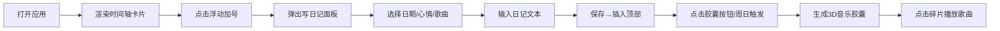

## 1. 产品概述
微型个人音乐心情日记应用，用户每日选择一首歌曲记录当下心情，系统自动汇总一周数据生成可交互的 3D 音乐胶囊，将音乐与情感以可视化方式永久留存。
- 核心目标：通过音乐+心情+时间轴的组合，为用户提供一个有温度的情感记录工具
- 目标用户：喜欢音乐、有情感记录习惯的年轻用户群体

## 2. 核心功能

### 2.1 功能模块
1. **时间轴主页**：纵向卡片时间轴、卡片进场动画、3D 翻转交互、删除操作
2. **写日记面板**：日期选择、心情选择、歌曲搜索过滤、日记文本输入、保存动画
3. **音乐胶囊页**：3D 旋转球体（心情碎片）、Canvas 心情折线图、歌曲片段播放、胶囊入口按钮

### 2.2 页面详情
| 页面名称 | 模块名称 | 功能描述 |
|----------|----------|----------|
| 时间轴主页 | 纵向时间轴 | 深色毛玻璃背景，卡片按日期倒序排列，stagger 淡入上滑动画 |
| 时间轴主页 | 日记卡片 | 圆形渐变描边封面、心情标签（颜色区分）、日期、20字日记、3D翻转、删除 |
| 时间轴主页 | 浮动加号按钮 | 渐变紫色圆形，悬浮放大 + glow 阴影，点击滑出写日记面板 |
| 写日记面板 | 表单模块 | 日期选择器（默认当天）、5个心情 emoji 按钮（选中脉动光晕）、歌曲搜索框+3列网格、200字文本域 |
| 写日记面板 | 交互动效 | 底部滑入、保存后卡片插入顶部+缩放闪烁反馈 |
| 音乐胶囊页 | 3D 球体场景 | Three.js 旋转球体，表面根据心情生成彩色碎片（金黄/翠绿/深蓝/粉紫） |
| 音乐胶囊页 | 心情折线图 | Canvas 绘制一周心情曲线，悬停显示标签，配色与心情一致 |
| 音乐胶囊页 | 入口触发 | 页面顶部胶囊按钮，或每周日 20:00 自动生成提示 |

## 3. 核心流程
用户打开应用 → 查看历史日记时间轴 → 点击浮动按钮 → 填写日期/心情/歌曲/日记 → 保存后新卡片插入顶部 → 每周或点击胶囊按钮 → 查看 3D 音乐胶囊 → 点击碎片播放歌曲 → 悬停折线查看心情数据

## 4. 用户界面设计
### 4.1 设计风格
- 主色调：深色背景 `#0f0f0f`，卡片毛玻璃 `backdrop-filter: blur(12px)`
- 强调色：渐变 `#667eea → #764ba2`，心情四色（金黄#ffd93d/翠绿#6bcb77/深蓝#4d96ff/粉紫#ff6b6b）
- 按钮风格：圆形渐变按钮，悬浮态 scale(1.1) + 0.3s glow
- 字体：现代无衬线字体，卡片标题加粗，日期弱化
- 布局：居中纵向时间轴（600px 宽），卡片间距 24px
- 图标风格：心情 emoji（😄 🧘 😢 😔 + 第五个情绪）

### 4.2 页面设计概述
| 页面名称 | 模块名称 | UI 元素 |
|----------|----------|---------|
| 时间轴主页 | 页面容器 | #0f0f0f 深色背景，全局最大宽 768px 居中 |
| 时间轴主页 | 顶部胶囊按钮 | 胶囊形状，紫粉渐变，固定顶部，点击进入胶囊页 |
| 时间轴主页 | 卡片正面 | 圆形渐变描边封面（64px）、心情色标签、日期文字、20字日记 |
| 时间轴主页 | 卡片背面 | 歌词片段居中、播放按钮（渐变圆形）、封面旋转动画 |
| 写日记面板 | 容器 | #1a1a2e 深色，顶部圆角 20px，底部滑入动画 |
| 写日记面板 | 心情按钮组 | 5个圆按钮带emoji，选中外围脉动光晕 |
| 写日记面板 | 歌曲网格 | 3列网格，缩略图带标题，选中scale(1.05)+边框闪现 |
| 音乐胶囊页 | 3D场景 | 球体居中旋转，背景轻微雾化，碎片发光 |
| 音乐胶囊页 | 折线图容器 | #1a1a2e 80% 透明度，圆角16px，内边距 |

### 4.3 响应性
- 桌面优先，移动端自适应：时间轴最大宽度 600px，小屏自动缩小卡片尺寸
- 写日记面板全屏适配，歌曲网格 3 列→2 列响应式调整
- 3D 场景自适应容器大小，折线图响应式重绘

### 4.4 3D 场景指导
- 环境：深色雾化背景 `#0f0f0f`，轻微 fog 营造空间感
- 光照：环境光 + 点光源，突出碎片边缘高光
- 相机：PerspectiveCamera，轻微 autoRotate，可拖拽旋转
- 交互：碎片点击高亮 + 外发光，悬停放大 1.1 倍
- 后处理：轻微 Bloom 效果增强氛围感
- 性能：控制碎片数量上限 50 个，InstancedMesh 优化，目标 30fps+
