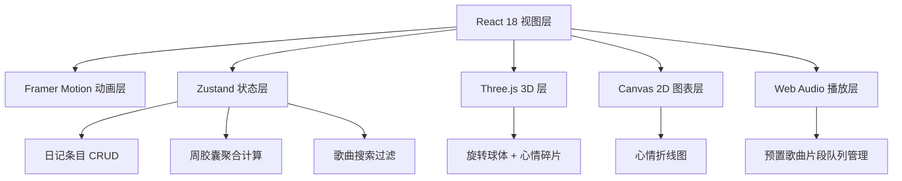

## 1. 架构设计


## 2. 技术描述
- 前端框架：React@18 + TypeScript@5
- 构建工具：Vite@5 + @vitejs/plugin-react
- 状态管理：Zustand@4（轻量级，store 集中管理）
- 3D 渲染：Three.js@0.160 + @types/three
- 动画驱动：Framer Motion@11（卡片动画/过渡）
- 音频：Web Audio API（原生封装，无额外依赖）
- 样式：内联 CSS-in-JS（styled components 不引入，保持依赖精简）
- 初始化：使用 Vite + react-ts 模板脚手架

## 3. 模块文件定义
| 文件路径 | 职责 |
|----------|------|
| package.json | 项目依赖与 dev 脚本 |
| vite.config.js | Vite + React 插件配置 |
| tsconfig.json | Strict 模式，ESNext 模块，JSX preserve |
| index.html | 挂载点 #root，深色背景预填充 |
| src/main.tsx | ReactDOM.createRoot 渲染入口 |
| src/store/useDiaryStore.ts | Zustand store：entries 数组、addEntry/deleteEntry、getWeeklyCapsule、搜索过滤 |
| src/components/Timeline.tsx | 时间轴：framer-motion stagger 动画、卡片 3D 翻转、删除 |
| src/components/EntryPanel.tsx | 写日记面板：日期选择、心情按钮组、歌曲搜索网格、文本域、保存 |
| src/components/CapsuleScene.tsx | 音乐胶囊：Three.js 初始化、球体碎片、Canvas 折线图、悬停提示 |
| src/utils/audioPlayer.ts | Web Audio 封装：20 首预置歌曲片段（模拟频率合成）、play/stop、队列 |

## 4. 数据模型
### 4.1 类型定义
```typescript
export type Mood = 'happy' | 'calm' | 'sad' | 'nostalgic' | 'energetic';

export interface Song {
  id: string;
  title: string;
  artist: string;
  coverUrl: string;
  lyricSnippet: string;
  frequency: number; // 用于模拟音频
}

export interface DiaryEntry {
  id: string;
  date: string; // YYYY-MM-DD
  mood: Mood;
  song: Song;
  note: string; // 200字内
}

export interface WeeklyCapsule {
  startDate: string;
  endDate: string;
  entries: DiaryEntry[];
  moodCounts: Record<Mood, number>;
}
```

### 4.2 Store 状态
- `entries: DiaryEntry[]`：所有日记条目，按 date 倒序
- `songs: Song[]`：20 首预置歌曲（seed 数据）
- `weeklyCapsule: WeeklyCapsule | null`：当前周胶囊数据
- `searchKeyword: string`：歌曲搜索关键词
- Actions：`addEntry(entry)`、`deleteEntry(id)`、`getEntries()`、`setSearchKeyword()`、`filterSongs()`、`generateWeeklyCapsule()`

## 5. 核心组件设计原则
### Timeline 组件
- 容器：`motion.div` variants 管理 stagger
- 单卡片：CSS `perspective` + `transform-style: preserve-3d` + `rotateY` 翻转
- 正/背面：`backface-visibility: hidden`
- 删除按钮：悬停显示，点击弹出确认（或直接删除）

### EntryPanel 组件
- 面板：AnimatePresence 控制挂载/卸载，y 轴从 100% → 0
- 心情按钮：5 个 button，选中态 pulse animation（keyframes scale + box-shadow）
- 歌曲搜索：输入框 → 实时过滤 songs → 3 列 CSS Grid
- 保存校验：mood + song 必填，note ≤ 200 字

### CapsuleScene 组件
- Three.js 初始化：useEffect 创建 Scene/Camera/Renderer
- 球体：基础 SphereGeometry（不渲染 wireframe），碎片分布：根据 entries 映射
- 碎片：心情颜色映射，BoxGeometry/SphereGeometry 小碎片，随机分布球面上（球坐标公式）
- Canvas 折线图：独立 canvas，使用 getContext('2d') 绘制，数据来自 weeklyCapsule.moodCounts
- 悬停：`mousemove` 计算最近折点，显示 tooltip

### audioPlayer 工具
- 不加载真实音频文件，使用 Web Audio API OscillatorNode 合成不同频率模拟不同歌曲
- 每首歌对应一个基础频率 + 简单 ADSR 包络
- `play(songId)` → 启动，`stop()` → 停止，`isPlaying` 状态

## 6. 性能保障
- 时间轴：`will-change: transform`，仅在可视区内渲染卡片（如数据量大可选虚拟滚动，本期不强制）
- 3D 场景：requestAnimationFrame 驱动，碎片数 ≤ 50，材质共享
- 搜索过滤：数组 filter + 原生字符串 includes，目标 <100ms
- 动画：Framer Motion 自动 GPU 加速，避免 layout thrash
- TypeScript strict 模式，减少运行时类型错误
