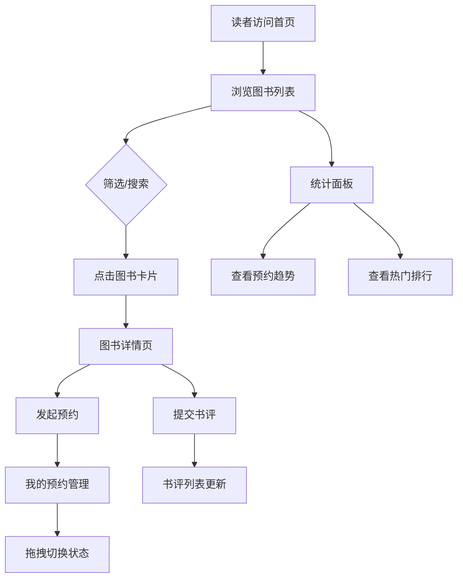

## 1. 产品概述

社区图书馆在线预约与书评应用，面向社区读者和图书馆管理员，提供图书在线浏览预约、书评互动讨论和借阅数据统计功能，替代传统手工登记和公告板模式，提升读者体验和管理效率。

## 2. 核心功能

### 2.1 用户角色

| 角色 | 注册方式 | 核心权限 |
|------|----------|----------|
| 读者 | 模拟登录 | 浏览图书、预约借阅、提交书评、管理个人预约、查看统计 |

### 2.2 功能模块

1. **首页（图书列表）**: 图书卡片网格展示、分类筛选、搜索框、点击进入详情
2. **图书详情页**: 图书详细信息、预约按钮、书评列表、提交书评
3. **我的预约页**: 三列看板（预约中/已取书/已归还）、拖拽切换状态、取消预约
4. **统计面板**: 每日预约量折线图、热门图书排行柱状图

### 2.3 页面详情

| 页面名称 | 模块名称 | 功能描述 |
|----------|----------|----------|
| 首页 | 分类筛选栏 | 5类标签（文学/科学/历史/艺术/技术），点击切换，卡片0.3s淡入淡出过渡 |
| 首页 | 搜索框 | 按书名或作者实时过滤，300ms防抖 |
| 首页 | 图书卡片网格 | 封面缩略图、书名、作者、平均评分，悬停上浮8px+阴影加深，点击缩小放大进入详情 |
| 图书详情页 | 图书信息 | 封面大图、书名、作者、简介、库存信息、平均评分 |
| 图书详情页 | 预约按钮 | 蓝色按钮，点击0.2s缩放反馈变"已预约"，库存为0时置灰提示排队人数 |
| 图书详情页 | 书评列表 | 展示已有书评（评分+评论），新评论从顶部滑入0.4s |
| 图书详情页 | 提交书评 | 1-5星评分（0.15s弹性动画）+ 10-200字文字评论 |
| 我的预约 | 预约看板 | 三列：预约中（黄）/已取书（绿）/已归还（灰），标题+计数 |
| 我的预约 | 拖拽操作 | 拖拽卡片切换状态，确认弹窗，卡片跟随鼠标+半透明阴影 |
| 统计面板 | 预约量折线图 | 过去7天每日预约量，tooltip显示具体数值 |
| 统计面板 | 排行柱状图 | 借阅前5图书，柱条从深蓝到浅蓝渐变，按数值从高到低 |

## 3. 核心流程

读者打开应用后，可通过首页浏览图书，使用分类筛选或搜索定位目标图书，点击卡片进入详情页查看完整信息。在详情页可发起预约（系统校验库存），也可浏览和提交书评。通过导航进入"我的预约"管理预约状态，拖拽卡片在预约中/已取书/已归还三列间切换。"统计"面板为管理员和读者提供借阅趋势和热门排行数据。

## 4. 用户界面设计

### 4.1 设计风格

- 主色：#4A90D9（暖蓝色），辅色：#F5A623（暖橙色），背景：#F8F9FA
- 按钮：圆角8px，点击波纹反馈效果
- 字体：标题使用 Noto Serif SC（衬线体，书卷气质），正文使用 Noto Sans SC
- 布局：顶部固定导航栏 + 内容区最大1200px居中，圆角卡片风格（圆角12px，轻微阴影）
- 动效：卡片悬停上浮+阴影加深、点击缩小放大、分类切换淡入淡出、书评滑入、星级弹性动画

### 4.2 页面设计概览

| 页面名称 | 模块名称 | UI元素 |
|----------|----------|--------|
| 首页 | 导航栏 | Logo左侧，首页/我的预约/统计链接（激活态下划线0.3s动画），右侧用户昵称+头像，手机端汉堡菜单 |
| 首页 | 分类筛选栏 | 5个标签按钮，选中态蓝色底色，切换0.3s淡入淡出 |
| 首页 | 搜索框 | 圆角输入框，左侧搜索图标，300ms防抖 |
| 首页 | 图书卡片网格 | 四列网格（桌面），卡片圆角12px，悬停上浮8px/0.3s，点击0.5s cubic-bezier缩放 |
| 图书详情页 | 预约区域 | 蓝色按钮，可用/已预约/库存不足三态，0.2s缩放反馈 |
| 图书详情页 | 星级评分 | 5颗星星，悬停实心填充，0.15s弹性动画 |
| 图书详情页 | 书评卡片 | 白色卡片，评分星星+评论文字+时间，新评论0.4s从顶部滑入 |
| 我的预约 | 三列看板 | 预约中黄/已取书绿/已归还灰，列标题+计数，可拖拽卡片 |
| 统计面板 | 图表区 | 折线图+柱状图横向并排，<768px上下排列 |

### 4.3 响应式设计

- 桌面优先设计，断点：768px（平板）、480px（手机）
- 卡片网格：桌面4列 → 平板2列 → 手机1列
- 导航栏：手机端折叠为汉堡菜单
- 统计图表：<768px时上下排列
- 预约看板：<768px时纵向堆叠
- 最小适配宽度360px

### 4.4 性能要求

- 列表渲染使用虚拟滚动（react-window），200+条数据时帧率≥55fps
- 数据操作响应时间≤200ms
- 骨架屏加载占位
- 错误提示底部toast，3s自动消失
