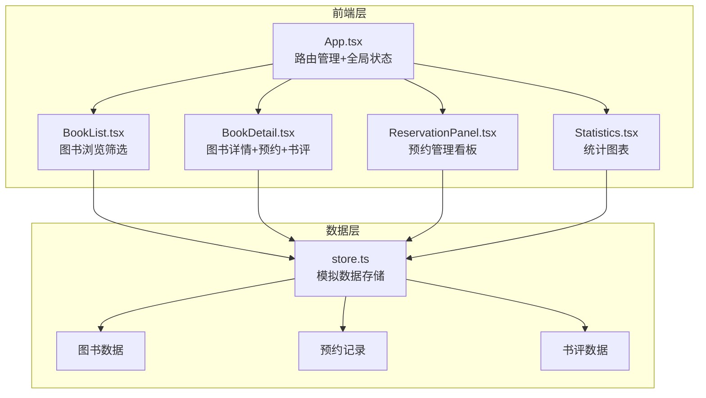
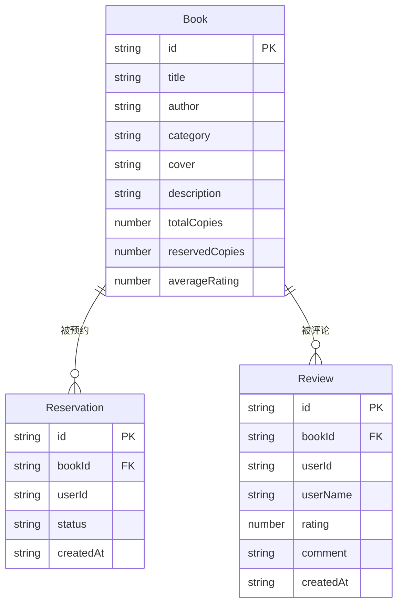

## 1. 架构设计



## 2. 技术说明

- 前端：React 18 + TypeScript + Vite
- 样式：Tailwind CSS 3
- 状态管理：Zustand
- 图表：Recharts
- 通知：react-hot-toast
- 虚拟滚动：react-window
- 初始化工具：vite-init（react-ts模板）
- 后端：无（模拟数据通过store.ts管理）
- 数据库：无（内存数据+JSON初始数据）

## 3. 路由定义

| 路由 | 用途 |
|------|------|
| / | 首页，图书列表（浏览、筛选、搜索） |
| /book/:id | 图书详情页（信息、预约、书评） |
| /reservations | 我的预约（三列看板管理） |
| /statistics | 统计面板（预约趋势+热门排行） |

## 4. API定义

无后端API，所有数据操作通过store.ts函数调用完成：

```typescript
interface Book {
  id: string;
  title: string;
  author: string;
  category: '文学' | '科学' | '历史' | '艺术' | '技术';
  cover: string;
  description: string;
  totalCopies: number;
  reservedCopies: number;
  averageRating: number;
}

interface Reservation {
  id: string;
  bookId: string;
  userId: string;
  status: 'reserved' | 'picked_up' | 'returned';
  createdAt: string;
}

interface Review {
  id: string;
  bookId: string;
  userId: string;
  userName: string;
  rating: number;
  comment: string;
  createdAt: string;
}

interface StoreAPI {
  getBooks: (filter?: { category?: string; search?: string }) => Book[];
  getBookById: (id: string) => Book | undefined;
  createReservation: (bookId: string, userId: string) => Reservation | null;
  cancelReservation: (reservationId: string) => boolean;
  updateReservationStatus: (reservationId: string, status: Reservation['status']) => boolean;
  getReservations: (userId: string) => Reservation[];
  getReviews: (bookId: string) => Review[];
  addReview: (bookId: string, userId: string, userName: string, rating: number, comment: string) => Review;
  getReservationStats: () => { date: string; count: number }[];
  getTopBooks: (limit: number) => { bookId: string; title: string; count: number }[];
}
```

## 5. 数据模型



## 6. 文件结构与调用关系

```
项目根目录/
├── package.json              # 依赖和脚本
├── vite.config.ts            # Vite构建配置
├── tsconfig.json             # TypeScript严格模式配置
├── index.html                # 入口HTML
├── tailwind.config.js        # Tailwind配置
├── postcss.config.js         # PostCSS配置
└── src/
    ├── main.tsx              # 应用入口，渲染App到DOM
    ├── index.css             # 全局样式+Tailwind指令
    ├── data/
    │   └── store.ts          # 模拟数据存储（被所有组件调用）
    ├── components/
    │   ├── App.tsx           # 根组件（路由+状态分发）→ store.ts
    │   ├── Header.tsx        # 导航栏组件 → App.tsx
    │   ├── BookList.tsx      # 图书列表 → store.ts
    │   ├── BookCard.tsx      # 图书卡片 → BookList.tsx
    │   ├── BookDetail.tsx    # 图书详情 → store.ts
    │   ├── StarRating.tsx    # 星级评分组件 → BookDetail.tsx
    │   ├── ReviewCard.tsx    # 书评卡片 → BookDetail.tsx
    │   ├── ReservationPanel.tsx # 预约管理 → store.ts
    │   └── Statistics.tsx    # 统计面板 → store.ts
    └── hooks/
        ├── useDebounce.ts    # 防抖Hook → BookList.tsx
        └── useVirtualList.ts # 虚拟滚动Hook → BookList.tsx
```

数据流向：
1. **App.tsx** 初始化时调用 `store.ts` 加载数据，通过 Zustand 分发全局状态
2. **BookList.tsx** 从 store 读取图书列表，筛选/搜索后渲染 BookCard
3. **BookDetail.tsx** 从 store 读取单本图书详情+书评，预约和书评操作写回 store
4. **ReservationPanel.tsx** 从 store 读取预约记录，状态更新写回 store
5. **Statistics.tsx** 从 store 的统计函数获取聚合数据，传递给 Recharts 渲染图表
