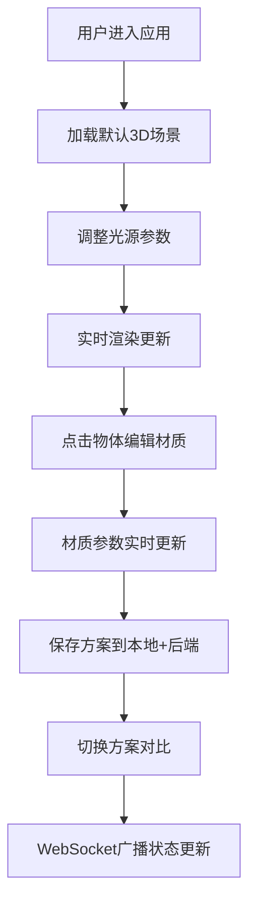

## 1. 产品概述
室内光照与材质实时预览应用，为建筑设计师提供浏览器端3D空间光照与材质参数的即时可视化反馈，解决传统设计软件调整参数后需等待渲染的痛点。

- **核心价值**：实现光源位置、色温、墙面材质的实时预览，无需等待渲染，支持快速对比不同设计方案
- **目标用户**：室内设计师、建筑设计师、照明工程师
- **市场定位**：专业设计工具的辅助预览平台，提升设计效率与决策质量

## 2. 核心功能

### 2.1 功能模块
1. **三维场景模块**：6x8x3米简约房间，中央家具组，OrbitControls交互
2. **光源控制模块**：三组独立点光源（主灯、辅助灯、射灯），色温/位置/束角可调
3. **材质编辑模块**：点击物体显示材质属性（颜色、粗糙度、金属度、凹凸强度），滑条实时调节
4. **方案对比模块**：保存最多4个方案，一键切换带过渡动画，快照缩略图展示

### 2.2 页面详情
| 页面名称 | 模块名称 | 功能描述 |
|---------|----------|---------|
| 主场景页 | 3D场景画布 | 实时渲染室内空间，支持鼠标拖拽旋转、滚轮缩放 |
| 主场景页 | 左侧光源面板 | 三组光源参数独立控制，色温3000K-6500K，位置XYZ滑条，束角10°-60° |
| 主场景页 | 右侧材质面板 | 点击物体后滑出，显示颜色、粗糙度、金属度、凹凸强度调节 |
| 主场景页 | 方案对比网格 | 2x2缩略图网格，保存/切换方案，0.5s平滑过渡动画 |
| 主场景页 | 方案快照面板 | 右上角展示当前方案快照和参数摘要 |

## 3. 核心流程

用户进入应用 → 查看默认3D室内场景 → 调整左侧光源参数（实时预览效果）→ 点击墙面/家具调节材质属性 → 点击保存按钮存储当前方案 → 切换不同方案对比效果 → 通过WebSocket同步状态到后端

## 4. 用户界面设计

### 4.1 设计风格
- **主色调**：暗色背景 `#1a1a2e`，滑条渐变 `#2d4059` → `#ea5455`
- **材质风格**：半透明毛玻璃面板（`backdrop-filter: blur(12px)`，背景 `rgba(255,255,255,0.05)`）
- **字体**：标题使用 Space Grotesk，正文使用 Inter，数字使用 JetBrains Mono
- **动效**：所有交互0.15s ease-out过渡，面板切换0.3s fade-slide，方案切换0.5s平滑渐变
- **滑块样式**：圆形滑块带白色光晕，选中缩略图0.8s周期脉动光晕

### 4.2 页面设计概述
| 页面名称 | 模块名称 | UI元素 |
|---------|----------|--------|
| 主场景页 | 3D画布 | 全屏暗色背景，中央渲染场景，OrbitControls交互 |
| 主场景页 | 左侧光源面板 | 固定宽度320px，毛玻璃效果，三组光源分组折叠，渐变滑条 |
| 主场景页 | 右侧材质面板 | 固定宽度300px，默认隐藏，点击物体后滑出，颜色选择器+滑条 |
| 主场景页 | 底部方案网格 | 2x2布局，每个180x120px，缩略图+名称，选中态光晕 |
| 主场景页 | 右上角快照面板 | 浮动卡片，显示当前方案快照、参数摘要 |

### 4.3 响应式
- **桌面端1920x1080**：左侧面板320px，右侧面板300px，方案网格4列横向排列
- **iPad横屏1024x768**：左侧面板260px，右侧面板260px，方案网格2x2排列，字体缩放0.9倍
- **触控优化**：滑块热区增大，按钮最小44x44px

### 4.4 3D场景指导
- **环境**：暗色背景 `#1a1a2e`，无HDRI，使用PMREMGenerator处理环境贴图
- **光照设置**：默认AmbientLight(0x404040, 0.3) + 三组可调节PointLight/SpotLight
- **相机**：PerspectiveCamera(fov=60, aspect, near=0.1, far=1000)，初始位置(8, 5, 8)，目标(0, 1, 0)
- **交互**：OrbitControls，enableDamping=true，dampingFactor=0.05，minDistance=3，maxDistance=20
- **后处理**：ACESFilmicToneMapping，outputColorSpace=SRGBColorSpace，shadowMap.enabled=true
- **性能优化**：使用BufferGeometry，合并几何体，限制阴影贴图大小1024x1024
