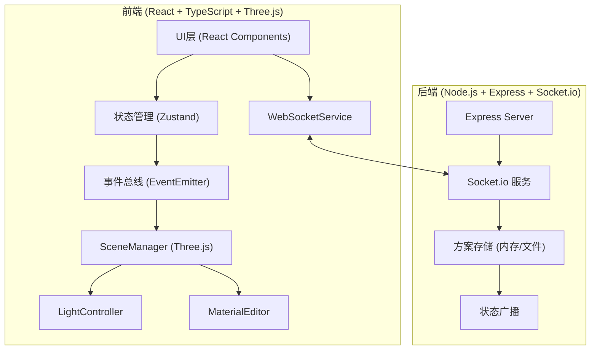
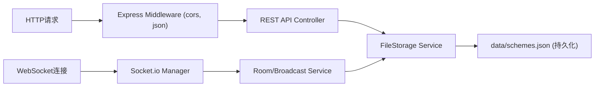

## 1. 架构设计



## 2. 技术描述

- **前端**：React@18 + TypeScript@5 + Vite@5 + Three.js@0.160 + Zustand@4 + socket.io-client@4
- **后端**：Express@4 + Socket.io@4 + cors@2
- **构建工具**：Vite@5，端口3000
- **状态管理**：Zustand 管理UI状态，Three.js 内部状态通过事件总线同步
- **通信协议**：WebSocket (Socket.io) 实时同步方案参数
- **持久化**：后端内存存储 + 文件持久化（JSON）

## 3. 目录结构

```
├── src/
│   ├── modules/
│   │   ├── scene/
│   │   │   ├── SceneManager.ts      # Three.js场景核心管理
│   │   │   ├── LightController.ts   # 光源控制模块
│   │   │   └── MaterialEditor.ts    # 材质编辑模块
│   │   ├── ui/
│   │   │   ├── ControlPanel.tsx     # 光源+材质控制面板
│   │   │   └── ComparisonPanel.tsx  # 方案对比面板
│   │   └── store/
│   │       └── useAppStore.ts       # Zustand状态管理
│   ├── utils/
│   │   ├── WebSocketService.ts      # WebSocket封装
│   │   └── colorUtils.ts            # 色温转RGB工具
│   ├── App.tsx
│   ├── main.tsx
│   └── index.css
├── server/
│   └── index.js                     # Express + Socket.io服务
├── package.json
├── vite.config.js
├── tsconfig.json
└── index.html
```

## 4. 核心类型定义

```typescript
// 光源类型
interface LightConfig {
  id: string;
  type: 'main' | 'fill' | 'spot';
  name: string;
  position: { x: number; y: number; z: number };
  colorTemp: number; // 3000-6500K
  intensity: number;
  angle?: number; // 射灯束角 10-60度
  penumbra?: number;
}

// 材质类型
interface MaterialConfig {
  id: string;
  name: string;
  color: string; // hex
  roughness: number; // 0-1
  metalness: number; // 0-1
  bumpScale: number; // 0-1
}

// 方案类型
interface DesignScheme {
  id: string;
  name: string;
  thumbnail: string; // base64
  lights: LightConfig[];
  materials: Record<string, MaterialConfig>;
  createdAt: number;
}

// 应用状态
interface AppState {
  selectedObjectId: string | null;
  activeSchemeId: string | null;
  schemes: DesignScheme[];
  lights: LightConfig[];
  materials: Record<string, MaterialConfig>;
  isMaterialPanelOpen: boolean;
}
```

## 5. API 定义

### WebSocket 事件

| 事件名 | 方向 | 数据结构 | 描述 |
|--------|------|----------|------|
| `scheme:update` | 客户端→服务端 | `DesignScheme` | 客户端更新方案 |
| `scheme:broadcast` | 服务端→客户端 | `DesignScheme` | 广播方案更新 |
| `scheme:list` | 双向 | `DesignScheme[]` | 获取/同步方案列表 |
| `scheme:save` | 客户端→服务端 | `DesignScheme` | 保存新方案 |
| `scheme:delete` | 客户端→服务端 | `{ id: string }` | 删除方案 |

### REST API

| 方法 | 路径 | 描述 |
|------|------|------|
| GET | `/api/schemes` | 获取所有方案列表 |
| POST | `/api/schemes` | 保存新方案 |
| PUT | `/api/schemes/:id` | 更新方案 |
| DELETE | `/api/schemes/:id` | 删除方案 |

## 6. 服务端架构



## 7. 性能优化策略

1. **Three.js 层面**
   - 使用 `BufferGeometry` 替代 `Geometry`
   - 开启 `shadowMap.autoUpdate = false`，仅在参数变化时手动更新
   - 限制阴影贴图分辨率为 1024x1024
   - 使用 `MeshStandardMaterial` 配合物理正确光照
   - 合并静态几何体减少 draw call

2. **React 层面**
   - 使用 `useMemo` 缓存计算结果
   - 使用 `React.memo` 避免不必要重渲染
   - 滑条使用 `requestAnimationFrame` 批量更新
   - 状态更新采用 immer 保证不可变

3. **动画层面**
   - 方案切换使用 GSAP Tween 平滑插值
   - 光源过渡使用线性插值 (LERP)
   - 材质过渡使用 RGB 颜色空间插值
