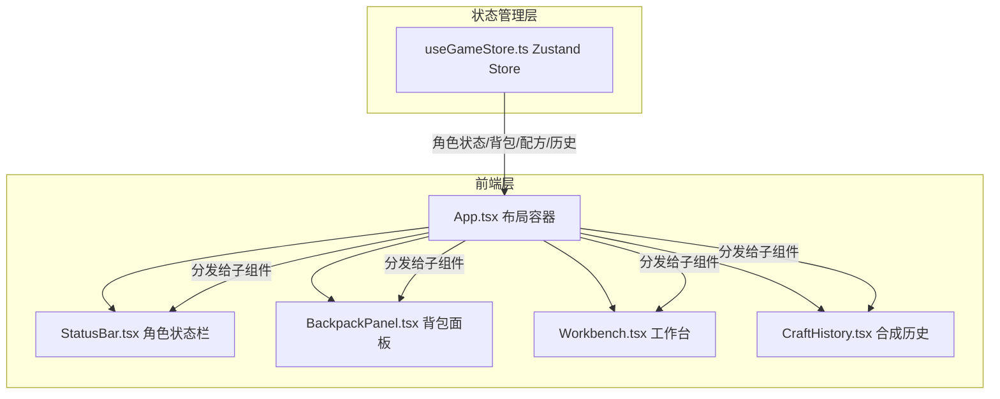
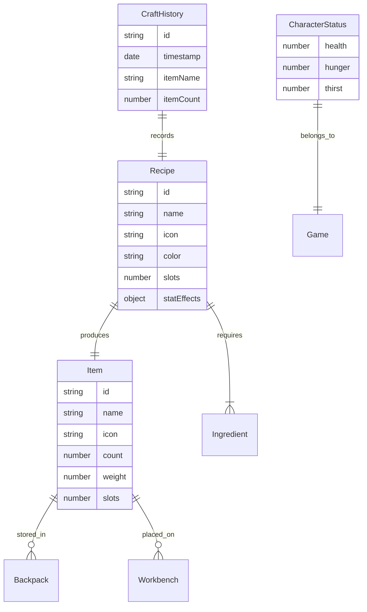

## 1. 架构设计



## 2. 技术说明

- 前端：React 18 + TypeScript + Vite
- 初始化工具：vite-init (react-ts模板)
- 状态管理：Zustand
- 动画库：framer-motion
- 样式：Tailwind CSS + CSS Modules（特定动画样式）
- 后端：无（纯前端应用）
- 数据库：无（内存状态管理）

## 3. 路由定义

| 路由 | 用途 |
|------|------|
| / | 主界面（背包+工作台+状态栏+合成历史） |

## 4. API定义

无后端API，所有数据通过Zustand store在内存中管理。

### 4.1 数据类型定义

```typescript
interface Item {
  id: string;
  name: string;
  icon: string;
  count: number;
  weight: number;
  slots: number;
  color?: string;
}

interface Recipe {
  id: string;
  name: string;
  icon: string;
  color: string;
  slots: number;
  ingredients: Record<string, number>;
  statEffects?: {
    health?: number;
    hunger?: number;
    thirst?: number;
  };
}

interface CharacterStatus {
  health: number;
  hunger: number;
  thirst: number;
}

interface HistoryEntry {
  id: string;
  timestamp: Date;
  itemName: string;
  itemCount: number;
  ingredients: Item[];
  result: Item;
}

interface GameState {
  items: Item[];
  workbenchItems: Item[];
  recipes: Map<string, Recipe>;
  status: CharacterStatus;
  history: HistoryEntry[];
  maxSlots: number;
}
```

## 5. 服务器架构图

不适用（纯前端应用）

## 6. 数据模型

### 6.1 数据模型定义



### 6.2 数据定义语言

不适用（无数据库，使用Zustand内存状态）

## 7. 文件结构与调用关系

```
src/
├── main.tsx                    # React挂载点，引入全局样式
├── App.tsx                     # 布局容器，从store读取数据分发给子组件
├── index.css                   # 全局样式（废土主题CSS变量、动画关键帧）
├── store/
│   └── useGameStore.ts         # Zustand store（背包/配方/角色状态/历史/操作）
├── components/
│   ├── BackpackPanel.tsx       # 背包面板（拖拽源，材料卡片网格）
│   ├── Workbench.tsx           # 工作台（拖放目标，配方匹配，合成动画）
│   ├── StatusBar.tsx           # 角色状态栏（生命/饥饿/口渴条带）
│   ├── CraftHistory.tsx        # 合成历史面板（可收起，回放动画）
│   ├── MaterialCard.tsx        # 材料卡片组件（拖拽交互，emoji+数量）
│   └── ParticleEffect.tsx     # 粒子爆发效果组件（requestAnimationFrame驱动）
└── data/
    └── recipes.ts              # 预设配方数据（8种配方定义）
```

**数据流向**：
- `useGameStore` → `App` → `StatusBar`（角色状态）
- `useGameStore` → `App` → `BackpackPanel`（背包物品列表）
- `useGameStore` → `App` → `Workbench`（工作台物品、配方匹配结果）
- `useGameStore` → `App` → `CraftHistory`（合成历史记录）
- `BackpackPanel` →（拖拽）→ `Workbench`（材料移入工作台）
- `Workbench` →（合成）→ `useGameStore.craftItem`（更新背包+角色状态+历史）
