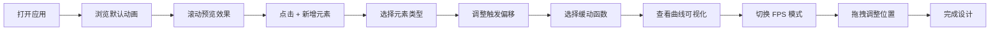

## 1. 产品概述

滚动驱动动画编排与性能模拟应用，为前端设计师提供可视化的滚动动画设计工具，解决跨设备动画帧率不一致、滚动联动效果难以控制的问题。用户可以像导演一样在虚拟滚动容器中放置动画元素，实时预览不同缓动曲线和触发偏移下的效果，并模拟低端设备的性能表现。

- 核心价值：让设计师精准控制元素入场、视差和缓动效果，提前发现性能问题
- 目标用户：前端设计师、动效设计师、交互设计师
- 市场价值：填补滚动动画设计工具的空白，提升动效开发效率和质量

## 2. 核心功能

### 2.1 用户角色
| 角色 | 注册方式 | 核心权限 |
|------|----------|----------|
| 设计师 | 无需注册 | 创建/编辑动画、预览效果、模拟性能 |

### 2.2 功能模块
1. **虚拟滚动预览区**：1000px 虚拟高度滚动容器，支持鼠标滚轮和触摸滑动
2. **动画参数编辑面板**：触发偏移调节、缓动函数选择、FPS 模式切换
3. **动画元素管理**：新增卡片/文本/图形元素、拖拽调整位置、选中高亮
4. **缓动曲线可视化**：SVG 曲线图实时展示缓动函数，标注关键点
5. **性能模拟与监控**：30FPS/60FPS 切换、实时帧率指示器、颜色预警

### 2.3 页面详情
| 页面名称 | 模块名称 | 功能描述 |
|----------|----------|----------|
| 主页面 | 虚拟滚动预览区 | 600x800px 视口，1000px 虚拟高度，显示滚动位置指示器，支持滚轮/触摸滚动 |
| 主页面 | 动画参数编辑面板 | 半透明深色面板，分三区：触发偏移区（双滑块）、缓动函数区（下拉选择）、FPS 模拟区（开关） |
| 主页面 | 新增元素按钮 | 左上角橙色圆形加号，点击弹出三选一菜单（卡片/文本/图形） |
| 主页面 | 缓动曲线可视化 | 120x60px SVG 曲线图，白色网格，#FF8A65 描边，标注关键点 |
| 主页面 | 帧率指示器 | 右下角圆形容器，实时显示 FPS，颜色根据帧率变化 |

## 3. 核心流程

设计师打开应用 → 浏览默认动画效果（滚动预览）→ 点击左上角 + 按钮添加新元素 → 选择元素类型（卡片/文本/图形）→ 在右侧面板调整触发偏移（startOffset/endOffset）→ 选择缓动函数（实时查看曲线）→ 切换 FPS 模式模拟性能 → 拖拽元素调整位置 → 完成设计

## 4. 用户界面设计

### 4.1 设计风格
- **主色调**：深色编辑器风格，背景 #1a1a2e，主字体色 #e0e0e0
- **强调色**：#FF8A65（橙红色，用于激活高亮、曲线描边、滑块旋钮）、#FF7043（深橙色，用于按钮、悬停状态）
- **辅助色**：#4caf50（绿色，≥55FPS）、#ff9800（橙色，30-55FPS）、#f44336（红色，<30FPS）
- **字体**：选择 JetBrains Mono 作为等宽字体，搭配 Space Grotesk 作为显示字体，体现极简数据可视化风格
- **按钮风格**：圆角过渡，悬停放大 1.1 倍，0.2s 过渡动画
- **布局风格**：左侧预览区 + 右侧编辑面板，浮动操作按钮，辅助线网格背景
- **图标风格**：使用 lucide-react 线性图标，保持极简风格

### 4.2 页面设计概述
| 页面名称 | 模块名称 | UI 元素 |
|----------|----------|----------|
| 主页面 | 虚拟滚动预览区 | 600x800px 视口、1000px 虚拟内容、灰色 0.5px 虚线辅助线（50px 间隔）、滚动位置指示器 |
| 主页面 | 动画元素 | 卡片（300x80px，圆角 12px，白色背景，边框阴影）、文本块（渐变色标题）、SVG 图形（圆形/矩形） |
| 主页面 | 编辑面板 | 300px 宽半透明深色面板（rgba(30,30,30,0.85)）、圆角 16px、选中项左边界 2px #FF8A65 高亮 |
| 主页面 | 滑块控件 | 旋钮背景 #FF8A65，悬停变为 #FF7043 并放大 1.1 倍，0.2s 过渡 |
| 主页面 | FPS 指示器 | 直径 48px 圆形容器，背景 #333，白色数字，颜色根据帧率变化 |

### 4.3 响应式设计
- **桌面端（≥1440px）**：正常布局，左侧预览区 + 右侧固定面板
- **平板端（1024-1440px）**：面板折叠为左侧滑出抽屉，点击汉堡菜单展开
- **移动端（<768px）**：滚动区宽度自适应填充，隐藏编辑面板

### 4.4 动画效果
- 元素激活时外发光：#FF8A65 颜色，10px blur
- 元素未激活时：opacity 0.3
- 所有按钮和滑块：0.2s hover/active 过渡
- 卡片入场：左滑入（100-300px）、右滑入（400-600px）、底部弹入（700-900px，bounce 缓动）
- 滚动指示器：实时显示当前像素位置
