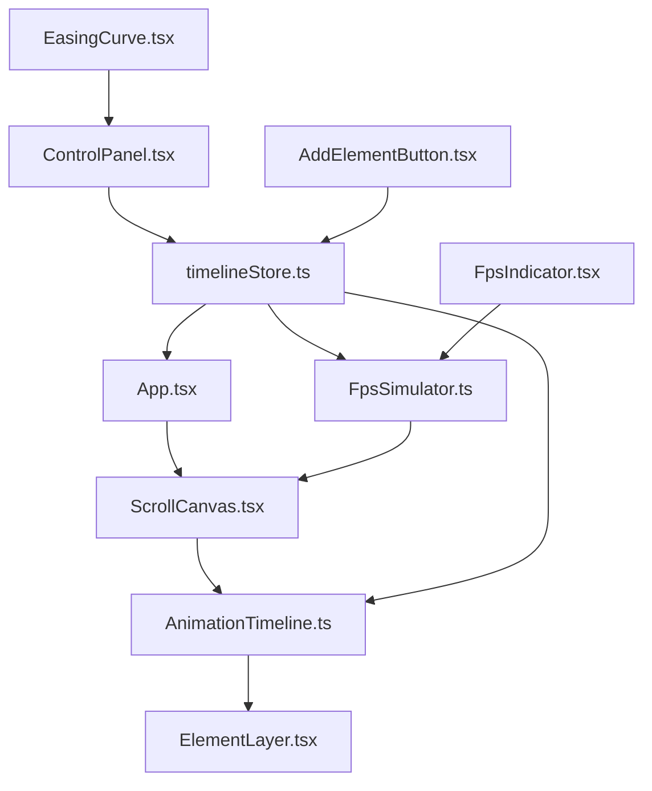

## 1. 架构设计

应用采用模块化分层架构，状态管理与 UI 渲染分离，SVG 动画引擎独立为模块，通过 Zustand 管理动画时间线与状态。



**数据流向说明：**
1. `App.tsx` → `ScrollCanvas.tsx`：接收滚动位置，初始化滚动容器
2. `ScrollCanvas.tsx` → `AnimationTimeline.ts`：调用 `updatePosition(scrollY)` 传递滚动位置
3. `AnimationTimeline.ts` → `ElementLayer.tsx`：返回激活元素列表及动画进度
4. `FpsSimulator.ts` → `ScrollCanvas.tsx`：提供模拟的 timestamp，替代原生 requestAnimationFrame
5. `timelineStore.ts`：被 App、AnimationTimeline、FpsSimulator 订阅和修改
6. `ControlPanel.tsx` → `timelineStore.ts`：用户操作更新动画参数
7. `EasingCurve.tsx`：根据选中的缓动函数实时渲染 SVG 曲线

## 2. 技术描述

- **前端框架**：React 18 + TypeScript
- **构建工具**：Vite 5 + @vitejs/plugin-react
- **状态管理**：Zustand 4
- **UI 样式**：原生 CSS（CSS Modules）+ CSS 变量
- **图标库**：lucide-react
- **字体**：JetBrains Mono（等宽）+ Space Grotesk（显示）

**初始化方式**：使用 `vite-init` 脚手架创建 react-ts 模板项目，然后按用户指定的依赖更新 package.json。

## 3. 项目文件结构

```
auto354/
├── index.html                          # 入口页面，挂载点 id="root"
├── package.json                        # 项目依赖与脚本
├── vite.config.js                      # Vite 构建配置
├── tsconfig.json                       # TypeScript 配置（严格模式，ES2020）
└── src/
    ├── main.tsx                        # ReactDOM 渲染入口
    ├── App.tsx                         # 顶级组件
    ├── ScrollCanvas.tsx                # 虚拟滚动容器组件
    ├── ElementLayer.tsx                # 动画元素渲染层
    ├── ControlPanel.tsx                # 动画参数编辑面板
    ├── FpsIndicator.tsx                # 帧率指示器组件
    ├── AddElementButton.tsx            # 新增元素按钮
    ├── EasingCurve.tsx                 # 缓动曲线 SVG 可视化
    ├── AnimationTimeline.ts            # 动画时间线计算（纯函数模块）
    ├── FpsSimulator.ts                 # 低帧率模拟模块
    └── store/
        └── timelineStore.ts            # Zustand 状态管理
```

**文件调用关系：**
- `App.tsx` 依赖：`ScrollCanvas.tsx`、`ControlPanel.tsx`、`FpsIndicator.tsx`、`AddElementButton.tsx`、`timelineStore.ts`
- `ScrollCanvas.tsx` 依赖：`ElementLayer.tsx`、`AnimationTimeline.ts`、`FpsSimulator.ts`、`timelineStore.ts`
- `ControlPanel.tsx` 依赖：`EasingCurve.tsx`、`timelineStore.ts`
- `AnimationTimeline.ts` 依赖：`timelineStore.ts`（仅类型）
- `FpsSimulator.ts` 依赖：`timelineStore.ts`

## 4. 数据模型

### 4.1 核心类型定义

```typescript
// 缓动函数类型
export type EasingFunction = 'linear' | 'easeInOutQuad' | 'bounce' | 'elastic' | 'backOut';

// 动画元素类型
export type ElementType = 'card' | 'text' | 'shape';

// SVG 图形类型
export type ShapeType = 'circle' | 'rect';

// 动画定义
export interface AnimationDefinition {
  id: string;
  name: string;
  elementType: ElementType;
  shapeType?: ShapeType;
  startOffset: number;
  endOffset: number;
  easingFunction: EasingFunction;
  initialTransform: {
    translateX?: number;
    translateY?: number;
    scale?: number;
    rotate?: number;
  };
  targetTransform: {
    translateX?: number;
    translateY?: number;
    scale?: number;
    rotate?: number;
  };
  initialOpacity: number;
  targetOpacity: number;
  position: {
    x: number;
    y: number;
  };
}

// 激活的动画元素
export interface ActiveAnimation {
  definition: AnimationDefinition;
  progress: number;
  easedProgress: number;
}

// FPS 模式
export type FpsMode = 60 | 30;

// Store 状态
export interface TimelineState {
  animations: AnimationDefinition[];
  currentScrollY: number;
  fpsMode: FpsMode;
  selectedAnimationId: string | null;
  setScrollY: (y: number) => void;
  addAnimation: (anim: Omit<AnimationDefinition, 'id'>) => void;
  updateAnimation: (id: string, updates: Partial<AnimationDefinition>) => void;
  updateOffset: (id: string, startOffset: number, endOffset: number) => void;
  setFpsMode: (mode: FpsMode) => void;
  selectAnimation: (id: string | null) => void;
}
```

### 4.2 Zustand Store 设计

`timelineStore.ts` 管理以下状态和方法：
- `animations`：所有动画定义数组
- `currentScrollY`：当前滚动位置
- `fpsMode`：FPS 模式（30/60）
- `selectedAnimationId`：当前选中的动画 ID
- `setScrollY(y)`：更新滚动位置
- `addAnimation(anim)`：添加新动画
- `updateAnimation(id, updates)`：更新动画参数
- `updateOffset(id, start, end)`：更新触发偏移
- `setFpsMode(mode)`：切换 FPS 模式
- `selectAnimation(id)`：选中动画元素

## 5. 核心模块实现要点

### 5.1 AnimationTimeline.ts（纯函数模块）

```typescript
// 计算单个动画的进度（0-1）
export function calculateProgress(scrollY: number, start: number, end: number): number;

// 内置 5 种缓动函数
export const easingFunctions: Record<EasingFunction, (t: number) => number>;

// 主入口：接收 scrollY 和动画数组，返回激活列表
export function getActiveAnimations(
  scrollY: number,
  animations: AnimationDefinition[]
): ActiveAnimation[];
```

### 5.2 FpsSimulator.ts

```typescript
// 创建 FPS 模拟器，替代 requestAnimationFrame
export function createFpsSimulator(
  getFpsMode: () => FpsMode
): {
  requestFrame: (callback: (timestamp: number) => void) => number;
  cancelFrame: (id: number) => void;
  getActualFps: () => number;
};
```

### 5.3 性能约束实现

1. **避免重排（Reflow）**：所有动画仅使用 `transform` 和 `opacity` 属性
2. **GPU 加速**：对动画元素应用 `will-change: transform, opacity`
3. **防抖处理**：滚动事件使用 `requestAnimationFrame` 节流
4. **拖拽优化**：使用 `transform` 移动拖拽元素，不改变布局
5. **帧率控制**：30FPS 模式下通过 `setTimeout` 模拟帧间隔约 33.3ms

## 6. 依赖版本

| 依赖包 | 版本 | 说明 |
|--------|------|------|
| react | ^18.2.0 | UI 框架 |
| react-dom | ^18.2.0 | DOM 渲染 |
| zustand | ^4.5.0 | 状态管理 |
| lucide-react | ^0.344.0 | 图标库 |
| vite | ^5.1.0 | 构建工具 |
| @vitejs/plugin-react | ^4.2.0 | React 插件 |
| typescript | ^5.3.0 | TypeScript |
| @types/react | ^18.2.0 | React 类型 |
| @types/react-dom | ^18.2.0 | ReactDOM 类型 |

## 7. 启动脚本

```json
{
  "scripts": {
    "dev": "vite",
    "build": "tsc && vite build",
    "preview": "vite preview"
  }
}
```
