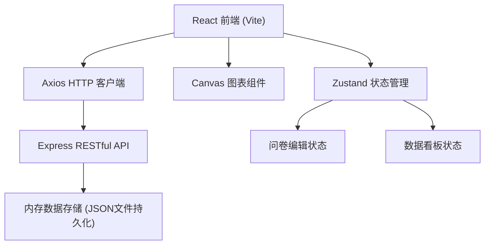
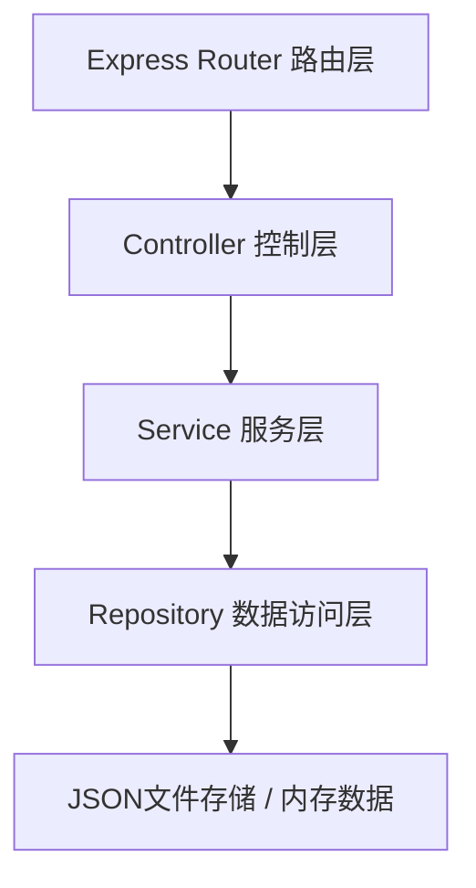
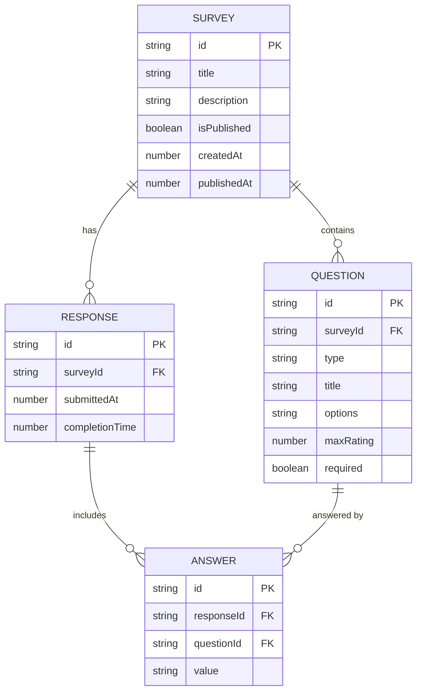

## 1. 架构设计



## 2. 技术说明

- 前端：React 18 + TypeScript + Vite
- 状态管理：Zustand
- HTTP客户端：Axios
- 后端：Express 4 + TypeScript
- 数据存储：内存存储 + JSON文件持久化（轻量方案）
- 图表：自研 Canvas 统计组件（饼图、柱状图、折线图、评分分布图）
- 前端路由：React Router DOM
- 唯一ID生成：uuid

## 3. 路由定义

| 前端路由 | 用途 |
|---------|------|
| / | 首页 - 问卷列表 |
| /editor/:surveyId? | 问卷编辑器 |
| /survey/:surveyId | 问卷填写页 |
| /dashboard/:surveyId | 数据看板 |

| 后端API | 方法 | 用途 |
|---------|------|------|
| /api/surveys | GET | 获取问卷列表 |
| /api/surveys | POST | 创建问卷 |
| /api/surveys/:id | GET | 获取单个问卷 |
| /api/surveys/:id | PUT | 更新问卷 |
| /api/surveys/:id/publish | POST | 发布问卷 |
| /api/surveys/:id/responses | GET | 获取问卷回复 |
| /api/surveys/:id/responses | POST | 提交问卷回复 |

## 4. API 定义

### 4.1 数据类型

```typescript
type QuestionType = 'single' | 'multiple' | 'rating';

interface Question {
  id: string;
  type: QuestionType;
  title: string;
  options?: string[];      // 单选/多选使用
  maxRating?: number;      // 评分题使用，默认5
  required?: boolean;
}

interface Survey {
  id: string;
  title: string;
  description: string;
  questions: Question[];
  isPublished: boolean;
  createdAt: number;
  publishedAt?: number;
}

interface ResponseAnswer {
  questionId: string;
  value: string | string[] | number;  // 单选:string, 多选:string[], 评分:number
}

interface SurveyResponse {
  id: string;
  surveyId: string;
  answers: ResponseAnswer[];
  submittedAt: number;
  completionTime: number;  // 秒
}
```

## 5. 服务器架构图



## 6. 数据模型

### 6.1 数据模型定义



## 7. 项目文件结构

```
auto355/
├── package.json
├── vite.config.ts
├── tsconfig.json
├── index.html
├── server/
│   └── index.ts              # Express服务器
└── src/
    ├── App.tsx               # 根组件
    ├── types.ts              # 共享类型
    ├── api.ts                # API调用封装
    ├── store/
    │   └── useSurveyStore.ts # Zustand状态管理
    └── components/
        ├── SurveyEditor.tsx  # 问卷编辑器
        ├── DataDashboard.tsx # 数据看板
        ├── SurveyForm.tsx    # 问卷填写组件
        ├── ChartCanvas.tsx   # Canvas图表组件
        └── SurveyList.tsx    # 问卷列表组件
```

## 8. 性能优化策略

1. **拖拽性能**：使用原生HTML5 Drag API，减少重渲染；题目列表采用memo优化子组件更新
2. **大列表渲染**：回复详情表格采用虚拟滚动（自实现轻量方案）
3. **图表性能**：Canvas直接绘制，避免DOM节点膨胀；数据预处理在useMemo中完成
4. **状态更新**：Zustand使用selector避免不必要重渲染；批量更新减少刷新次数
5. **首屏优化**：React.lazy路由级代码分割；图表数据按需加载
