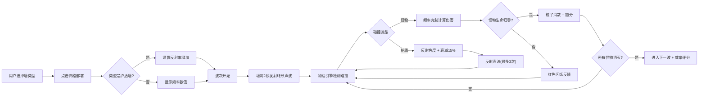

## 1. 产品概述

音波塔防战术沙盒是一款面向独立游戏开发者的数值验证工具，用于在浏览器中快速测试不同频率声波对怪物的伤害曲线与护盾反射角度，避免正式开发中的数值平衡失衡。

- 核心用户：独立游戏开发者、游戏数值策划师
- 核心价值：以可视化沙盒形式验证音波攻击/护盾反弹机制的平衡合理性

## 2. 核心功能

### 2.1 功能模块

1. **六边形网格地图**：20x20六边形网格，支持塔部署与悬停高亮反馈
2. **塔部署系统**：低频/中频/高频声波塔 + 护盾反射塔，部署动画与频率显示
3. **声波物理引擎**：环形声波扩散、碰撞检测、护盾反射、伤害衰减计算
4. **怪物波次系统**：预设路径寻路、护甲类型（轻/重）、受击反馈、死亡粒子
5. **控制面板**：塔类型切换、护盾反射率调节、发射控制、分数与波次显示
6. **发射日志系统**：记录每次声波发射、伤害命中、反射事件

### 2.2 页面详情

| 页面名称 | 模块名称 | 功能描述 |
|---------|---------|---------|
| 主应用页面 | 波次倒计时栏 | 顶部显示当前波次/总波次与倒计时，右侧滑入动画 |
| 主应用页面 | 六边形网格地图 | 20x20网格渲染，可点击部署塔，悬停高亮，已部署塔显示图标与频率 |
| 主应用页面 | 控制面板（桌面端） | 右侧固定260px毛玻璃面板：塔类型切换、反射率滑块、发射按钮、分数显示、怪物剩余数 |
| 主应用页面 | 控制面板（移动端） | 底部抽屉式面板，浮动圆形展开按钮 |
| 主应用页面 | 声波渲染层 | Canvas/SVG渲染环形声波、反射轨迹、颜色渐变与透明度衰减 |
| 主应用页面 | 怪物渲染层 | 怪物沿路径移动、蓝色轨迹线、受击红色闪烁、死亡粒子消散 |

## 3. 核心流程

用户打开应用 → 选择塔类型（低/中/高频或护盾）→ 点击六边形网格部署 → 点击"开始波次"或自动触发 → 塔每2秒发射声波 → 声波扩散中检测怪物碰撞与护盾反射 → 根据频率-护甲克制计算伤害 → 怪物受伤/死亡粒子 → 消灭所有怪物进入下一波 → 显示效率评分与累计分数

## 4. 用户界面设计

### 4.1 设计风格

- **主色**：深空蓝 `#0a0a1a` 背景，网格线 `#1a1a3a`
- **低频塔**：`#4fc3f7`（冷蓝）
- **中频塔**：`#81c784`（青绿）
- **高频塔**：`#ff8a65`（暖橙）
- **护盾塔**：`#ab47bc`（紫色）
- **怪物受击**：`#ff1744`（红）
- **怪物轨迹**：`#4fc3f7` 透明度0.3
- **按钮/文本**：`#e0e0e0`

**按钮风格**：圆角10px，按压缩放 scale:0.95，毛玻璃背景 `backdrop-filter: blur(8px)`
**字体**：标题 `Courier New` 等宽字母间距2px，正文系统等宽字体

### 4.2 页面设计概述

| 页面名称 | 模块名称 | UI元素 |
|---------|---------|--------|
| 主应用 | 波次倒计时栏 | Courier New字体，translateX滑入动画0.3s，颜色#e0e0e0 |
| 主应用 | 六边形网格 | 悬停高亮#3a3a8a + 0.15s缩放入场，部署0.2s扩散圆环动画 |
| 主应用 | 控制面板 | 毛玻璃blur(12px) #1a1a2e半透明，右侧固定260px |
| 主应用 | 声波动画 | 环形渐变（中心亮边缘透明），每次反射透明度-15%，3次后消失，颜色渐变为紫色 |
| 主应用 | 怪物动画 | 0.5px蓝色轨迹线，受击0.1s红闪，死亡8粒子随机方向0.3s消散 |
| 主应用 | 分数动画 | 0.2s数字递增滚动 |

### 4.3 响应式设计

- **桌面端（≥1024px）**：控制面板右侧固定260px，网格占据左侧画布
- **移动端（<1024px）**：控制面板折叠为底部抽屉，浮动圆形按钮（#e53935）位于底部右侧，网格自动缩放适应画布高度

### 4.4 性能预算

- 游戏循环：60FPS
- 物理计算单帧：≤4ms
- 声波数量上限合并：>50条时合并同频率同位置临近声波
- 粒子总数上限：200（FIFO回收）
