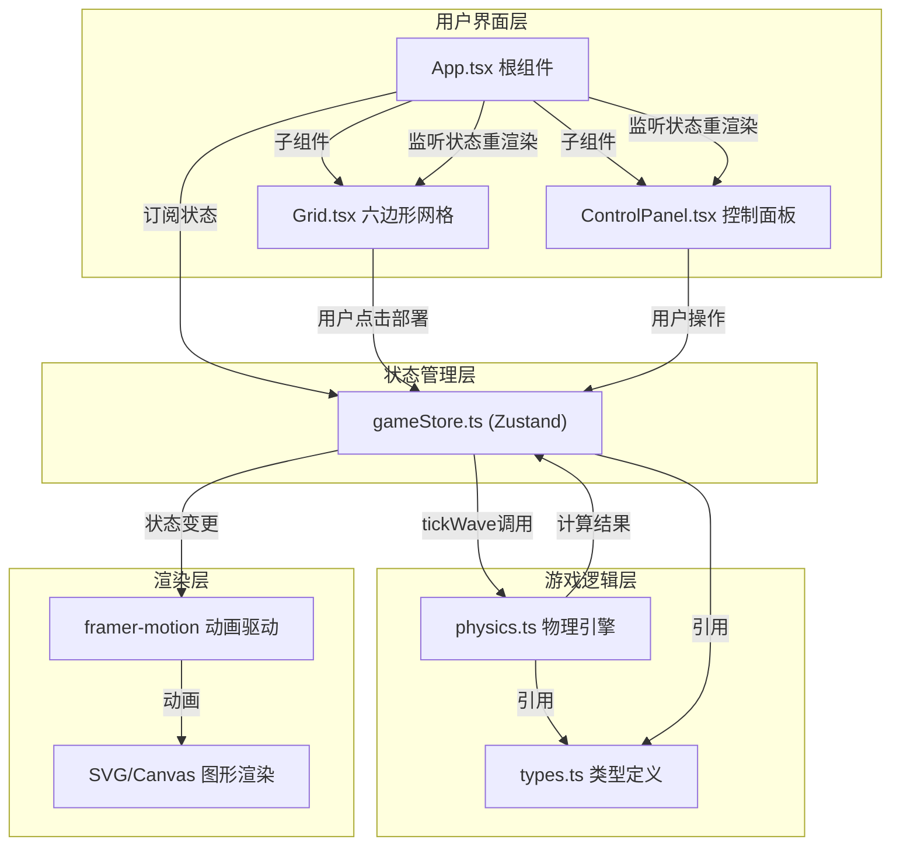
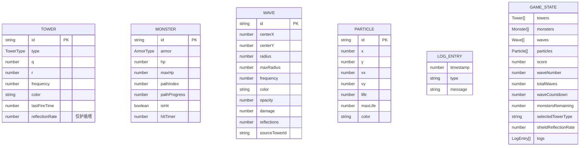

## 1. 架构设计



## 2. 技术描述

- **前端框架**：React 18 + TypeScript (strict: true, jsx: react-jsx)
- **构建工具**：Vite 5 + @vitejs/plugin-react，别名 @ → src
- **状态管理**：Zustand 4（塔、怪物、声波、分数、日志）
- **动画引擎**：framer-motion 11（声波扩散、塔部署、分数滚动、抽屉折叠）
- **渲染方式**：SVG六边形网格 + Canvas声波/粒子层（或纯SVG视性能决定）
- **包管理器**：npm

## 3. 核心文件职责与调用关系

| 文件路径 | 职责 | 被调用方 | 调用方 |
|---------|------|---------|--------|
| `src/game/types.ts` | Wave/Tower/Monster/Shield/Particle/GameState接口定义 | 无 | physics.ts, gameStore.ts, 全部组件 |
| `src/game/physics.ts` | createWave/reflectWave/applyDamage/mergeWaves物理计算 | types.ts | gameStore.ts |
| `src/store/gameStore.ts` | Zustand仓库：deployTower/spawnMonster/tickWave等action | types.ts, physics.ts | App.tsx, Grid.tsx, ControlPanel.tsx |
| `src/components/Grid.tsx` | 20x20六边形网格渲染、点击部署、悬停动画 | types.ts, gameStore.ts, framer-motion | App.tsx |
| `src/components/ControlPanel.tsx` | 塔类型切换、反射率滑块、发射按钮、分数显示 | types.ts, gameStore.ts, framer-motion | App.tsx |
| `src/App.tsx` | 集成网格+面板+波次栏+游戏循环，Canvas声波层 | types.ts, gameStore.ts, framer-motion | main.tsx |
| `src/main.tsx` | React入口渲染 | App.tsx | index.html |

**数据流向**：
`用户输入(Grid/ControlPanel)` → `gameStore action` → `physics计算(按需)` → `状态更新` → `framer-motion动画` → `UI重渲染`

## 4. 数据模型

### 4.1 数据模型定义



### 4.2 关键枚举类型

```typescript
enum TowerType { LOW = 'low', MID = 'mid', HIGH = 'high', SHIELD = 'shield' }
enum ArmorType { LIGHT = 'light', HEAVY = 'heavy' }
```

## 5. 游戏物理引擎核心算法

### 5.1 频率克制伤害计算

```
baseDamage = 10 + frequency * 0.01
modifier = 1.0
if frequency == LOW and armor == HEAVY: modifier = 1.2
if frequency == LOW and armor == LIGHT: modifier = 0.7
if frequency == HIGH and armor == LIGHT: modifier = 1.3
if frequency == HIGH and armor == HEAVY: modifier = 0.8
finalDamage = baseDamage * modifier * (0.85 ^ reflections)
```

### 5.2 护盾反射向量

```
入射方向 = normalize(monsterPos - waveCenter)
法线 = normalize(shieldPos - waveCenter)  // 径向法线
反射方向 = incident - 2 * dot(incident, normal) * normal
新圆心 = shieldPos + reflectDirection * epsilon
```

### 5.3 六边形坐标转换（轴向坐标→像素）

```
size = 六边形外接圆半径
x = size * (3/2 * q)
y = size * (sqrt(3)/2 * q + sqrt(3) * r)
```

## 6. 性能优化策略

1. **声波合并**：每帧检测 waves[]，同频率(freq差<50)且圆心距离<20px的声波合并为一条，半径取最大值
2. **粒子池**：固定200个粒子的环形缓冲，超出时覆盖最早生成的粒子
3. **空间分区**：怪物/塔按网格分区注册，碰撞检测只遍历相邻格子
4. **requestAnimationFrame**：游戏循环使用 rAF，物理更新与渲染分离，物理步长固定16.67ms
5. **Canvas批量渲染**：声波圆环批量 path 绘制，减少 draw call
