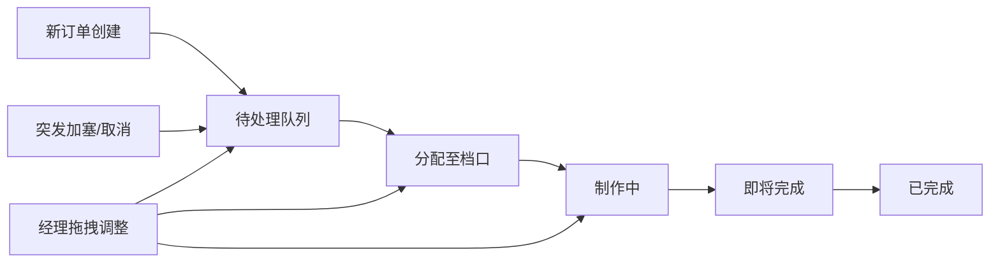
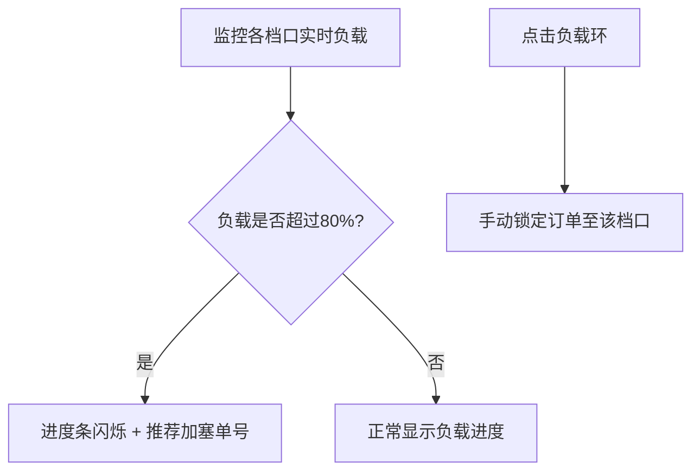

## 1. 产品概述

微型餐厅后厨订单看板与实时排程系统，为餐厅经理和厨师提供高峰期间的订单可视化与任务调度工具。通过大屏幕直观展示所有未完成订单的优先级、制作状态和预计完成时间，支持手动拖拽调整任务顺序，各档口根据负载自动推荐最优任务分配。

- 目标用户：餐厅经理、后厨厨师、档口负责人
- 核心价值：提升后厨运营效率，减少订单延误，优化人员与设备负载分配

## 2. 核心功能

### 2.1 用户角色
| 角色 | 使用场景 | 核心权限 |
|------|----------|----------|
| 餐厅经理 | 高峰期监控全局订单状态，处理突发情况 | 查看所有订单、拖拽调整、锁定档口、取消订单 |
| 厨师/档口负责人 | 专注本档口任务列表，查看制作进度 | 查看订单详情、更新制作状态 |

### 2.2 功能模块
1. **全屏看板主页面**：实时时钟、订单统计、四区域订单展示
2. **订单卡片组件**：桌号、菜品列表、倒计时、拖拽交互
3. **档口负载面板**：环形进度条、负载监控、推荐分配、锁定功能
4. **实时推送系统**：WebSocket双向通信，订单状态实时同步
5. **拖拽排程系统**：跨区域拖拽、顺序调整、弹性动画过渡

### 2.3 页面详情
| 页面名称 | 模块名称 | 功能描述 |
|----------|----------|----------|
| 看板主页 | 顶部状态栏 | 实时时钟显示、当日在途订单总数统计 |
| 看板主页 | 待处理区域 | 水平滚动展示待处理订单卡片，深蓝渐变背景(#16213e) |
| 看板主页 | 制作中区域 | 水平滚动展示制作中订单卡片，紫灰渐变背景(#0f3460) |
| 看板主页 | 即将完成区域 | 水平滚动展示即将完成订单卡片，暖橙渐变背景(#e94560) |
| 看板主页 | 已完成区域 | 水平滚动展示已完成订单卡片，浅绿渐变背景(#00b4d8) |
| 看板主页 | 档口负载浮动面板 | 炒锅/烤炉/冷盘三档口环形进度条、负载监控与推荐 |

## 3. 核心流程

### 3.1 订单生命周期流程

### 3.2 档口负载调度流程

## 4. 用户界面设计

### 4.1 设计风格
- **主背景色**：深色 #1a1a2e
- **区域渐变色**：待处理 #16213e → 制作中 #0f3460 → 即将完成 #e94560 → 已完成 #00b4d8
- **倒计时色彩**：>10分钟白色、5-10分钟黄色 #ffd93d、<5分钟红色 #ff4757（脉冲动画）
- **档口色彩**：炒锅 #0ea5e9、烤炉 #f97316、冷盘 #22c55e
- **毛玻璃效果**：background: rgba(26,26,46,0.85) + backdrop-filter: blur(16px)
- **按钮交互**：悬停时 0.2s 缩放 + 阴影加深
- **卡片过渡**：0.4s cubic-bezier(0.68,-0.55,0.265,1.55) 弹性动画
- **拖拽效果**：卡片放大 1.1 倍跟随鼠标，放置后 0.3s 确认动画
- **字体风格**：大号加粗桌号、菜品带 emoji 图标、清晰的层级对比

### 4.2 页面设计概述
| 页面名称 | 模块名称 | UI 元素 |
|----------|----------|----------|
| 看板主页 | 顶部状态栏 | 实时时钟（等宽字体）、订单总数徽章、毛玻璃背景 |
| 看板主页 | 四大订单区域 | 渐变背景色、水平滚动容器、区域标题卡片计数 |
| 看板主页 | 订单卡片 | 圆角卡片、大号桌号、菜品emoji列表、倒计时标签 |
| 看板主页 | 档口浮动面板 | 左侧吸附、环形SVG进度条、负载百分比、锁定按钮 |

### 4.3 响应式设计
- **桌面端（1366x768及以上）**：四区域水平排列，自动调整卡片密度
- **平板端（768px-1024px）**：四区域改为纵向上下滚动，字体和卡片间距增大
- **触控优化**：拖拽区域增大，按钮最小触控尺寸 44x44px

### 4.4 性能指标
- 同时展示 200 张订单卡片时帧率 ≥ 45fps
- 拖拽操作响应延迟 < 50ms
- WebSocket 状态更新延迟 < 100ms
