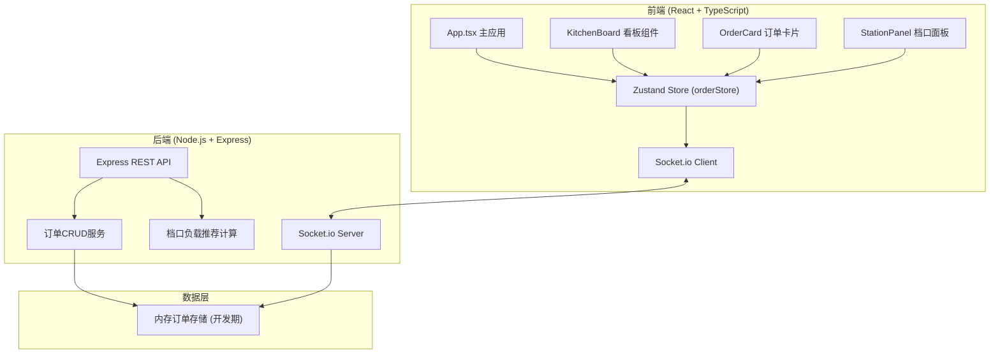
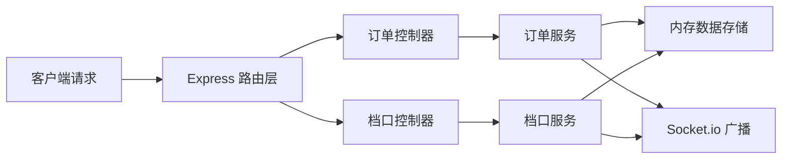
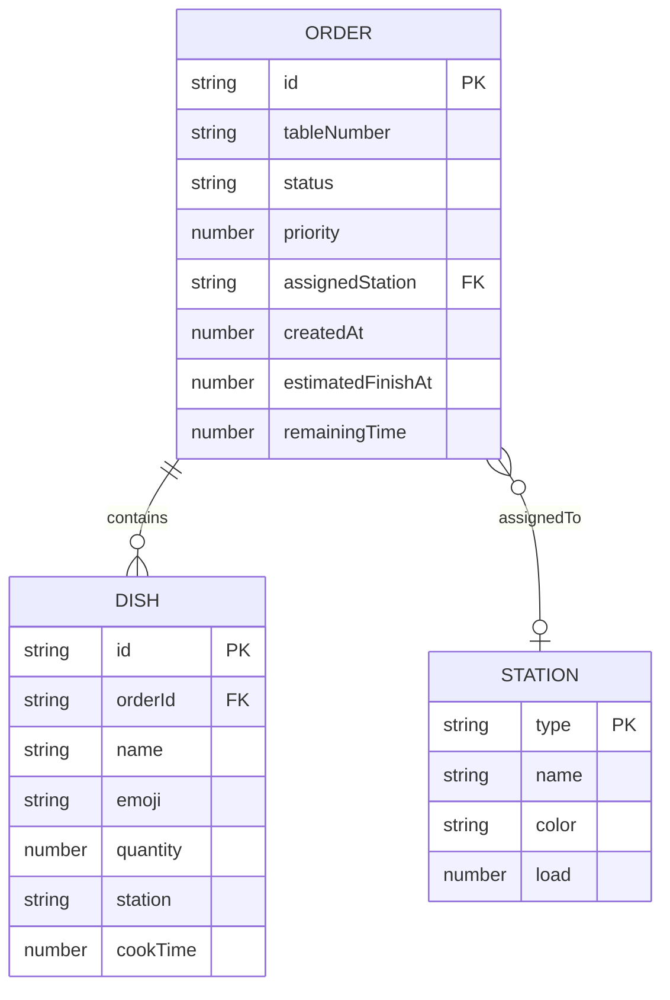

## 1. 架构设计



## 2. 技术描述

- **前端框架**: React 18 + TypeScript
- **构建工具**: Vite 5.x
- **状态管理**: Zustand 4.x
- **实时通信**: Socket.io Client
- **后端框架**: Express 4.x
- **实时推送**: Socket.io Server
- **跨域支持**: cors
- **HTTP客户端**: axios
- **样式方案**: 原生CSS + CSS变量 + 响应式媒体查询

## 3. 路由定义

| 路由 | 方法 | 用途 |
|------|------|------|
| /api/orders | GET | 获取所有订单列表 |
| /api/orders | POST | 创建新订单 |
| /api/orders/:id | GET | 获取单个订单详情 |
| /api/orders/:id | PUT | 更新订单状态/信息 |
| /api/orders/:id | DELETE | 取消/删除订单 |
| /api/stations | GET | 获取所有档口实时负载 |
| /api/stations/:id/recommend | GET | 获取指定档口推荐分配的订单 |
| /api/stations/:id/lock | POST | 锁定订单到指定档口 |

## 4. API 类型定义

```typescript
// 订单状态枚举
type OrderStatus = 'pending' | 'cooking' | 'finishing' | 'completed';

// 档口类型
type StationType = 'wok' | 'grill' | 'cold';

// 菜品项
interface DishItem {
  name: string;
  emoji: string;
  quantity: number;
  station: StationType;
  cookTime: number; // 秒
}

// 订单
interface Order {
  id: string;
  tableNumber: string;
  status: OrderStatus;
  dishes: DishItem[];
  priority: number; // 1-10, 数值越高优先级越高
  assignedStation?: StationType | null;
  createdAt: number;
  estimatedFinishAt: number;
  remainingTime: number; // 剩余秒数
}

// 档口状态
interface Station {
  type: StationType;
  name: string;
  color: string;
  load: number; // 0-100 百分比
  activeOrders: string[];
  recommendedOrderId?: string;
}
```

## 5. 服务端架构



## 6. 数据模型

### 6.1 实体关系



### 6.2 前端 Store 结构

```typescript
interface OrderStore {
  orders: Order[];
  draggingOrder: Order | null;
  dragOverArea: OrderStatus | null;
  stations: Station[];
  socket: Socket | null;
  currentTime: number;
  setOrders: (orders: Order[]) => void;
  addOrder: (order: Order) => void;
  updateOrder: (id: string, updates: Partial<Order>) => void;
  removeOrder: (id: string) => void;
  setDragging: (order: Order | null) => void;
  setDragOverArea: (area: OrderStatus | null) => void;
  setStations: (stations: Station[]) => void;
  lockOrderToStation: (orderId: string, stationType: StationType) => void;
  initSocket: () => void;
  updateCurrentTime: () => void;
}
```
