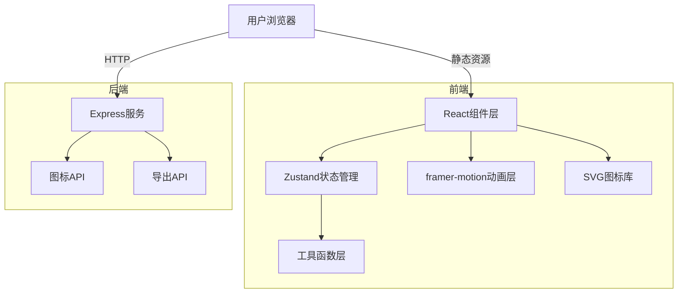

## 1. 架构设计



## 2. 技术选型说明

- **前端框架**：React@18 + TypeScript
- **构建工具**：Vite@5
- **状态管理**：Zustand@4
- **动画引擎**：framer-motion@11
- **后端框架**：Express@4
- **跨域处理**：cors@2
- **HTTP客户端**：axios@1
- **图标方案**：内联SVG，100+预设图标库

## 3. 目录结构

```
auto360/
├── index.html                 # 入口HTML
├── package.json               # 项目依赖
├── vite.config.js             # Vite配置
├── tsconfig.json              # TypeScript配置
├── src/
│   ├── components/
│   │   ├── EditorPanel.tsx    # 编辑区组件
│   │   └── PreviewPanel.tsx   # 预览区组件
│   ├── store/
│   │   └── useContentStore.ts # Zustand状态管理
│   ├── utils/
│   │   ├── splitContent.ts    # 内容拆分工具
│   │   └── svgIcons.ts        # SVG图标库
│   ├── App.tsx                # 主应用组件
│   ├── main.tsx               # 入口文件
│   └── index.css              # 全局样式
└── server/
    └── index.ts               # Express后端服务
```

## 4. API接口定义

### 4.1 获取图标列表

- **GET** `/api/icons`
- **响应**：`{ icons: Array<{ id: string; name: string; category: string }> }`

### 4.2 导出HTML

- **POST** `/api/export`
- **请求体**：
  ```typescript
  {
    cards: Array<{
      id: string;
      text: string;
      iconId: string;
      themeColor: string;
    }>;
    theme: 'light' | 'warm' | 'dark';
    font: 'noto' | 'kuaile' | 'serif';
    transition: 'fade' | 'slide' | 'flip' | 'zoom';
  }
  ```
- **响应**：`{ html: string }`

## 5. 数据模型

### 5.1 卡片数据

```typescript
interface Card {
  id: string;
  text: string;
  iconId: string;
  themeColor: string;
}
```

### 5.2 主题配置

```typescript
interface ThemeConfig {
  name: string;
  primary: string;
  secondary: string;
  cardRadius: number;
  bgColor: string;
  textColor: string;
}
```

### 5.3 状态管理

```typescript
interface ContentState {
  rawText: string;
  cards: Card[];
  highlightedCardId: string | null;
  currentTheme: string;
  currentFont: string;
  transitionEffect: string;
  isFullscreen: boolean;
  fullscreenCardId: string | null;
  isExporting: boolean;
  splitContent: () => void;
  setHighlightedCard: (id: string | null) => void;
  setTheme: (theme: string) => void;
  setFont: (font: string) => void;
  setTransition: (transition: string) => void;
  replaceIcon: (cardId: string, iconId: string) => void;
  toggleFullscreen: (cardId?: string) => void;
  exportHtml: () => Promise<void>;
}
```

## 6. 核心功能实现方案

### 6.1 内容拆分算法

1. 将Markdown按段落分割（双换行）
2. 对每个段落按长度和标点进行智能拆分
3. 确保每页内容字数在合理范围内（约200-300字）
4. 优先在句号、问号、感叹号等句末标点处拆分

### 6.2 主题色分配

1. 预设6种主题色：#FF6B6B、#4ECDC4、#45B7D1、#96CEB4、#FFEAA7、#DDA0DD
2. 将颜色转换为HSL色彩空间
3. 随机分配颜色，确保相邻卡片色相差异大于90度
4. 使用洗牌算法保证颜色分布均匀

### 6.3 图标匹配

1. 提取卡片中的第一个一级标题
2. 基于关键词匹配算法从图标库中选择相关图标
3. 图标颜色使用背景色的互补色（hue相差180度）
4. 支持用户手动替换图标

### 6.4 动画实现

1. 使用framer-motion的AnimatePresence实现翻页动画
2. 图标加载使用初始态+动画态的变化实现淡入上移
3. 全屏切换使用spring弹性动画
4. 主题切换使用CSS变量过渡

### 6.5 同步滚动

1. 监听编辑区scroll事件
2. 计算当前光标位置对应的段落索引
3. 映射到对应的卡片ID
4. 预览区平滑滚动到该卡片位置并添加高亮效果

### 6.6 HTML导出

1. 后端接收卡片数据、主题、字体、过渡效果
2. 生成完整的HTML字符串，内联所有CSS和JS
3. 嵌入卡片内容和SVG图标
4. 使用CSS动画实现翻页效果，无需依赖外部库
