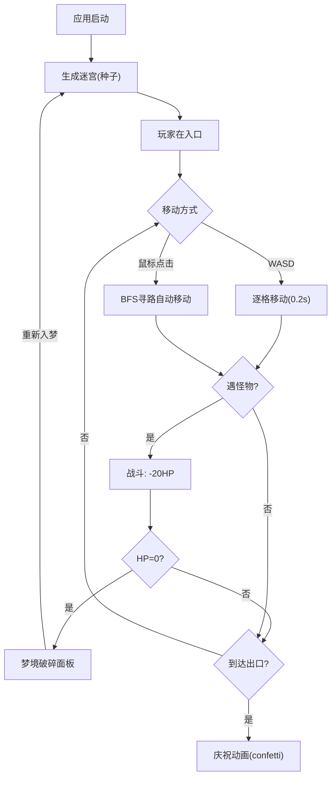

## 1. 产品概述

梦境迷宫是一款基于Web的Roguelike探索与战斗演示应用，核心玩法围绕随机迷宫生成、角色移动寻路、怪物AI巡逻与追踪、以及即时战斗结算展开。面向独立游戏开发者，用于快速验证随机地图生成与实体交互逻辑，避免后续开发中频繁修改底层寻路与碰撞代码。

## 2. 核心功能

### 2.1 功能模块

1. **迷宫探索页**：随机迷宫生成与渲染、玩家WASD移动与BFS自动寻路、怪物巡逻AI与追踪模式、碰撞战斗与结算
2. **控制面板**：种子输入与重置、玩家生命值展示、怪物计数、战斗日志滚动列表

### 2.2 页面详情

| 页面名称 | 模块名称 | 功能描述 |
|----------|----------|----------|
| 迷宫探索页 | 迷宫生成 | 基于种子(seed)的递归回溯法生成15x15网格迷宫，墙色#3a3a5c，路色#1a1a2e，左上入口、右下出口带金色闪烁光圈 |
| 迷宫探索页 | 玩家移动 | WASD逐格移动(0.2s过渡)，鼠标点击BFS最短路径自动寻路，路径>10格时加速至0.1s/步，路径淡蓝色高亮 |
| 迷宫探索页 | 怪物AI | 3只红色三角形怪物沿3-5个随机路径点循环巡逻(0.3s/步)，2格视野内切换追踪模式(0.15s/步) |
| 迷宫探索页 | 战斗结算 | 玩家怪物同格触发战斗：-20HP，红色十字爆炸动画，怪物消失，HP归零弹出"梦境破碎"结束面板 |
| 控制面板 | 种子控制 | 种子输入框(白色边框圆角8px)，修改后重新生成迷宫 |
| 控制面板 | 状态展示 | 生命条(红色渐变#ff4444→#ff8888按比例变化)、怪物计数、战斗日志(framer-motion左滑入，>10条自动滚动) |

## 3. 核心流程

用户进入应用 → 基于默认种子生成迷宫 → 玩家出现在左上角入口 → 通过WASD或鼠标点击移动 → 遇到怪物触发战斗(-20HP) → 到达右下出口 → canvas-confetti庆祝动画 → 可修改种子重新生成迷宫 → HP归零则弹出"梦境破碎"面板 → 点击"重新入梦"重置游戏

## 4. 用户界面设计

### 4.1 设计风格

- **主背景色**：#0d0d1a（深蓝黑色奇幻风格）
- **迷宫区域**：居中显示，四周径向渐变光晕(#2a2a5e→#0d0d1a)
- **按钮风格**：圆角按钮，悬停渐变#667eea→#764ba2，0.1s缩放反馈
- **字体**：标题使用Cinzel（奇幻衬线体），正文使用Quicksand（圆润无衬线）
- **布局风格**：左侧220px悬浮毛玻璃面板 + 右侧迷宫区域
- **图标**：无额外图标库，使用自定义Canvas绘制

### 4.2 页面设计概览

| 页面名称 | 模块名称 | UI元素 |
|----------|----------|--------|
| 迷宫探索页 | 迷宫网格 | Canvas渲染，墙#3a3a5c/路#1a1a2e，玩家蓝色发光圆形，怪物红色三角形，出口金色闪烁光圈 |
| 迷宫探索页 | 战斗特效 | 红色十字爆炸(scale 0→1.5, 0.3s)，伤害数字飘字动画 |
| 控制面板 | 面板整体 | 毛玻璃效果(rgba(255,255,255,0.05) + backdrop-filter:blur(8px))，左侧悬浮 |
| 控制面板 | 种子输入 | 白色边框圆角8px输入框 |
| 控制面板 | 生命条 | 红色渐变(#ff4444→#ff8888)宽度按HP比例变化 |
| 控制面板 | 战斗日志 | framer-motion从左侧滑入(opacity 0→1, 0.3s)，>10条自动滚动到底 |
| 结束面板 | 游戏结束 | 半透明黑色背景，白色"梦境破碎"文字，"重新入梦"按钮 |

### 4.3 响应式设计

- **桌面端**：左侧220px悬浮面板 + 右侧迷宫居中
- **移动端(宽度<768px)**：面板折叠为顶部固定横条，迷宫自适应缩小至屏幕宽度
- 桌面端优先设计，移动端自适应降级

### 4.4 动画规范

- 玩家移动：framer-motion平移动画，0.2s/步（加速时0.1s）
- 怪物移动：framer-motion平移动画，0.3s/步（追踪时0.15s）
- 战斗爆炸：framer-motion scale 0→1.5, 0.3s后消失
- 出口光圈：CSS动画0.5s周期缩放1.0→1.2
- 战斗日志：framer-motion从左侧滑入并渐入0.3s
- 庆祝动画：canvas-confetti散花
- 按钮悬停：渐变过渡 + 0.1s缩放反馈
