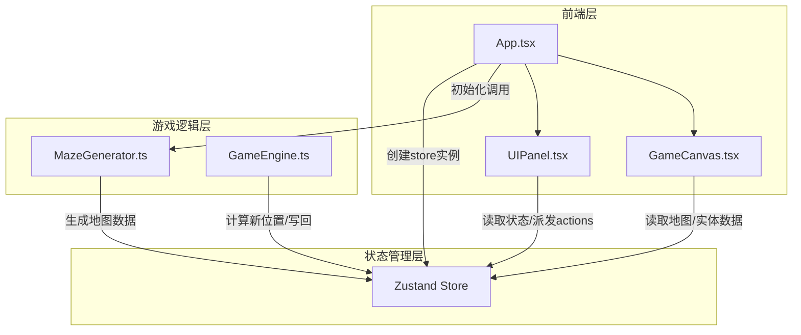

## 1. 架构设计



**数据流向**：
1. `App.tsx` 初始化时调用 `MazeGenerator.ts` 生成迷宫数据 → 存入 Zustand Store
2. `GameCanvas.tsx` 从 Store 读取地图与实体数据 → Canvas 渲染
3. `GameEngine.ts` 从 Store 读取地图和实体数组 → 计算新位置 → 写回 Store
4. `UIPanel.tsx` 从 Store 读取状态 → 用户操作 → dispatch actions → 更新 Store
5. 游戏循环(30FPS)驱动：GameCanvas 的 useFrame → GameEngine 更新 → Store 变更 → 重新渲染

## 2. 技术说明

- **前端框架**：React 18 + TypeScript + Vite
- **初始化工具**：vite-init (react-ts 模板)
- **状态管理**：Zustand
- **动画库**：framer-motion
- **特效库**：canvas-confetti
- **后端**：无
- **数据库**：无

## 3. 路由定义

| 路由 | 用途 |
|------|------|
| / | 单页应用，包含迷宫探索与控制面板 |

## 4. 文件结构与模块职责

```
src/
├── main.tsx                    # ReactDOM渲染入口
├── App.tsx                     # 顶层布局，组合GameCanvas与UIPanel
├── game/
│   ├── MazeGenerator.ts        # 迷宫生成模块(递归回溯法)
│   └── GameEngine.ts           # 游戏逻辑模块(玩家移动/AI/战斗/BFS寻路)
├── store/
│   └── gameStore.ts            # Zustand状态管理(地图/玩家/怪物/日志)
├── components/
│   ├── GameCanvas.tsx          # 迷宫渲染+实体绘制+动画驱动
│   └── UIPanel.tsx             # 侧边面板(种子/生命/日志)
└── types/
    └── game.ts                 # 类型定义(Position/Monster/BattleLog等)
```

**调用关系**：
- `App.tsx` → `MazeGenerator.generateMaze()` → `gameStore.setMap()`
- `App.tsx` → `GameCanvas` + `UIPanel` (通过 Store 共享状态)
- `GameCanvas` → `GameEngine.updatePlayer()` / `GameEngine.updateAI()`
- `GameEngine` → `gameStore` (读写实体位置与战斗日志)
- `UIPanel` → `gameStore` (读取状态/派发重置等actions)

## 5. 核心数据结构

```typescript
interface Position {
  x: number;
  y: number;
}

interface Monster {
  id: string;
  position: Position;
  patrolPoints: Position[];
  currentPatrolIndex: number;
  mode: "patrol" | "chase";
  alive: boolean;
}

interface BattleLog {
  id: string;
  message: string;
  timestamp: number;
}

interface GameState {
  seed: number;
  map: number[][];
  player: Position;
  playerHP: number;
  monsters: Monster[];
  battleLogs: BattleLog[];
  gameOver: boolean;
  gameWon: boolean;
  pathHighlight: Position[];
}
```

## 6. 算法说明

### 6.1 迷宫生成（递归回溯法）
1. 创建15x15全墙网格
2. 从(0,0)开始，标记为通路
3. 随机选择未访问的相邻格子（间隔2格），打通中间墙
4. 递归直到所有可达格子都被访问
5. 使用种子(seed)初始化伪随机数生成器确保可复现

### 6.2 BFS自动寻路
1. 从玩家当前位置开始BFS
2. 遍历4方向相邻可通行格子
3. 记录每个格子的前驱节点
4. 回溯构建最短路径
5. 路径>10格时加速移动

### 6.3 怪物AI
1. **巡逻模式**：沿预设路径点循环移动，每0.3s一步
2. **检测逻辑**：每帧计算与玩家曼哈顿距离，≤2格时切换追踪
3. **追踪模式**：朝玩家方向移动（优先缩小x差值或y差值），每0.15s一步
4. **恢复巡逻**：玩家离开2格视野后恢复巡逻模式

## 7. 性能约束

- 游戏循环稳定30FPS，移动端不低于20FPS
- 战斗特效并发数不超过5个
- Canvas重绘优化：仅重绘变化区域或使用requestAnimationFrame节流
- 怪物AI更新频率与渲染帧率解耦，避免每帧重复计算
