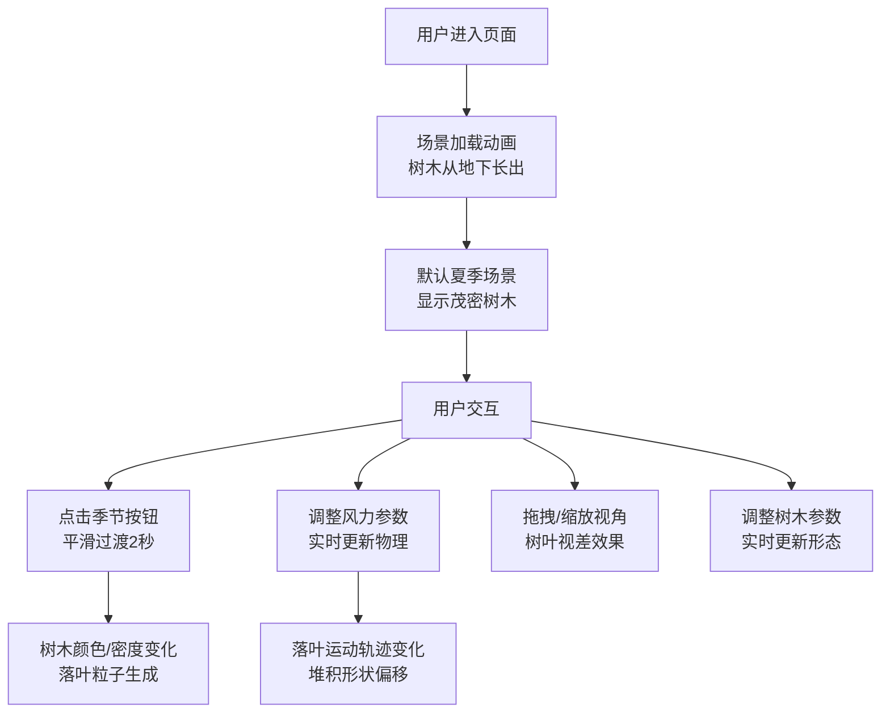

## 1. 产品概述

城市街道树木四季变化模拟应用，为景观设计师和游戏场景美术提供直观的植被季节变化预览工具。通过三维场景实时展示同一树种在春夏秋冬四季的外形变化，以及落叶粒子在风力影响下的堆积与扩散效果，帮助用户在规划开放世界植被时做出更精准的设计决策。

## 2. 核心功能

### 2.1 用户角色

| 角色 | 注册方式 | 核心权限 |
|------|----------|----------|
| 景观设计师 | 无需注册 | 预览四季树木变化、调整风力参数、保存场景配置 |
| 游戏场景美术 | 无需注册 | 调整树木参数、控制落叶效果、导出预设数据 |

### 2.2 功能模块

1. **三维场景展示**: 城市街道渲染、参数化树木生成、OrbitControls视角交互
2. **四季动态切换**: 春/夏/秋/冬四季平滑过渡、树木形态变化、天空盒色调映射
3. **风力与落叶物理**: 风向风速控制、落叶粒子物理模拟、地面堆积效果
4. **实时性能监控**: FPS计数器、粒子合并优化、性能自适应

### 2.3 页面详情

| 页面名称 | 模块名称 | 功能描述 |
|---------|----------|----------|
| 主场景页 | 3D场景渲染 | 100米城市街道、两侧建筑、中央行道树、鼠标拖拽旋转视角 |
| 主场景页 | 季节控制栏 | 顶部四季切换按钮、2秒平滑过渡动画、天空盒渐变 |
| 主场景页 | 风力控制面板 | 右下角指南针风向控制、风速滑块、实时物理参数更新 |
| 主场景页 | 性能监控面板 | 左下角FPS显示、粒子数量统计、合并优化状态 |
| 主场景页 | 侧边参数面板 | 左侧树木参数调整、响应式布局适配 |

## 3. 核心流程

用户进入应用后，首先看到加载中的树木生长动画（从地面下缓缓长出）。加载完成后，用户可以：
1. 通过顶部四季按钮切换季节，观察树木从嫩芽到茂密再到落叶光秃的变化过程
2. 调整右下角风力控制面板的风向和风速，观察落叶粒子的运动轨迹和地面堆积效果
3. 通过鼠标拖拽旋转视角、滚轮缩放，从不同角度观察场景
4. 在左侧边栏调整树木参数，实时更新场景中的树木形态

## 4. 用户界面设计

### 4.1 设计风格

- **主色调**: 深色调背景渐变 (#1A1A2E 至 #16213E)
- **辅助色**: 四季渐变色 - 春#A5D6A7、夏#1B5E20、秋#FFB74D、冬#B0BEC5
- **按钮风格**: 圆角8px、毛玻璃效果 (backdrop-filter: blur(8px))、柔光阴影
- **字体**: 标题使用 Playfair Display，正文使用 Inter
- **布局风格**: 浮动面板式布局，3D场景全屏，UI控件悬浮于场景之上
- **图标风格**: Lucide React 线性图标，与整体扁平风格统一

### 4.2 页面设计概述

| 页面名称 | 模块名称 | UI元素 |
|---------|----------|--------|
| 主场景页 | 3D场景 | 全屏Three.js画布、OrbitControls交互、视差效果 |
| 主场景页 | 季节控制栏 | 顶部居中、四个渐变按钮、hover放大动画、工具提示 |
| 主场景页 | 风力控制面板 | 右下角悬浮、指南针转盘、风速滑块、数值显示 |
| 主场景页 | 性能监控 | 左下角悬浮、FPS计数器、粒子统计、半透明背景 |
| 主场景页 | 侧边参数面板 | 左侧滑出、树木参数滑块、响应式折叠/隐藏 |

### 4.3 响应式设计

- **大屏 (>=1024px)**: 左侧边栏完整显示所有参数面板
- **中屏 (768-1023px)**: 左侧边栏折叠为图标按钮，hover展开
- **小屏 (<768px)**: 左侧边栏隐藏，顶部显示菜单按钮，点击弹出抽屉面板

### 4.4 3D场景设计

- **环境**: 天空盒随季节变化（春/夏浅蓝#87CEEB，秋灰白#E0E0E0，冬灰白#ECEFF1）
- **光照**: 半球光 + 方向光，模拟自然日光，阴影开启
- **相机**: 初始位置(0, 8, 20)，fov 60度，近裁0.1，远裁1000
- **构图**: 街道沿Z轴延伸，树木居中排列，建筑对称分布两侧
- **动画**: 树木生长动画(ease-out 1秒)、季节过渡(2秒平滑插值)、落叶物理(每帧更新)
- **后处理**: Bloom效果增强场景氛围，色调映射随季节调整
- **性能**: 粒子数量限制2000，超过500自动合并，目标帧率>=30FPS
