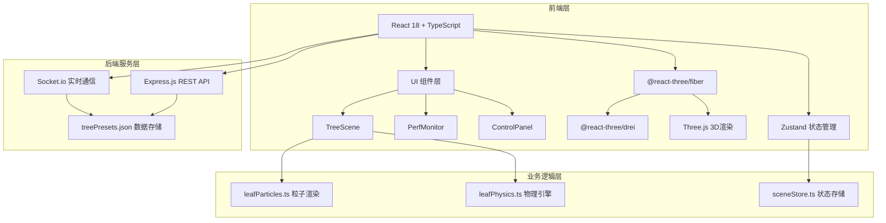
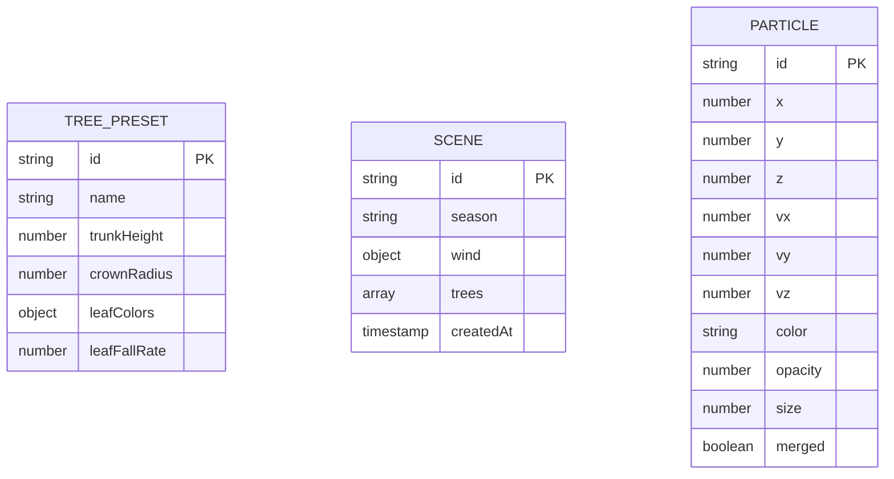
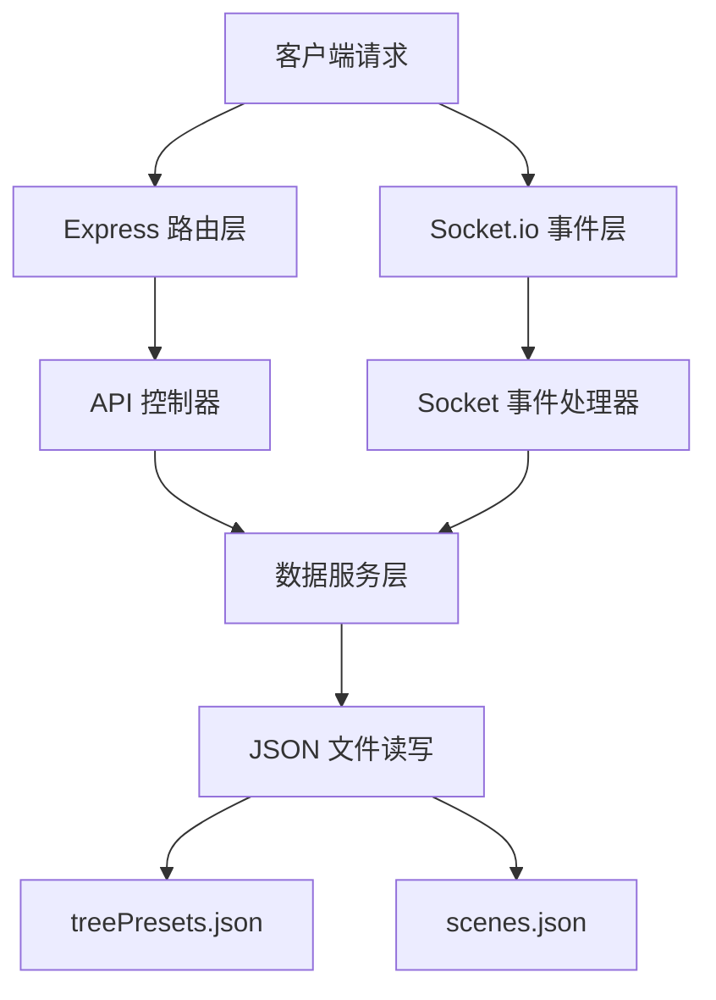

## 1. 架构设计



## 2. 技术描述

- **前端框架**: React 18 + TypeScript 5
- **构建工具**: Vite 5
- **3D渲染**: Three.js + @react-three/fiber + @react-three/drei
- **状态管理**: Zustand
- **数据校验**: Zod
- **实时通信**: Socket.io-client
- **样式方案**: Tailwind CSS 3
- **图标库**: Lucide React
- **后端服务**: Express.js 4 + Socket.io
- **数据存储**: JSON文件 (treePresets.json)

## 3. 项目初始化

- **初始化工具**: `vite-init` 使用 `react-express-ts` 模板
- **前端端口**: 3000
- **后端端口**: 3001

## 4. 目录结构

```
auto363/
├── src/
│   ├── components/
│   │   ├── TreeScene.tsx          # 3D场景主组件
│   │   ├── ControlPanel.tsx       # 控制面板（季节+风力）
│   │   ├── PerfMonitor.tsx        # 性能监控组件
│   │   ├── SeasonButtons.tsx      # 季节切换按钮组件
│   │   ├── WindControl.tsx        # 风力控制组件
│   │   └── Sidebar.tsx            # 左侧边栏参数面板
│   ├── physics/
│   │   └── leafPhysics.ts         # 落叶粒子物理引擎
│   ├── rendering/
│   │   └── leafParticles.ts       # 粒子渲染模块
│   ├── store/
│   │   └── sceneStore.ts          # Zustand状态管理
│   ├── types/
│   │   └── sceneSchema.ts         # Zod类型定义
│   ├── hooks/
│   │   └── usePerformance.ts      # 性能监控Hook
│   ├── utils/
│   │   ├── api.ts                 # API请求工具
│   │   └── socket.ts              # Socket.io客户端
│   ├── App.tsx                    # 主应用组件
│   ├── main.tsx                   # 应用入口
│   └── index.css                  # 全局样式
├── backend/
│   ├── server.ts                  # Express+Socket.io服务
│   ├── data/
│   │   └── treePresets.json       # 树种预设数据
│   └── package.json               # 后端依赖
├── public/
├── index.html
├── vite.config.ts
├── tsconfig.json
├── tailwind.config.js
├── postcss.config.js
└── package.json                   # 前端依赖
```

## 5. 路由定义

| 路由 | 组件 | 功能 |
|------|------|------|
| / | App.tsx | 主场景页面，包含所有功能模块 |

## 6. API 定义

### 6.1 REST API

```typescript
// 获取树种预设列表
GET /api/presets
Response: TreePreset[]

// 保存用户自定义场景
POST /api/scene
Request: { season: string; wind: WindParams; trees: TreeParams[] }
Response: { success: boolean; id: string }

// 加载预制场景
GET /api/scene/:id
Response: SceneData
```

### 6.2 Socket.io 事件

```typescript
// 客户端发送参数更新
socket.emit('params:update', { season, wind })

// 服务端广播参数更新
socket.on('params:changed', (data) => void)

// 接收树种预设数据
socket.on('presets:data', (presets) => void)
```

## 7. 数据模型

### 7.1 ER 图



### 7.2 Zod Schema 定义

```typescript
import { z } from 'zod';

export const SeasonSchema = z.enum(['spring', 'summer', 'autumn', 'winter']);

export const WindParamsSchema = z.object({
  direction: z.number().min(0).max(360),
  speed: z.number().min(0).max(20),
});

export const TreeParamsSchema = z.object({
  id: z.string(),
  position: z.tuple([z.number(), z.number(), z.number()]),
  trunkHeight: z.number().min(4).max(6),
  crownRadius: z.number().min(1.5).max(2.5),
  leafDensity: z.number().min(0).max(1),
  branchAngle: z.number().min(0).max(90),
});

export const TreePresetSchema = z.object({
  id: z.string(),
  name: z.string(),
  trunkHeight: z.number(),
  crownRadius: z.number(),
  leafColors: z.object({
    spring: z.string(),
    summer: z.string(),
    autumn: z.string(),
    winter: z.string(),
  }),
  leafFallRate: z.number(),
});

export const ParticleSchema = z.object({
  id: z.string(),
  position: z.tuple([z.number(), z.number(), z.number()]),
  velocity: z.tuple([z.number(), z.number(), z.number()]),
  color: z.string(),
  opacity: z.number(),
  size: z.number(),
  merged: z.boolean(),
  settled: z.boolean(),
});
```

### 7.3 初始数据 (treePresets.json)

```json
[
  {
    "id": "1",
    "name": "法国梧桐",
    "trunkHeight": 5.5,
    "crownRadius": 2.2,
    "leafColors": {
      "spring": "#66BB6A",
      "summer": "#2E7D32",
      "autumn": "#FFA726",
      "winter": "#795548"
    },
    "leafFallRate": 3
  },
  {
    "id": "2",
    "name": "银杏树",
    "trunkHeight": 6,
    "crownRadius": 2.5,
    "leafColors": {
      "spring": "#81C784",
      "summer": "#388E3C",
      "autumn": "#FFEB3B",
      "winter": "#795548"
    },
    "leafFallRate": 4
  },
  {
    "id": "3",
    "name": "白蜡树",
    "trunkHeight": 4.5,
    "crownRadius": 1.8,
    "leafColors": {
      "spring": "#A5D6A7",
      "summer": "#43A047",
      "autumn": "#FF8F00",
      "winter": "#795548"
    },
    "leafFallRate": 2
  },
  {
    "id": "4",
    "name": "枫树",
    "trunkHeight": 5,
    "crownRadius": 2,
    "leafColors": {
      "spring": "#66BB6A",
      "summer": "#2E7D32",
      "autumn": "#E53935",
      "winter": "#795548"
    },
    "leafFallRate": 5
  },
  {
    "id": "5",
    "name": "槐树",
    "trunkHeight": 4,
    "crownRadius": 1.5,
    "leafColors": {
      "spring": "#81C784",
      "summer": "#388E3C",
      "autumn": "#FF9800",
      "winter": "#795548"
    },
    "leafFallRate": 2.5
  }
]
```

## 8. 服务端架构



## 9. 性能优化策略

1. **粒子合并**: 当粒子数量 > 500 时，自动合并距离 < 0.1 的粒子
2. **粒子池**: 使用对象池复用粒子对象，避免频繁GC
3. **视锥体剔除**: Three.js 内置视锥体剔除，不可见对象不渲染
4. **LOD**: 树木可根据距离使用不同细节级别
5. **帧率自适应**: 当 FPS < 30 时，自动减少粒子生成速率
6. **WebGL 优化**: 开启硬件加速，使用 Points 而非多个 Sprite
