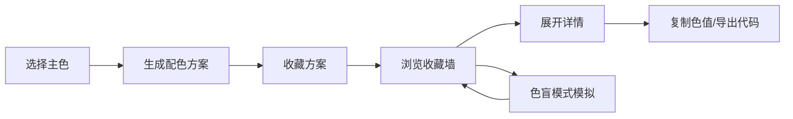

## 1. 产品概述

微型调色板与配色方案灵感墙是一款面向设计师和前端开发者的浏览器端工具，帮助用户快速创建、混合和保存颜色组合，自动生成渐变背景、预览文本可读性，并模拟色盲模式下的视觉效果。

- **目标用户**：UI/UX 设计师、前端开发者、配色爱好者
- **核心价值**：一站式配色灵感工具，提升配色效率与可访问性设计

## 2. 核心功能

### 2.1 用户角色
| 角色 | 注册方式 | 核心权限 |
|------|----------|----------|
| 普通用户 | 无需注册，本地存储 | 创建配色、保存方案、预览效果、导出代码 |

### 2.2 功能模块
1. **颜色控制台**：色相环选色、饱和度/亮度/透明度滑块、色值显示（HEX/RGB/HSL）
2. **配色方案生成器**：5种经典配色方案（单色、互补、分裂互补、类似、三色）
3. **收藏夹墙**：瀑布流布局展示、搜索排序、卡片详情
4. **色盲模式模拟**：5种视觉模式（正常、红色盲、绿色盲、蓝色盲、全色盲）
5. **详情面板**：色值复制、CSS变量导出、渐变预览

### 2.3 页面详情
| 页面名称 | 模块名称 | 功能描述 |
|----------|----------|----------|
| 工作台 | 颜色控制区 | 色相环拖拽选色、三滑块调节、实时色值显示 |
| 工作台 | 配色方案生成器 | 一键生成5种配色方案、色块交互、设为主色 |
| 工作台 | 收藏夹墙 | 瀑布流展示、搜索排序、卡片悬停动效 |
| 工作台 | 详情面板 | 右侧滑出、磨砂玻璃效果、色值复制、CSS导出、渐变预览 |
| 工作台 | 色盲模拟 | 顶部滤镜覆盖、全页面实时重绘 |

## 3. 核心流程

用户打开应用 → 调节色相环/滑块选择颜色 → 生成配色方案 → 收藏喜欢的方案 → 搜索/排序浏览收藏 → 展开详情查看 → 复制色值/导出CSS → 切换色盲模式验证可访问性

## 4. 用户界面设计

### 4.1 设计风格
- **主色调**：暗色背景 #121212，霓虹紫 #BB86FC（按钮/链接），霓虹青 #03DAC6（成功/强调）
- **视觉风格**：暗色霓虹科技感，磨砂玻璃面板，柔和微动效
- **字体**：现代无衬线字体，等宽字体展示色值
- **卡片**：160x160px，圆角12px，抬升阴影，悬停上浮
- **动效**：0.2-0.3s缓动过渡，FLIP动画，涟漪效果

### 4.2 页面设计概述
| 页面名称 | 模块名称 | UI元素 |
|----------|----------|--------|
| 工作台 | 颜色控制区 | 圆形色相环、滑块组件、色值标签、生成按钮 |
| 工作台 | 收藏夹墙 | 搜索框、排序下拉、瀑布流卡片网格 |
| 工作台 | 详情面板 | 色块展示、复制按钮、导出按钮、渐变预览 |
| 工作台 | 色盲选择器 | 下拉菜单、全屏滤镜覆盖 |

### 4.3 响应式
- **桌面端**（≥768px）：三栏布局，左侧控制区+中央收藏夹+右侧详情面板
- **移动端**（<768px）：左侧控制区折叠为抽屉，收藏夹单列瀑布流，详情面板底部滑出

### 4.4 性能指标
- 颜色更新响应时间 ≤ 50ms
- 收藏夹滚动帧率稳定 60fps
- 色盲滤镜切换无明显卡顿
- 搜索去抖延迟 400ms
