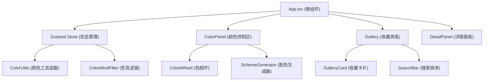

## 1. 架构设计



## 2. 技术描述

- **前端框架**：React 18 + TypeScript
- **构建工具**：Vite 5 + @vitejs/plugin-react
- **状态管理**：Zustand 4
- **动画库**：Framer Motion 11
- **样式方案**：内联样式 + CSS 变量
- **数据持久化**：localStorage
- **色盲模拟**：SVG feColorMatrix 滤镜

## 3. 文件结构

```
src/
├── App.tsx              # 根组件，布局与状态切换
├── store.ts             # Zustand store，全局状态管理
├── ColorWheel.tsx       # 色相环组件
├── ColorPanel.tsx       # 颜色控制区组件
├── Gallery.tsx          # 收藏夹墙组件
├── utils/
│   ├── colorUtils.ts    # 颜色转换与配色算法
│   └── colorblind.ts    # 色盲滤镜矩阵
├── components/
│   ├── DetailPanel.tsx  # 详情面板
│   ├── SchemeCard.tsx   # 配色方案卡片
│   └── GalleryCard.tsx  # 收藏卡片
└── types/
    └── index.ts         # 类型定义
```

## 4. 状态管理 (Zustand Store)

```typescript
interface ColorState {
  currentColor: HSL;
  saturation: number;
  lightness: number;
  alpha: number;
  colorblindMode: ColorblindMode;
  favorites: FavoriteScheme[];
  selectedScheme: FavoriteScheme | null;
  searchQuery: string;
  sortBy: 'name' | 'date';
  setColor: (hsl: HSL) => void;
  setSaturation: (value: number) => void;
  setLightness: (value: number) => void;
  setAlpha: (value: number) => void;
  setColorblindMode: (mode: ColorblindMode) => void;
  addFavorite: (scheme: ColorScheme) => void;
  removeFavorite: (id: string) => void;
  selectScheme: (scheme: FavoriteScheme | null) => void;
  setSearchQuery: (query: string) => void;
  setSortBy: (sort: 'name' | 'date') => void;
}
```

## 5. 核心数据模型

### 5.1 颜色模型
```typescript
interface HSL { h: number; s: number; l: number; }
interface RGB { r: number; g: number; b: number; }
type ColorblindMode = 'normal' | 'protanopia' | 'deuteranopia' | 'tritanopia' | 'achromatopsia';
```

### 5.2 配色方案
```typescript
interface ColorScheme {
  id: string;
  name: string;
  type: 'monochromatic' | 'complementary' | 'split-complementary' | 'analogous' | 'triadic';
  colors: string[]; // HEX 数组
  createdAt: number;
}
```

## 6. 性能优化策略

1. **颜色计算缓存**：使用 useMemo 缓存颜色转换结果
2. **虚拟滚动**：收藏夹数量较多时启用虚拟列表
3. **去抖搜索**：搜索框输入使用 400ms 去抖
4. **GPU 加速动画**：使用 transform 和 opacity 属性做动画
5. **will-change 提示**：对频繁变换的元素添加 will-change
6. **SVG 滤镜复用**：色盲滤镜 SVG 定义一次，全局引用
