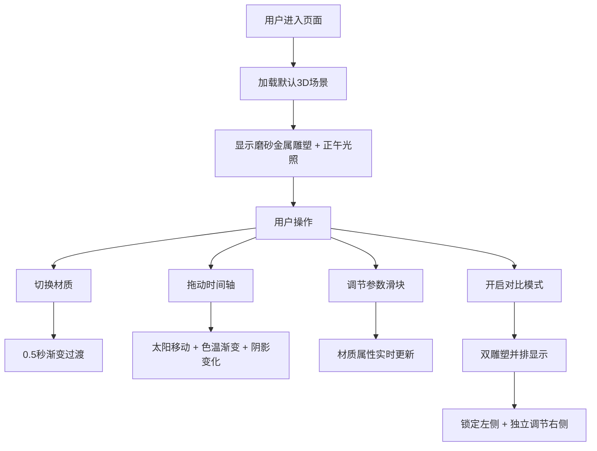

## 1. 产品概述

材质光影实验室是一款基于Web的3D材质与光照效果展示工具，面向室内设计师和3D美术，用于直观展示不同材质表面在动态环境光下的视觉效果差异。

- **核心目标**：解决设计师在展示材质方案时，无法直观对比同一物体在不同光照角度和强度下视觉质感差异的痛点
- **目标用户**：室内设计师、3D美术师、产品设计师
- **核心价值**：在浏览器中即可呈现逼真的光学反射与折射效果，无需专业3D软件

## 2. 核心功能

### 2.1 用户角色
| 角色 | 注册方式 | 核心权限 |
|------|----------|----------|
| 访客用户 | 无需注册 | 使用全部功能、切换材质、调节参数、对比模式 |

### 2.2 功能模块
1. **三维材质展示与切换**：场景中央显示抽象雕塑，支持磨砂金属、镜面金属、清玻璃、粗麻布、花岗岩五种材质切换
2. **动态环境光模拟**：虚拟太阳沿半圆弧移动，色温从暖橙到冷白再到深橙渐变，阴影实时变化
3. **材质参数微调面板**：粗糙度、金属度、环境光强度三个滑块实时调节
4. **对比模式**：并排显示两个独立雕塑，锁定左侧参数，独立调节右侧进行对比

### 2.3 页面详情
| 页面名称 | 模块名称 | 功能描述 |
|-----------|-------------|---------------------|
| 主页面 | 3D场景区 | 展示雕塑、太阳、地面棋盘格和实时阴影渲染 |
| 主页面 | 右上角信息栏 | 显示当前材质名称和光照时间 |
| 主页面 | 右侧材质选择面板 | 毛玻璃效果的材质切换按钮组 |
| 主页面 | 左侧参数调节面板 | 粗糙度、金属度、环境光强度滑块 |
| 主页面 | 底部时间轴 | 6:00-18:00时间滑块控制太阳位置 |
| 主页面 | 对比模式按钮 | 切换单/双雕塑对比模式 |

## 3. 核心流程
用户进入应用后，默认展示磨砂金属材质的雕塑在正午光照下的效果。用户可：
1. 通过右侧面板切换预设材质，观察0.5秒渐变过渡效果
2. 拖动底部时间轴，观察太阳移动和光影变化
3. 调节左侧参数滑块，实时微调材质属性
4. 点击对比按钮，并排对比两种不同材质或光照效果

## 4. 用户界面设计

### 4.1 设计风格
- **主色调**：深色科技风背景 `#1a1a2e`
- **辅助色**：渐变 `#667eea` → `#764ba2`（滑块进度条），浅灰 `#e0e0e0`（文字），棋盘格 `#D3D3D3`（地面）
- **材质面板**：毛玻璃效果 `background: rgba(255,255,255,0.1)`，`backdrop-filter: blur(10px)`，圆角12px
- **字体**：无衬线体（系统默认sans-serif）
- **动效**：按钮和滑块0.2秒平滑过渡

### 4.2 页面设计概述
| 页面名称 | 模块名称 | UI元素 |
|-----------|-------------|-------------|
| 主页面 | 3D场景区 | 全屏Canvas，中央抽象雕塑，移动的黄色太阳，棋盘格地面 |
| 主页面 | 右上角信息 | 固定定位，浅灰文字，显示材质名和时间 |
| 主页面 | 右侧材质面板 | 垂直排列5个材质按钮，毛玻璃卡片 |
| 主页面 | 左侧参数面板 | 三个带数值显示的滑块，毛玻璃卡片 |
| 主页面 | 底部时间轴 | 水平滑块，标注6:00-18:00，对比按钮 |
| 主页面 | 响应式抽屉 | <768px时面板折叠为底部抽屉（高200px，圆角16px） |

### 4.3 响应式
- 桌面端（≥768px）：左右面板固定悬浮，3D场景全屏
- 移动端（<768px）：面板折叠为底部抽屉，可拖出，场景自适应视口

### 4.4 3D场景指导
- **环境**：深色背景，程序化环境贴图模拟天光
- **光照**：主方向光（太阳）+ 环境光，实时阴影
- **相机**：OrbitControls，可拖拽旋转、缩放
- **物体**：球体、立方体、圆环、圆柱组合的抽象雕塑
- **后处理**：软阴影、抗锯齿
- **性能要求**：参数调节≥45FPS，对比模式≥30FPS，响应≤100ms
