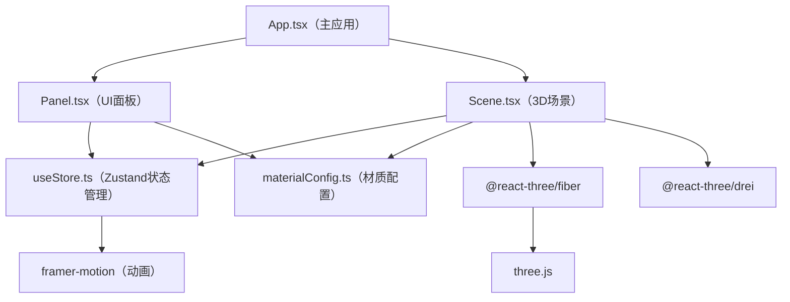

## 1. 架构设计



## 2. 技术说明
- **前端框架**：React@18 + TypeScript
- **构建工具**：Vite
- **3D渲染**：three.js + @react-three/fiber + @react-three/drei
- **状态管理**：zustand
- **动画库**：framer-motion
- **样式方案**：内联CSS样式 + framer-motion（无额外CSS框架）

## 3. 路由定义
| 路由 | 用途 |
|-------|---------|
| / | 主应用页面（单页应用，无路由） |

## 4. 项目文件结构

```
auto368/
├── package.json
├── index.html
├── vite.config.js
├── tsconfig.json
└── src/
    ├── main.tsx          # 入口，渲染App
    ├── App.tsx           # 主应用组件，布局和状态
    ├── components/
    │   ├── Scene.tsx     # Three.js三维场景
    │   └── Panel.tsx     # UI面板（材质选择+参数）
    ├── store/
    │   └── useStore.ts   # Zustand状态管理
    └── utils/
        └── materialConfig.ts  # 材质参数配置
```

## 5. 数据模型

### 5.1 Zustand Store状态定义
```typescript
interface MaterialState {
  materialType: 'brushedMetal' | 'mirrorMetal' | 'glass' | 'burlap' | 'granite';
  roughness: number;
  metalness: number;
  envIntensity: number;
  timeOfDay: number; // 6-18
  compareMode: boolean;
  // 对比模式下右侧独立参数
  rightMaterial?: MaterialState;
}
```

### 5.2 材质配置数据
```typescript
interface MaterialPreset {
  name: string;
  color: string;
  roughness: number;
  metalness: number;
  transmission?: number;
  ior?: number;
  opacity?: number;
}
```

## 6. 核心实现要点

### 6.1 3D场景（Scene.tsx）
- 使用 `Canvas` 组件作为渲染容器
- 雕塑由 `Sphere`, `Box`, `Torus`, `Cylinder` 组合而成
- 使用 `useFrame` 实现太阳位置的插值动画
- 使用 `DirectionalLight` + `shadowMap` 实现实时阴影
- 使用 `Environment` 或程序化环境贴图提供反射
- 材质过渡使用 `lerp` 在 `useFrame` 中插值参数

### 6.2 材质过渡动画
- 切换材质时，保存目标参数
- 在 `useFrame` 中以约0.5秒时长线性插值当前参数到目标参数
- 确保PBR材质参数（roughness, metalness, color等）平滑过渡

### 6.3 光照时间计算
- 时间值（6-18）映射到半圆弧角度（180°-0°）
- 太阳位置：`x = cos(angle) * radius`, `y = sin(angle) * radius`
- 色温插值：清晨 `#FFA07A` → 正午 `#FFFFFF` → 黄昏 `#FF4500`
- 使用 `THREE.Color` 的 `lerp` 方法实现颜色渐变

### 6.4 对比模式
- 当 `compareMode=true` 时，渲染两个独立的雕塑Group
- 左侧使用store中的锁定参数，右侧使用独立的参数状态
- 两个雕塑各自独立的OrbitControls或共享相机视角

### 6.5 性能优化
- 避免在渲染循环中创建新对象（复用Vector3、Color等）
- 使用 `useMemo` 缓存几何体和材质
- 阴影贴图尺寸适度（1024x1024），使用PCFSoftShadowMap
- 响应式画布自动调整像素比
