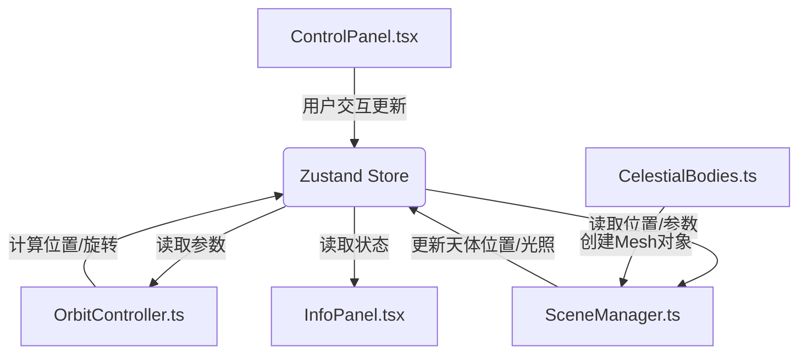

# 三维日地月系统可视化 - 技术架构文档

## 1. 技术选型与依赖

### 1.1 核心依赖

| 依赖 | 版本 | 用途 |
|------|------|------|
| three | ^0.160.0 | 3D渲染引擎 |
| @types/three | ^0.160.0 | Three.js类型定义 |
| react | ^18.2.0 | UI框架 |
| react-dom | ^18.2.0 | React DOM渲染 |
| vite | ^5.0.0 | 构建工具 |
| @vitejs/plugin-react | ^4.2.0 | React插件 |
| typescript | ^5.3.0 | 类型系统 |
| zustand | ^4.4.0 | 状态管理 |
| framer-motion | ^10.16.0 | 动画库 |

### 1.2 状态管理方案
采用Zustand作为全局状态管理器，实现三大模块（场景、天体、UI）之间的状态共享。

---

## 2. 文件结构与职责

```
auto369/
├── package.json              # 项目依赖与脚本
├── vite.config.js            # Vite构建配置
├── tsconfig.json             # TypeScript配置
├── index.html                # 入口HTML
└── src/
    ├── store.ts              # Zustand状态管理（核心）
    ├── main.tsx              # React入口
    ├── App.tsx               # 根组件
    ├── index.css             # 全局样式
    ├── SceneManager.ts       # 场景管理模块
    ├── CelestialBodies.ts    # 天体对象模块
    ├── OrbitController.ts    # 轨道控制模块
    ├── ControlPanel.tsx      # UI控制面板
    └── InfoPanel.tsx         # 天体信息面板
```

### 2.1 模块调用关系与数据流向



---

## 3. 核心模块设计

### 3.1 Zustand Store (store.ts)

**状态定义**：
```typescript
interface CelestialState {
  // 可调参数
  orbitSpeed: number;        // 公转速度倍率 1-10
  earthScale: number;        // 地球半径缩放 0.5-2.0
  moonOrbitScale: number;    // 月球轨道缩放 1.0-3.0
  
  // 运行时状态（由OrbitController更新）
  earthOrbitAngle: number;   // 地球公转角
  moonOrbitAngle: number;    // 月球公转角
  earthRotation: number;     // 地球自转角
  sunPosition: Vector3Tuple; // 太阳位置
  earthPosition: Vector3Tuple; // 地球位置
  moonPosition: Vector3Tuple;  // 月球位置
  
  // 计算属性
  earthOrbitSpeed: number;   // 地球公转角速度(度/秒)
  moonOrbitSpeed: number;    // 月球公转角速度(度/秒)
  sunEarthDistance: number;  // 日地距离
  
  // Action
  setOrbitSpeed: (v: number) => void;
  setEarthScale: (v: number) => void;
  setMoonOrbitScale: (v: number) => void;
  updatePositions: (delta: number) => void;
}
```

### 3.2 SceneManager.ts - 场景管理模块

**职责**：
- 创建Three.js Scene、PerspectiveCamera、WebGLRenderer
- 设置OrbitControls轨道控制器
- 创建方向光和环境光
- 每帧更新天体位置和光照
- 提交新位置到Store供UI读取

**核心方法**：
- `init(container: HTMLElement)`: 初始化场景
- `update(delta: number)`: 每帧更新逻辑
- `dispose()`: 资源清理

### 3.3 CelestialBodies.ts - 天体对象模块

**职责**：
- 生成太阳Mesh（金色#FFD700，自发光）
- 生成地球Mesh（蓝色#2196F3，自转轴倾斜23.5度，云层）
- 生成月球Mesh（灰色#9E9E9E，凹凸纹理）
- 返回三个天体Mesh对象供SceneManager使用

**核心方法**：
- `createSun(): Mesh`: 创建太阳
- `createEarth(): { earth: Mesh, clouds: Mesh }`: 创建地球和云层
- `createMoon(): Mesh`: 创建月球

### 3.4 OrbitController.ts - 轨道控制模块

**职责**：
- 接收公转速度与缩放比例
- 每帧计算地月公转位置和自转角度
- 更新天体position和rotation

**计算公式**：
- 地球公转：`x = orbitRadius * cos(angle), z = orbitRadius * sin(angle)`
- 月球公转：相对地球位置计算
- 角度更新：`angle += deltaTime * speed * orbitSpeedMultiplier`

### 3.5 ControlPanel.tsx - UI控制面板

**职责**：
- React组件，显示三个滑块
- 用户滑动 → 更新Store
- 数值变化动画

### 3.6 InfoPanel.tsx - 信息面板

**职责**：
- 显示天体运行实时数据
- 从Store读取状态
- 数值变化时高亮闪烁

---

## 4. 关键实现策略

### 4.1 性能优化策略

| 优化点 | 方案 |
|--------|------|
| 渲染帧率 | 使用requestAnimationFrame，deltaTime计算 |
| Draw Calls | 合并几何体，使用实例化渲染（如星空粒子） |
| 纹理尺寸 | 程序化生成纹理，控制在512x512以内 |
| 阴影优化 | shadow map size 1024x1024，仅关键物体投射阴影 |
| 状态更新 | Zustand选择器避免不必要重渲染 |

### 4.2 动画过渡策略
- 参数变化使用线性插值（LERP）在0.15秒内平滑过渡
- UI动画使用Framer Motion
- 滑块拖拽反馈使用CSS transform scale

### 4.3 响应式实现
- CSS媒体查询实现不同屏幕尺寸布局
- 移动端控制面板使用framer-motion的AnimatePresence实现展开收起动画

---

## 5. 数据流向详解

### 5.1 单向数据流
1. **用户交互层**：ControlPanel接收滑块输入，调用Store的action更新参数
2. **状态管理层**：Zustand Store保存所有状态，通知订阅者更新
3. **逻辑计算层**：OrbitController读取Store参数，计算新的位置和角度，写回Store
4. **渲染层**：SceneManager读取Store中的位置，更新Three.js对象并渲染
5. **展示层**：InfoPanel读取Store状态，展示实时数据

### 5.2 帧循环流程
```
requestAnimationFrame → calculate deltaTime 
  → OrbitController.update(delta) → 更新位置到Store
  → SceneManager.update(delta) → 读取Store位置，更新Mesh，渲染
  → React组件重渲染（仅订阅状态变化的组件）
```

---

## 6. 构建与部署

### 6.1 构建命令
```bash
npm install    # 安装依赖
npm run dev    # 开发模式
npm run build  # 生产构建
```

### 6.2 构建产物
输出到`dist/`目录，包含优化后的静态资源。
