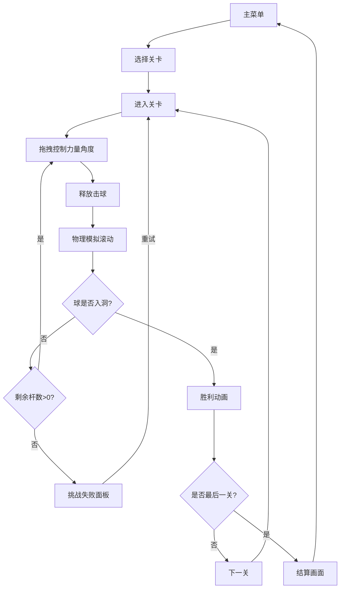

## 1. 产品概述

基于物理引擎的2D俯视角迷你高尔夫游戏，玩家通过控制力量与角度将球推入洞中。游戏包含6个难度渐进的关卡，支持本地进度保存，提供流畅的击球体验和丰富的视觉反馈。

- 主要用途：休闲娱乐，物理模拟游戏
- 目标用户：休闲游戏玩家，各年龄段用户
- 产品价值：提供真实物理碰撞体验，难度递进的关卡设计，带来成就感与挑战乐趣

## 2. 核心功能

### 2.1 用户角色

| 角色 | 注册方式 | 核心权限 |
|------|----------|----------|
| 玩家 | 无需注册，本地存储 | 游戏游玩、关卡选择、进度保存 |

### 2.2 功能模块

1. **主菜单页面**：游戏标题、开始按钮、关卡选择
2. **游戏场景页面**：物理引擎渲染、力量角度控制、碰撞检测
3. **HUD界面**：关卡信息、杆数统计、指南针、剩余杆数
4. **关卡完成页面**：本关成绩、下一关按钮、结算画面
5. **关卡选择页面**：已通关关卡展示、重新挑战功能

### 2.3 页面详情

| 页面名称 | 模块名称 | 功能描述 |
|----------|----------|----------|
| 主菜单 | 标题区域 | 渐变背景，"Mini Golf"白色标题，淡入动画 |
| 主菜单 | 按钮区域 | 开始游戏、关卡选择按钮，圆角矩形，hover动效 |
| 游戏场景 | 物理世界 | Matter.js引擎驱动，60Hz更新频率 |
| 游戏场景 | 力量控制 | 鼠标拖拽橙色虚线，距离代表力量0-100% |
| 游戏场景 | 角度控制 | 拖拽反方向为击球方向 |
| 游戏场景 | 碰撞反馈 | 屏幕震动、轨迹残留、水花粒子 |
| 游戏场景 | 球洞检测 | 落球动画、胜利判定 |
| HUD | 左上角 | 当前关卡序号、总杆数 |
| HUD | 右上角 | 剩余杆数，0时触发失败 |
| HUD | 右下角 | 指南针，球洞方向和距离 |
| 关卡完成 | 弹窗 | 半透明磨砂玻璃效果，弹性缩放动画 |
| 结算画面 | 柱状图 | 每关杆数对比标准杆，颜色区分 |

## 3. 核心流程

玩家从主菜单开始游戏，进入第一关，通过拖拽控制击球力量和方向，将球推入洞中完成关卡。每关记录杆数，通关后进入下一关，完成6关后显示结算画面。支持中途退出和关卡重玩。

## 4. 用户界面设计

### 4.1 设计风格

- **主色调**：深绿色 `#2E7D32`（背景）、浅绿色 `#7CCD7C`（草地）、米黄色 `#F5DEB3`（沙坑）
- **强调色**：橙色（力量条）、蓝色（水域、粒子）
- **按钮风格**：圆角矩形 `border-radius: 12px`，淡入动画 `fade-in 0.3s`
- **字体**：标题使用圆润无衬线字体，正文使用清晰易读字体
- **布局**：全屏Canvas，HUD元素悬浮在画布四角
- **动画**：弹性缩放、淡入淡出、屏幕震动、粒子效果

### 4.2 页面设计概述

| 页面名称 | 模块名称 | UI元素 |
|----------|----------|--------|
| 主菜单 | 标题区域 | 深绿色渐变背景，大号白色"Mini Golf"标题，居中显示 |
| 主菜单 | 按钮区域 | 两个圆角按钮（开始游戏、关卡选择），垂直排列，hover放大效果 |
| 游戏场景 | Canvas区域 | 2D俯视视角，草地纹理平铺，沙坑不规则多边形，水域半透明 |
| 游戏场景 | 力量条 | 从球体向外延伸的橙色虚线，拖拽距离显示力量百分比 |
| HUD | 左上角 | 白色文字"洞 X / 6"和"总杆数：XX"，半透明背景 |
| HUD | 右上角 | 红色剩余杆数图标，数字醒目显示 |
| HUD | 右下角 | 圆形指南针，内含方向箭头和距离数字 |
| 关卡完成 | 弹窗 | 半透明白色磨砂玻璃，`backdrop-filter: blur(8px)`，弹性缩放进入 |
| 结算画面 | 柱状图 | 6个柱子，绿色=低于标准杆，红色=高于标准杆 |

### 4.3 响应式

- **桌面优先**，自适应屏幕宽度，Canvas最大宽度1200px
- **移动端**：触控支持，手指拖拽替代鼠标拖拽
- **布局自适应**：HUD元素位置相对Canvas固定，不随窗口大小改变相对位置

### 4.4 视觉特效

- **草地纹理**：128x128像素浅绿色网格纹理，重复平铺
- **轨迹效果**：30个半透明白色点组成，随球速渐变淡出
- **水花粒子**：10-15个蓝色小点，向四周散开，最大50个粒子
- **屏幕震动**：碰撞时0.1s，位移2px
- **落球动画**：球在洞内旋转缩小，0.5s ease-in
- **弹窗动画**：0.4s弹性缩放进入
