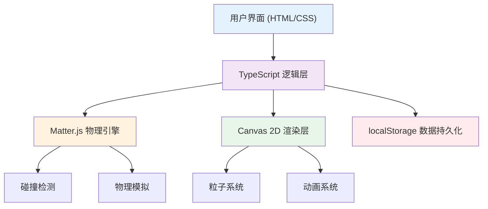

## 1. 架构设计



## 2. 技术描述

- **前端**：TypeScript + Vite + Matter.js
- **物理引擎**：Matter.js（2D刚体物理）
- **渲染**：Canvas 2D API
- **构建工具**：Vite 5.x
- **语言**：TypeScript 5.x（严格模式）
- **数据存储**：localStorage（本地进度保存）
- **类型定义**：@types/matter-js

### 核心依赖
```json
{
  "typescript": "^5.0.0",
  "vite": "^5.0.0",
  "matter-js": "^0.19.0",
  "@types/matter-js": "^0.19.0",
  "@dimforge/rapier2d-compat": "^0.11.0"
}
```

## 3. 模块结构

```
src/
├── main.ts          # 入口文件，引擎初始化，主循环
├── level.ts         # 关卡数据定义与加载
├── ball.ts          # 高尔夫球物理实体与控制
├── hole.ts          # 球洞检测与胜利动画
├── ui.ts            # UI组件与HUD管理
└── types.ts         # 全局类型定义
```

## 4. 核心类与模块

### 4.1 类型定义 (types.ts)
```typescript
interface LevelData {
  id: number;
  name: string;
  par: number;
  ballStart: { x: number; y: number };
  holePosition: { x: number; y: number };
  obstacles: Obstacle[];
  sandPits: Polygon[];
  waterAreas: Polygon[];
  trees: CircleObstacle[];
  walls: Wall[];
}

interface Obstacle {
  type: 'rect' | 'circle' | 'polygon';
  position: { x: number; y: number };
  size?: { width: number; height: number };
  radius?: number;
  vertices?: { x: number; y: number }[];
  friction?: number;
  restitution?: number;
}

interface GameState {
  currentLevel: number;
  strokes: number[];
  totalStrokes: number;
  isPlaying: boolean;
  isAiming: boolean;
  ballMoving: boolean;
  completedLevels: number[];
}

interface Particle {
  x: number;
  y: number;
  vx: number;
  vy: number;
  life: number;
  maxLife: number;
  color: string;
  size: number;
}

interface TrailPoint {
  x: number;
  y: number;
  alpha: number;
  speed: number;
}
```

### 4.2 关卡模块 (level.ts)
- 定义6个关卡数据，难度递进
- 加载关卡到物理世界
- 创建碰撞体（墙体、障碍物、沙坑、水域）

### 4.3 球体模块 (ball.ts)
- 创建Matter.js圆形刚体
- 管理击球力量与角度计算
- 处理鼠标/触控拖拽输入
- 运动轨迹记录与渲染

### 4.4 球洞模块 (hole.ts)
- 球洞碰撞检测（距离判定）
- 落球动画（旋转缩小）
- 胜利条件触发

### 4.5 UI模块 (ui.ts)
- 力量条渲染（橙色虚线）
- HUD元素（关卡、杆数、指南针）
- 弹窗系统（关卡完成、失败、结算）
- 主菜单与关卡选择界面

### 4.6 主入口 (main.ts)
- Matter.js引擎初始化
- 游戏主循环（requestAnimationFrame）
- 物理更新（60Hz）
- 渲染管线协调
- 事件监听管理

## 5. 物理引擎配置

### Matter.js 核心参数
```typescript
const engine = Engine.create({
  gravity: { x: 0, y: 0 }, // 俯视角，无重力
  enableSleeping: false
});

// 球体配置
const ball = Bodies.circle(x, y, 8, {
  friction: 0.02,
  frictionAir: 0.01,
  restitution: 0.6,
  density: 0.001
});

// 墙体配置
const wallOptions = {
  isStatic: true,
  restitution: 0.8,
  friction: 0.5
};
```

### 碰撞检测策略
- 使用Matter.js `collisionStart` 事件检测碰撞
- 球洞使用距离判定而非物理碰撞（球需"落入"洞中）
- 水域使用传感器（sensor）触发粒子效果，不产生物理碰撞响应

## 6. 性能优化

### 帧率控制
- 物理更新固定60Hz，使用 `Engine.update(engine, 1000 / 60)`
- 渲染使用 `requestAnimationFrame`，与显示器刷新率同步
- 轨迹点限制30个，超出自动移除最旧点

### 粒子系统
- 最大粒子数50个，超出时复用最旧粒子
- 粒子生命周期结束自动回收
- 水花粒子10-15个，速度衰减

### 渲染优化
- 草地纹理使用Canvas `createPattern` 预先生成
- 静态障碍物渲染到离屏Canvas，每帧直接贴图
- 使用脏矩形区域更新（如非必要不重绘全场景）

## 7. 数据持久化

### localStorage 结构
```typescript
interface SaveData {
  completedLevels: number[];
  levelScores: Record<number, number>;
  bestTotal: number;
  lastPlayed: number;
}

// 存储键名
const STORAGE_KEY = 'mini_golf_progress';
```

### 存储时机
- 每关完成后保存杆数
- 退出游戏时自动保存当前进度
- 支持重置进度功能

## 8. 响应式设计

### Canvas 自适应
```typescript
function resizeCanvas() {
  const maxWidth = 1200;
  const aspectRatio = 16 / 9;
  let width = Math.min(window.innerWidth, maxWidth);
  let height = width / aspectRatio;
  
  if (height > window.innerHeight) {
    height = window.innerHeight;
    width = height * aspectRatio;
  }
  
  canvas.width = width;
  canvas.height = height;
}
```

### 触控支持
- 同时监听 `mousedown/mousemove/mouseup` 和 `touchstart/touchmove/touchend`
- 触控事件阻止默认滚动行为
- 触控拖拽检测半径适当放大（适应手指操作）

## 9. 动画系统

### 缓动函数
```typescript
const easings = {
  easeIn: (t: number) => t * t,
  easeOut: (t: number) => t * (2 - t),
  easeInOut: (t: number) => t < 0.5 ? 2 * t * t : -1 + (4 - 2 * t) * t,
  elastic: (t: number) => {
    const p = 0.3;
    return Math.pow(2, -10 * t) * Math.sin((t - p / 4) * (2 * Math.PI) / p) + 1;
  }
};
```

### 屏幕震动
- 碰撞时触发，持续0.1秒
- 位移范围±2px
- 每帧随机偏移，结束时重置位置

### 落球动画
- 球缩小至0，持续0.5秒
- 旋转360度
- 使用 `ease-in` 缓动
