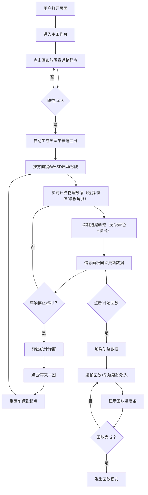

## 1. 产品概述

迷你赛车漂移轨迹记录与回放分析系统是一款面向赛车游戏玩家和赛道工程师的浏览器端可视化工具。用户可自定义赛道、操控小车行驶、实时记录漂移轨迹，并通过回放功能分析驾驶数据，优化入弯点和漂移角度。

- **目标用户**：赛车游戏玩家、赛道设计工程师、驾驶技术爱好者
- **核心价值**：可视化漂移数据、辅助驾驶技巧分析、赛道体验优化

## 2. 核心功能

### 2.1 用户角色
本产品为单用户工具，无需注册登录，用户即开即用。

### 2.2 功能模块
1. **赛道编辑器**：点击放置路径点、贝塞尔曲线自动连接、路径点选中高亮
2. **驾驶系统**：键盘操控小车（方向键/WASD）、物理引擎实时计算速度与漂移
3. **轨迹记录**：实时绘制漂移拖尾、按漂移程度分级着色、3秒自动淡出
4. **回放系统**：逐帧回放轨迹动画、进度条显示、轨迹逐段淡入亮起
5. **数据面板**：车速/漂移角度/分数实时显示、数字平滑动画、最近漂移事件列表
6. **统计弹窗**：车辆停止5秒自动弹出、圈速数据汇总、一键再来一圈

### 2.3 页面详情

| 页面名称 | 模块名称 | 功能描述 |
|---------|---------|---------|
| 主工作台 | 赛道画布 | 800x600暗色背景、3/4俯视视角、鼠标滚轮缩放/拖拽平移、移动端自适应90%屏宽 |
| 主工作台 | 赛道路径系统 | 点击放置路径点、贝塞尔曲线连接、半透明白色虚线边界、6px灰色圆点/选中高亮蓝 |
| 主工作台 | 车辆渲染 | 20px红色三角形、车头随速度向量旋转、拖尾轨迹点（慢速3px/快速6px） |
| 主工作台 | 轨迹绘制 | 三档漂移颜色（浅黄#FFD700/橙#FF8C00/红#FF0000）、3秒淡出、超2000点自动合并为虚线 |
| 主工作台 | 控制条 | 开始/暂停、重置车辆、开始回放三个按钮（背景#0f3460，悬停#16213e，点击缩放0.95） |
| 主工作台 | 信息面板 | 宽240px、背景#16213e、圆角12px，实时车速/漂移角度/漂移分数/最近5次漂移事件 |
| 主工作台 | 统计弹窗 | 停止5秒触发、60%黑遮罩、400x300统计卡片（总耗时/最高车速/总漂移分数/最佳漂移/漂移次数） |

## 3. 核心流程

## 4. 用户界面设计

### 4.1 设计风格
- **主色调**：深紫蓝 `#1a1a2e`（工作台背景）、 `#16213e`（面板/按钮默认）、 `#0f3460`（按钮悬停）
- **强调色**：高亮蓝 `#00d4ff`、车辆红 `#e94560`（再来一圈按钮）、按钮悬停红 `#ff6b6b`
- **漂移色阶**：浅黄 `#FFD700`（0-15°）→ 橙 `#FF8C00`（15-30°）→ 红 `#FF0000`（>30°）
- **辅助色**：路径点灰 `#b0b0b0`、半透明白色虚线边界
- **字体**：主字体使用 JetBrains Mono 等宽字体，数字区域使用 Orbitron 科技感字体
- **按钮风格**：矩形圆角6px、悬停背景变亮、点击缩放0.95倍+0.2秒ease-in-out回弹
- **动画**：全局过渡0.2-0.5秒ease-in-out、数字滚动动画、分数向上飘出动画、遮罩/卡片淡入0.3秒
- **布局**：桌面端左侧赛道画布(800x600)+右侧信息面板(240px)+底部控制条；移动端赛道画布自适应90%屏宽，控制面板堆叠下方

### 4.2 页面设计概览

| 页面名称 | 模块名称 | UI元素 |
|---------|---------|--------|
| 主工作台 | 赛道画布 | 背景#2d2d44、圆角8px、内阴影、拖拽时显示手型光标 |
| 主工作台 | 控制条 | 底部固定、Flex布局三按钮等宽、按钮间间距16px、悬停高光+轻微上浮2px |
| 主工作台 | 信息面板 | 右上角数据区块带发光边框(0 0 12px rgba(0,212,255,0.15))、标题用Orbitron字体大写 |
| 主工作台 | 统计弹窗 | 遮罩淡入0.3s、卡片带边框辉光(box-shadow: 0 0 40px rgba(0,212,255,0.2))、数据分两列网格 |
| 主工作台 | 回放进度条 | 右下角绝对定位、玻璃拟态风格(backdrop-filter: blur(8px))、百分比+时间戳并排 |

### 4.3 响应式策略
- **桌面端（≥1200px）**：赛道画布800x600居中、右侧信息面板240px、底部控制条全宽
- **平板端（768-1199px）**：赛道画布缩放到640x480、信息面板宽度200px
- **移动端（<768px）**：赛道画布90%屏宽、高度按比例(4:3)缩放、信息面板堆叠到画布下方、控制条固定底部
- **触摸优化**：赛道画布支持双指缩放、单指拖拽平移、虚拟方向键可配置（可选功能）

### 4.4 性能保障
- Canvas渲染使用requestAnimationFrame维持60fps
- 轨迹点数量>2000时，最早的1000个点合并为虚线线段（Path2D批量绘制）
- 回放模式帧率不低于50fps，使用预计算帧插值
- Zustand状态切片订阅，避免不必要重渲染
- 信息面板数字动画使用framer-motion transform而非state逐帧更新
