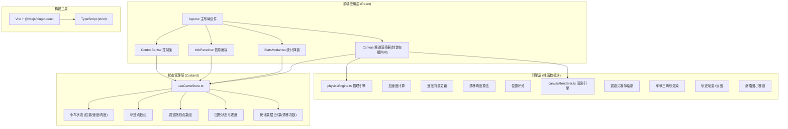

## 1. 架构设计



## 2. 技术说明

- **前端框架**：React 18 + TypeScript 5 (strict: true, target: ES2020)
- **构建工具**：Vite 5 + @vitejs/plugin-react（开启严格模式）
- **状态管理**：Zustand 4（轻量、不可变更新、支持切片订阅）
- **动画库**：framer-motion 11（AnimatePresence、数字过渡、弹窗动画）
- **渲染方式**：HTML5 Canvas 2D（独立渲染模块封装）
- **样式方案**：CSS-in-JS + 全局CSS变量（保证暗色主题一致性）
- **无后端/无数据库**：所有状态存在内存，刷新即重置（纯前端工具）

## 3. 目录结构

```
auto370/
├── index.html                     # 入口HTML (含viewport适配)
├── package.json                   # 依赖与脚本
├── vite.config.js                 # Vite构建配置
├── tsconfig.json                  # TS严格模式配置
└── src/
    ├── main.tsx                   # React根节点入口
    ├── App.tsx                    # 主布局(组合所有组件)
    ├── store/
    │   └── useGameStore.ts        # Zustand状态管理
    ├── engine/
    │   ├── physicsEngine.ts       # 物理引擎(纯函数)
    │   └── canvasRenderer.ts      # Canvas渲染模块
    └── components/
        ├── ControlBar.tsx         # 底部控制条
        ├── InfoPanel.tsx          # 右侧信息面板
        └── StatsModal.tsx         # 统计弹窗
```

## 4. 核心数据模型

### 4.1 Zustand Store 状态定义 (useGameStore.ts)

```typescript
interface TrailPoint {
  x: number;           // 画布坐标系X
  y: number;           // 画布坐标系Y
  driftAngle: number;  // 漂移角度(度)
  timestamp: number;   // 生成时间戳(ms)
  opacity: number;     // 当前透明度(1→0, 3秒淡出)
}

interface TrackPoint {
  x: number;
  y: number;
  selected: boolean;
}

interface DriftEvent {
  timestamp: number;
  peakAngle: number;
}

interface GameState {
  // 小车物理状态
  carX: number;
  carY: number;
  carAngle: number;         // 车头朝向(弧度)
  velocityX: number;        // 像素/秒
  velocityY: number;
  speedKmh: number;         // 显示用km/h
  driftAngleDeg: number;    // 当前漂移角度

  // 赛道
  trackPoints: TrackPoint[];
  selectedTrackPointIndex: number | null;

  // 轨迹
  trailPoints: TrailPoint[];
  lastTrailTime: number;

  // 统计
  driftScore: number;
  driftCount: number;
  bestDriftAngle: number;
  maxSpeedKmh: number;
  lapStartTime: number | null;
  lapTotalTime: number | null;
  recentDrifts: DriftEvent[];

  // 控制状态
  isPaused: boolean;
  isDriving: boolean;
  isReplayMode: boolean;
  replayProgress: number;     // 0-1
  replayStartTime: number;
  recordedTrail: TrailPoint[]; // 记录的圈速轨迹
  stopTimer: number;           // 车辆停止计时(ms)
  showStatsModal: boolean;

  // 画布变换
  viewScale: number;           // 0.5-2.5
  viewOffsetX: number;
  viewOffsetY: number;

  // Actions
  setCarState: (...) => void;
  addTrackPoint: (x, y) => void;
  selectTrackPoint: (index) => void;
  clearTrackPoints: () => void;
  addTrailPoint: (p) => void;
  cleanupExpiredTrails: (now) => void;
  mergeOldTrails: () => void;
  recordDriftEvent: (peakAngle) => void;
  addScore: (points) => void;
  togglePause: () => void;
  resetCar: () => void;
  startReplay: () => void;
  stopReplay: () => void;
  setReplayProgress: (p) => void;
  setShowStatsModal: (v) => void;
  setViewTransform: (scale, ox, oy) => void;
  updateFromPhysics: (physicsResult) => void;
}
```

### 4.2 物理引擎接口 (physicsEngine.ts)

```typescript
interface PhysicsInput {
  deltaTime: number;      // 帧间隔(秒)
  // 输入状态
  inputForward: boolean;
  inputBackward: boolean;
  inputLeft: boolean;
  inputRight: boolean;
  // 当前状态
  currentVx: number;
  currentVy: number;
  currentX: number;
  currentY: number;
  currentCarAngle: number;
}

interface PhysicsResult {
  newVx: number;
  newVy: number;
  newX: number;
  newY: number;
  newCarAngle: number;
  driftAngleDeg: number;   // 0~90度
  speedKmh: number;
}

export function stepPhysics(input: PhysicsInput): PhysicsResult;
```

**物理参数常量**：
- MAX_SPEED = 500 px/s（约等于200km/h换算系数）
- ACCELERATION = 400 px/s²
- BRAKE_DECEL = 600 px/s²
- FRICTION = 2.0 / s （自然减速系数）
- TURN_RATE = 3.0 rad/s（低速最大转向速率）
- DRIFT_THRESHOLD = 0.05（速度与车头朝向角度差阈值）

### 4.3 Canvas渲染接口 (canvasRenderer.ts)

```typescript
interface RenderInput {
  ctx: CanvasRenderingContext2D;
  width: number;
  height: number;
  // 视图变换
  scale: number;
  offsetX: number;
  offsetY: number;
  // 赛道
  trackPoints: TrackPoint[];
  // 小车
  carX: number;
  carY: number;
  carAngle: number;
  // 轨迹
  trailPoints: TrailPoint[];
  mergedTrailSegments?: Array<{x1,y1,x2,y2,avgDrift}>;
  // 回放
  isReplayMode: boolean;
  replayProgress: number;
  recordedTrail: TrailPoint[];
  // 时间
  now: number;
}

export function renderScene(input: RenderInput): void;
export function renderTrackThumbnail(
  thumbCtx: CanvasRenderingContext2D,
  tw: number,
  th: number,
  trackPoints: TrackPoint[]
): void;
```

**渲染阶段顺序**：
1. 清空画布 + 背景填充 `#2d2d44`
2. 应用视图变换（scale + translate）
3. 绘制赛道贝塞尔曲线（含两侧半透明虚线边界）
4. 绘制合并的旧轨迹虚线段（Path2D）
5. 按时间倒序绘制轨迹点（渐变尺寸+漂移色+透明度）
6. 回放模式：逐段淡入轨迹（按replayProgress裁剪）
7. 绘制路径点（灰圆/选中高亮蓝）
8. 绘制车辆三角形（红，带白描边）
9. 重置变换

## 5. 关键实现约束

### 5.1 性能优化
- **trailPoints 上限2000**：超限时调用 `mergeOldTrails()` 将最早1000点合并为100段左右的虚线（每10点平均一个段）
- **淡出计算**：渲染时根据 `(now - timestamp)/3000` 实时计算opacity，而非每帧更新state（避免re-render）
- **Zustand订阅**：各组件使用 `useGameStore(state => state.x)` 精确订阅切片，Canvas组件只订阅渲染所需字段
- **Canvas批量绘制**：同类型轨迹点用 `beginPath()` + 多`arc()` + 单`fill()` 批量提交

### 5.2 漂移角度算法
```
前进向量 = normalize(velocityX, velocityY)
朝向向量 = (cos(carAngle), sin(carAngle))
点积 = dot(前进向量, 朝向向量)
漂移角度(弧度) = acos(clamp(点积, -1, 1))
漂移角度(度)   = 弧度 * 180 / π
注：若速度大小 < 10 px/s，漂移角度视为 0（停止时不计算漂移）
```

### 5.3 回放实现
- 开始回放时：将当前 `trailPoints` 快照存到 `recordedTrail`，重置车辆到轨迹起点
- 回放帧计算：按 `replayProgress * recordedTrail.length` 取最近轨迹点插值位置/角度
- 轨迹渐入：绘制第i个轨迹点时 `opacity = min(1, (replayProgress - i/length) * 2 + 0.5)` 实现从起点逐段亮起效果

### 5.4 键盘输入
使用 `window.addEventListener('keydown'/'keyup')` 在 App 组件挂载时注册，存入 Zustand 的 `inputState` 切片（不触发重渲染，用ref或直接读state）。

### 5.5 移动端适配
- CSS媒体查询：`@media (max-width: 768px)` 控制画布宽度
- viewport meta：`<meta name="viewport" content="width=device-width, initial-scale=1.0, maximum-scale=1.0, user-scalable=no">`
- 触摸事件：画布监听 `touchstart/touchmove/touchend` 处理双指缩放与单指拖拽
