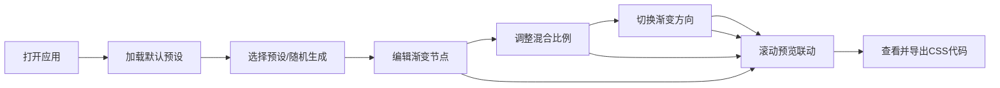

## 1. 产品概述

滚动联动渐变谱系生成与预览应用，专为UI设计师打造的沉浸式渐变调色工具。设计师可为滚动页面每段区域定义专属渐变，实时预览滚动时多渐变间的平滑交叉融合与色彩流动效果，并支持导出CSS渐变样式代码。

- 核心价值：解决市面渐变工具无法与滚动位置联动的痛点，实现页面切换的沉浸感与流畅过渡
- 目标用户：UI设计师、前端开发者、视觉创作者

## 2. 核心功能

### 2.1 用户角色
| 角色 | 注册方式 | 核心权限 |
|------|---------|---------|
| 设计师用户 | 无需注册，直接使用 | 定义渐变节点、调整参数、预览效果、导出代码 |

### 2.2 功能模块
1. **渐变谱系编辑面板**：颜色选择器、预设色板、混合比例滑块、渐变方向选择
2. **滚动预览区域**：2000px高度滚动容器，4个分段区域，实时渐变联动渲染
3. **代码导出浮窗**：右下角半透明浮窗显示当前区域CSS代码
4. **主题与随机生成**：4套预设渐变谱系一键加载，HSL空间随机生成

### 2.3 页面详情
| 页面名称 | 模块名称 | 功能描述 |
|---------|---------|---------|
| 主应用页 | 渐变谱系编辑面板 | 颜色选择器或预设色板设置起始/结束色，拖拽节点调整混合比例0-100% |
| 主应用页 | 滚动预览区域 | 4个等高分段区域，滚动时实时插值相邻节点渐变色，交叉融合动画0.5秒 |
| 主应用页 | 渐变方向控制 | 线性0-360度、径向center/left top、锥形gradient |
| 主应用页 | 主题加载区 | 暖阳/深海/极光/日落4套预设，一键加载 |
| 主应用页 | 随机生成按钮 | HSL全范围随机生成4节点渐变谱系，平滑过渡 |
| 主应用页 | 代码导出浮窗 | 右下角半透明黑#00000080浮窗，显示当前区域CSS代码 |
| 主应用页 | 滚动指示器 | 左侧半透明白边圆形指示器(r=24px)跟随滚动垂直移动 |

## 3. 核心流程

设计师打开应用 → 默认加载一套预设渐变谱系 → 可选择切换预设或随机生成 → 通过颜色选择器或预设色板调整每个节点的起始色与结束色 → 拖拽滑块调整混合比例 → 切换渐变方向 → 在预览区滚动查看渐变联动效果 → 右下角浮窗实时显示CSS代码 → 复制导出代码使用

## 4. 用户界面设计

### 4.1 设计风格
- **主背景色**：深灰色#1a1a2e（暗色主题，突出渐变色彩）
- **控制面板**：右侧固定宽320px，半透明毛玻璃效果 backdrop-filter: blur(20px)
- **颜色卡片**：圆角12px，hover放大1.1倍带0.15秒弹性动画
- **滚动指示器**：左侧垂直移动，半径24px圆形，半透明+白色边框
- **代码浮窗**：右下角，半透明黑#00000080背景
- **缓动函数**：所有色彩切换使用cubic-bezier(0.4, 0, 0.2, 1)，时长0.3秒

### 4.2 页面设计概述
| 页面名称 | 模块名称 | UI元素 |
|---------|---------|--------|
| 主应用页 | 渐变谱系编辑面板 | 暗色毛玻璃卡片、圆角颜色选择器、滑块控件、方向切换按钮组 |
| 主应用页 | 滚动预览区域 | 2000px高容器，4个等分区域，1px浅灰半透明分割线，平滑渐变背景 |
| 主应用页 | 滚动指示器 | 左侧垂直轨道，圆形指示器随滚动位置移动 |
| 主应用页 | 代码浮窗 | 右下角固定，等宽字体显示CSS，复制按钮 |
| 主应用页 | 响应式抽屉 | <768px时控制面板折叠为底部抽屉，圆角16px，覆盖80%高度 |

### 4.3 响应式
- **桌面端**(≥768px)：控制面板固定右侧宽320px，预览区占剩余宽度
- **移动端**(<768px)：控制面板折叠为底部抽屉（从下弹出，圆角16px，覆盖80%高度），预览区占满全屏，触摸滚动触发渐变联动

### 4.4 性能指标
- 连续滚动时渐变引擎最多30FPS更新，超量时降采样到20FPS
- 桌面端帧率稳定≥55FPS
- 移动端(iPhone12)触摸滚动帧率≥45FPS
