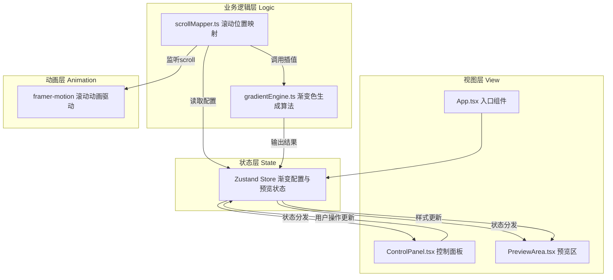

## 1. 架构设计



## 2. 技术描述
- **前端框架**：React@18 + TypeScript@5
- **构建工具**：Vite@5 + @vitejs/plugin-react
- **状态管理**：Zustand@4
- **动画驱动**：framer-motion@11
- **路径别名**：@/* 映射到 src/*
- **无后端**：纯前端应用，所有状态内存管理

## 3. 项目文件结构

```
d:\Pro\tasks\auto372/
├── package.json
├── vite.config.js
├── tsconfig.json
├── index.html
└── src/
    ├── App.tsx                 # 应用入口，挂载Provider，渲染滚动容器与UI面板
    ├── main.tsx                # React渲染入口
    ├── store/
    │   └── gradientStore.ts    # Zustand store，管理渐变配置与预览状态
    ├── gradient/
    │   ├── gradientEngine.ts   # 渐变算法模块：颜色插值、CSS渐变字符串生成
    │   └── scrollMapper.ts     # 滚动映射模块：滚动百分比→混合比例
    ├── ui/
    │   ├── ControlPanel.tsx    # 控制面板：颜色选择器、预设色板、滑块、方向选择
    │   ├── PreviewArea.tsx     # 预览区：2000px滚动容器、4区域、指示器
    │   └── CodeExport.tsx      # 代码导出浮窗
    └── types/
        └── index.ts            # 类型定义
```

## 4. 数据流向

### 4.1 初始化流程
```
App.tsx 挂载
  → 初始化 Zustand store（载入默认预设）
  → 分发至 ControlPanel（显示配置）
  → 分发至 PreviewArea（渲染初始渐变）
```

### 4.2 用户编辑流程
```
ControlPanel 用户操作(颜色/比例/方向)
  → 调用 Zustand action 更新配置
  → Zustand 自动触发订阅组件重渲染
  → PreviewArea 接收新配置并平滑更新(0.3s)
  → gradientEngine 按需重新计算插值
```

### 4.3 滚动联动流程
```
PreviewArea scrollYProgress (framer-motion)
  → scrollMapper 监听滚动百分比
  → 读取 store 中渐变节点配置
  → 计算当前可视区域对应的相邻节点与混合比例
  → 调用 gradientEngine 获取插值后颜色与CSS字符串
  → 节流(30FPS/降采样20FPS)后写回 store
  → PreviewArea 背景实时更新(0.5s交叉融合)
  → CodeExport 浮窗显示对应CSS代码
```

## 5. 核心数据模型

### 5.1 类型定义 (types/index.ts)

```typescript
interface GradientNode {
  id: string;
  startColor: string;      // HEX色值
  endColor: string;        // HEX色值
  blendRatio: number;      // 0-100 混合百分比
  position: number;        // 0-100 节点在滚动轴上的位置百分比
}

type GradientDirection =
  | { type: 'linear'; angle: number }          // 0-360度
  | { type: 'radial'; position: 'center' | 'left top' }
  | { type: 'conic' };

interface GradientPreset {
  name: string;
  nodes: Omit<GradientNode, 'id'>[];
}

interface GradientState {
  nodes: GradientNode[];
  direction: GradientDirection;
  scrollProgress: number;      // 0-1 当前滚动百分比
  currentCSS: string;          // 当前应用的CSS渐变字符串
  activeRegion: number;        // 0-3 当前激活的区域索引
  isPanelOpen: boolean;        // 移动端抽屉开关
  // actions
  setNodes: (nodes: GradientNode[]) => void;
  updateNode: (id: string, patch: Partial<GradientNode>) => void;
  setDirection: (dir: GradientDirection) => void;
  setScrollProgress: (p: number) => void;
  setCurrentCSS: (css: string) => void;
  setActiveRegion: (r: number) => void;
  loadPreset: (preset: GradientPreset) => void;
  randomize: () => void;
  togglePanel: () => void;
}
```

## 6. 核心模块职责

### 6.1 gradientEngine.ts
- `hexToRgb(hex: string): {r,g,b}`：HEX转RGB
- `rgbToHsl(r,g,b): {h,s,l}`：RGB转HSL
- `hslToRgb(h,s,l): {r,g,b}`：HSL转RGB
- `interpolateColor(c1, c2, t: number): string`：在两色间按t(0-1)插值，返回HEX
- `interpolateNode(nodeA, nodeB, globalT: number): {start, end}`：在两节点间插值出当前起止色
- `generateGradientCSS(start, end, direction): string`：根据方向生成CSS渐变字符串
- `interpolateColorsArray(colors, steps): string[]`：生成插值后的颜色数组（用于多色标）

### 6.2 scrollMapper.ts
- `mapScrollToNodes(progress, nodes): {nodeA, nodeB, localT}`：根据全局滚动进度找到相邻节点与局部插值参数
- `createThrottledUpdater(callback, maxFPS=30, minFPS=20)`：FPS自适应节流器
- 导出给 PreviewArea 使用的 hook：`useScrollGradientSync()`

### 6.3 Zustand Store (store/gradientStore.ts)
- 默认预设：暖阳(0-25%)、深海(25-50%)、极光(50-75%)、日落(75-100%)
- 4个预设主题常量 + randomize 实现（HSL全范围随机）
- 所有 action 实现

## 7. 性能实现

- 滚动节流：`createThrottledUpdater` 使用 requestAnimationFrame + 时间戳实现30FPS上限，连续触发超过阈值自动降采样至20FPS
- CSS过渡：所有背景色、渐变色通过 CSS `transition: background 0.3s cubic-bezier(0.4,0,0.2,1)` 实现平滑过渡
- framer-motion：使用 `useScroll` + `useTransform` + `useMotionValueEvent` 监听 scrollYProgress，避免直接绑定 scroll 事件
- 移动端：touch-action: manipulation，passive 事件监听
