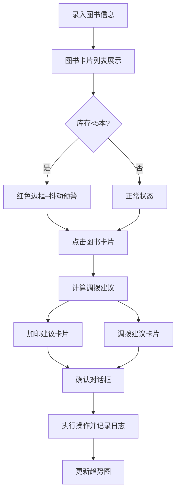

## 1. 产品概述

图书库存智能调拨系统，帮助线上书店和图书馆快速解决热门图书断货时的库存决策难题。通过智能算法提供加印与调拨的双路线建议，并可视化库存趋势，提升库房管理效率。

- 核心目标：解决热门图书突然断货时，加印与调拨的智能决策问题
- 目标用户：库房管理员、图书运营人员
- 核心价值：减少决策时间、优化库存成本、提升补货效率

## 2. 核心 Features

### 2.1 Feature Module

1. **图书主数据管理**：新书录入表单、图书卡片列表、库存预警展示
2. **智能调拨建议引擎**：加印建议（需求预测）、调拨建议（距离+库存）、对比展示与确认
3. **库存变动日志与趋势图**：操作历史记录、7天库存趋势折线图

### 2.2 Page Details

| Page Name | Module Name | Feature description |
|-----------|-------------|---------------------|
| 主页面 | 顶部导航栏 | 深蓝背景固定导航，系统标题展示 |
| 主页面 | 图书录入表单 | 书名、作者、ISBN、库存、近7日销量、单价录入 |
| 主页面 | 图书卡片网格 | 三列响应式布局，库存预警状态展示 |
| 主页面 | 调拨建议区域 | 加印/调拨双卡片对比，横向排布，移动端堆叠 |
| 主页面 | 库存趋势图 | recharts可交互折线图，颜色渐变指示健康度 |
| 主页面 | 操作日志 | 操作时间、类型、变更量记录列表 |

## 3. Core Process

用户录入图书信息 → 系统展示图书卡片并标记库存状态 → 用户点击低库存图书 → 系统计算加印与调拨建议 → 用户选择方案并确认 → 系统记录操作并更新库存趋势图

## 4. User Interface Design

### 4.1 Design Style

- **主色调**：浅灰白背景 #eceff1，深蓝导航 #1a237e
- **功能色**：加印暖橙 #FF8A65，调拨冷蓝 #4FC3F7，健康绿 #66BB6A，警告红 #EF5350 / #E53935
- **卡片设计**：280px × 160px，圆角 8px，浅灰 #f5f5f5 背景
- **动效设计**：点击放大1.02倍回弹（0.15s缓动），低库存抖动，确认框缩放过渡（0.2s）
- **字体**：使用系统字体栈，标题加粗，正文适中，保证可读性

### 4.2 Page Design Overview

| Page Name | Module Name | UI Elements |
|-----------|-------------|-------------|
| 主页面 | 顶部导航栏 | 100%宽度阴影条，白色文字，深蓝背景 |
| 主页面 | 图书录入表单 | 整齐的表单布局，合理间距，提交按钮 |
| 主页面 | 图书卡片网格 | 三列响应式grid（min-width:300px），卡片hover效果 |
| 主页面 | 调拨建议对比 | 两列横向排布，<768px纵向堆叠，颜色区分方案类型 |
| 主页面 | 库存趋势图 | 交互式折线图，颜色渐变，悬停显示详细值 |
| 主页面 | 操作日志 | 简洁列表，时间线样式，清晰展示变动记录 |

### 4.3 Responsiveness

- Desktop-first 设计，断点 768px
- 图书卡片网格：桌面端三列，平板端两列，移动端单列
- 调拨建议区域：桌面端横向两列，移动端纵向堆叠
- 所有交互元素保证触摸区域 ≥ 44px × 44px
