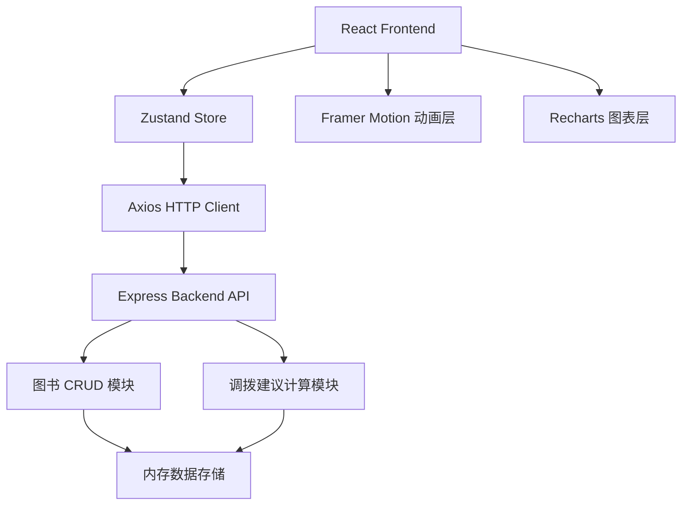
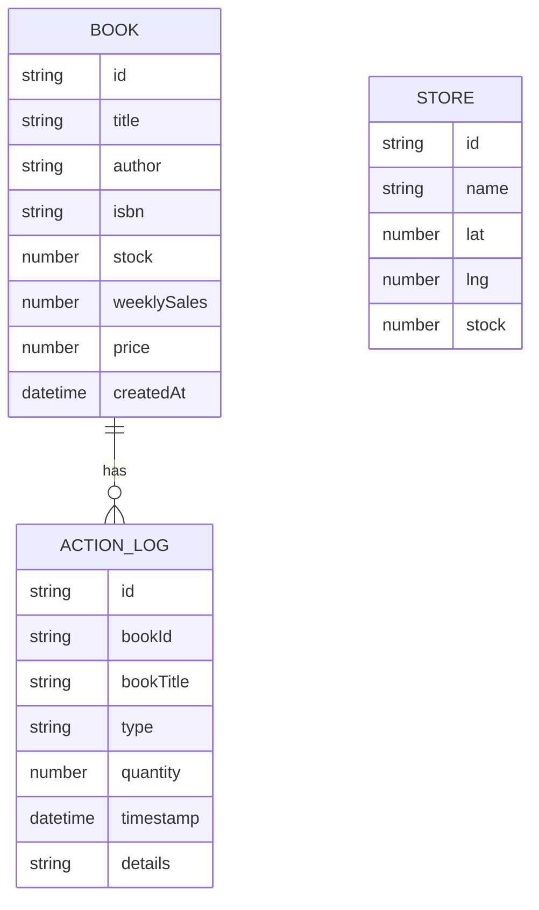

## 1. Architecture Design



## 2. Technology Description

- **Frontend**: React 18 + TypeScript + Vite
- **状态管理**: Zustand
- **HTTP Client**: Axios
- **动画库**: Framer Motion
- **图表库**: Recharts
- **Backend**: Express 4 + TypeScript
- **数据存储**: 内存数组模拟
- **代理配置**: Vite 代理 /api 到 localhost:3000

## 3. Project Structure

```
├── package.json          # 项目依赖与脚本
├── index.html            # 入口HTML
├── vite.config.ts        # Vite配置
├── tsconfig.json         # TypeScript配置
├── server/
│   └── server.ts         # Express服务器
└── src/
    ├── main.tsx          # React入口
    ├── App.tsx           # 主布局组件
    ├── BookCard.tsx      # 图书卡片组件
    ├── TrendChart.tsx    # 趋势图组件
    └── useBookStore.ts   # Zustand状态管理
```

## 4. Route Definitions

| Route | Purpose |
|-------|---------|
| / (前端) | 主页面，包含所有功能模块 |
| /api/books (GET) | 获取图书列表 |
| /api/books (POST) | 新增图书 |
| /api/books/:id (GET) | 获取单书详情 |
| /api/books/:id (PUT) | 更新图书信息 |
| /api/suggestion/:bookId (GET) | 获取调拨建议 |
| /api/action (POST) | 执行加印/调拨操作 |

## 5. API Definitions

### 5.1 TypeScript 类型定义

```typescript
interface Book {
  id: string;
  title: string;
  author: string;
  isbn: string;
  stock: number;
  weeklySales: number;
  price: number;
  createdAt: string;
  inventoryHistory: { date: string; stock: number }[];
}

interface Store {
  id: string;
  name: string;
  lat: number;
  lng: number;
  stock: number;
  distance: number;
}

interface PrintSuggestion {
  type: 'print';
  predictedDemand: number;
  recommendedQty: number;
  reason: string;
  estimatedCost: number;
}

interface TransferSuggestion {
  type: 'transfer';
  stores: Store[];
  totalAvailable: number;
  recommendedQty: number;
  reason: string;
  estimatedCost: number;
}

interface SuggestionResponse {
  print: PrintSuggestion;
  transfer: TransferSuggestion;
}

interface ActionLog {
  id: string;
  bookId: string;
  bookTitle: string;
  type: 'print' | 'transfer';
  quantity: number;
  timestamp: string;
  details: string;
}
```

### 5.2 请求/响应格式

**GET /api/books**
```
Response: Book[]
```

**POST /api/books**
```
Request: { title, author, isbn, stock, weeklySales, price }
Response: Book
```

**GET /api/suggestion/:bookId**
```
Response: SuggestionResponse
```

**POST /api/action**
```
Request: { bookId, type: 'print' | 'transfer', quantity, details }
Response: { success: boolean, book: Book, log: ActionLog }
```

## 6. Data Model

### 6.1 数据模型定义



### 6.2 核心算法

**需求预测算法（加印建议）**：
1. 计算销量增长斜率 = 近7日销量 / 7
2. 未来3日预测需求 = 斜率 × 3 × 安全系数(1.2)
3. 推荐加印数量 = max(0, 预测需求 - 当前库存)
4. 取整到10的倍数，最小50本

**门店调拨算法**：
1. 计算当前位置到各门店的距离（Haversine公式）
2. 按距离排序取最近3家
3. 过滤库存 > 0 的门店
4. 推荐调拨数量 = min(总可用库存, 预测需求量)
