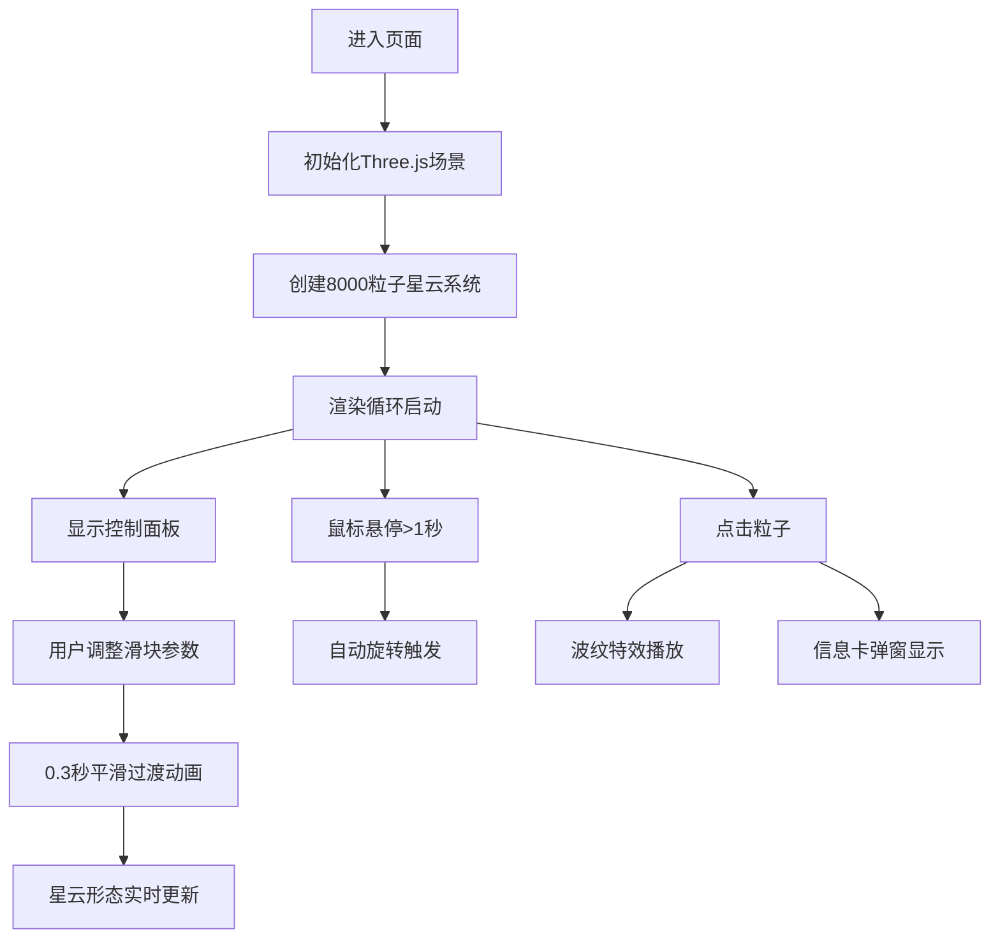

## 1. 产品概述
本项目是一个基于WebGL的三维粒子星云动态生成与交互探索工具，为天文爱好者和游戏特效设计师提供实时参数化星云生成体验。用户可以通过调整形态、湍流度、色温偏移等参数，实时生成形态各异的三维星云效果，并通过鼠标交互探索粒子细节。

## 2. 核心功能

### 2.1 用户角色
| 角色 | 注册方式 | 核心权限 |
|------|----------|----------|
| 访客用户 | 无需注册 | 浏览3D星云场景、调整参数、与粒子交互 |

### 2.2 功能模块
1. **3D星云场景**：8000粒子组成的动态星云系统，支持球状、螺旋状、环状形态插值
2. **参数控制面板**：三个滑块控制星云形态、湍流度、色温偏移
3. **实时状态显示**：粒子数量和帧率实时监控
4. **粒子交互系统**：鼠标悬停自动旋转、点击粒子显示光谱数据弹窗、点击波纹特效
5. **平滑过渡动画**：参数调整时0.3秒easeOutCubic缓动过渡

### 2.3 页面详情
| 页面名称 | 模块名称 | 功能描述 |
|---------|----------|---------|
| 主页面 | 3D星云场景 | 全屏深空背景，中央悬浮8000粒子星云，粒子缓慢飘动旋转 |
| 主页面 | 控制面板 | 左下角半透明面板，包含三个渐变滑块和状态显示 |
| 主页面 | 粒子信息卡 | 点击粒子弹出200x100px信息卡，显示坐标、RGB、半径数据 |
| 主页面 | 点击波纹特效 | 点击粒子产生向外扩散的白色波纹圈 |

## 3. 核心流程
用户进入页面 → 看到全屏3D星云场景（初始球状星云）→ 通过左下角滑块调整参数 → 星云平滑过渡到新形态 → 鼠标悬停1秒触发自动旋转 → 点击粒子触发波纹特效并弹出信息卡 → 继续探索或调整参数

## 4. 用户界面设计

### 4.1 设计风格
- **主色调**：深空背景 #0B0C10，控制面板 #1F2833（0.7透明度），状态文字绿色 #66FF66
- **粒子渐变色**：内圈亮蓝色 #00E5FF 过渡到外圈紫色 #B388FF，色温偏移时向橙红渐变
- **交互色**：波纹白色 #FFFFFF，信息卡白色边框
- **按钮风格**：滑块使用渐变背景，半透明圆角设计
- **布局**：全屏3D场景为主，左下角浮动控制面板，信息卡跟随点击位置
- **字体**：现代无衬线等宽字体，科技感十足

### 4.2 页面设计概述
| 页面名称 | 模块名称 | UI元素 |
|---------|----------|--------|
| 主页面 | 3D星云场景 | 全屏深色背景，8000发光粒子，动态噪声飘动，鼠标拖拽旋转视角，滚轮缩放 |
| 主页面 | 控制面板 | 半透明圆角12px面板，三个渐变滑块带标签，实时状态显示（绿色文字） |
| 主页面 | 粒子信息卡 | 200x100px圆角8px卡片，白色边框，显示XYZ坐标、RGB颜色、距中心半径 |
| 主页面 | 波纹特效 | 点击位置向外扩散的白色圆圈，1.2秒内从5px膨胀到80px并淡出 |

### 4.3 响应性
- **桌面端优先**：全屏WebGL画布，鼠标拖拽、滚轮缩放、点击交互完整支持
- **移动端适配**：触控拖拽旋转、双指缩放，自动适配屏幕尺寸
- **性能优化**：粒子数量固定8000，目标帧率55fps以上，低端设备自动降级渲染质量

### 4.4 3D场景指引
- **环境**：纯深空背景 #0B0C10，无HDRI，粒子自发光
- **光照**：粒子使用Additive Blending自发光，无需场景光源
- **相机设置**：PerspectiveCamera，fov 75，初始距离150，OrbitControls控制
- **相机动画**：鼠标悬停1秒后自动Y轴旋转（每秒2度），用户交互时停止
- **构图**：星云居中，相机围绕原点旋转，控制面板不遮挡核心区域
- **后处理**：无额外后处理，使用PointsMaterial的size和transparent实现发光效果
- **性能预算**：8000个粒子，单BufferGeometry，每帧更新粒子位置，CPU开销<5ms
