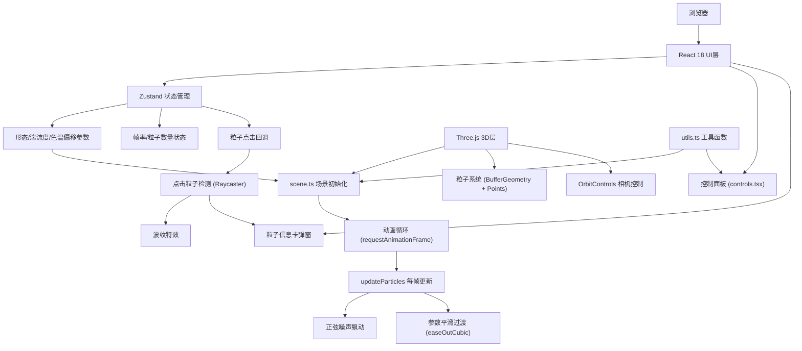

## 1. 架构设计



## 2. 技术描述

- **前端框架**：React 18 + TypeScript
- **构建工具**：Vite 5.x + @vitejs/plugin-react
- **3D引擎**：Three.js r160+ + @types/three
- **状态管理**：Zustand 4.x
- **UI样式**：原生CSS + CSS变量，无UI框架
- **音效**：Web Audio API（内置AudioContext生成正弦波）
- **无后端、无数据库**：纯前端静态项目

## 3. 项目文件结构

| 文件路径 | 职责描述 |
|---------|----------|
| `package.json` | 项目依赖与脚本配置 |
| `index.html` | 入口HTML，包含div#root挂载点 |
| `vite.config.ts` | Vite基础配置 |
| `tsconfig.json` | TypeScript严格模式配置 |
| `src/main.tsx` | React入口，渲染App组件 |
| `src/App.tsx` | 主组件，整合3D场景与UI控制面板 |
| `src/scene.ts` | Three.js场景初始化、粒子系统创建与更新逻辑 |
| `src/controls.tsx` | 控制面板UI组件，三个参数滑块 |
| `src/store.ts` | Zustand状态管理，全局参数与回调 |
| `src/utils.ts` | 工具函数：坐标格式化、颜色转换、正弦噪声、缓动函数 |

## 4. 核心数据结构与类型定义

### 4.1 Zustand Store 类型
```typescript
interface ParticleState {
  morphology: number;        // 形态: 0-1 (球→螺旋→环)
  turbulence: number;        // 湍流度: 0-5
  colorTemp: number;         // 色温偏移: -1到1
  fps: number;               // 当前帧率
  particleCount: number;     // 粒子数量 (8000)
  onParticleClick: (data: ParticleClickData | null) => void;
  setMorphology: (v: number) => void;
  setTurbulence: (v: number) => void;
  setColorTemp: (v: number) => void;
  setFps: (v: number) => void;
}

interface ParticleClickData {
  x: number;
  y: number;
  z: number;
  r: number;
  g: number;
  b: number;
  radius: number;  // 距中心半径
}
```

### 4.2 粒子系统数据结构
```typescript
// 每个粒子的基础属性（初始化时计算，存入TypedArray）
interface ParticleBase {
  baseX: number;       // 基础X坐标（根据形态）
  baseY: number;       // 基础Y坐标
  baseZ: number;       // 基础Z坐标
  baseRadius: number;  // 距中心基础半径
  noiseOffset: number; // 噪声相位偏移
}

// 运行时平滑过渡参数
interface SmoothParams {
  currentMorphology: number;
  targetMorphology: number;
  currentTurbulence: number;
  targetTurbulence: number;
  currentColorTemp: number;
  targetColorTemp: number;
  transitionProgress: number; // 0-1
}
```

## 5. 核心算法说明

### 5.1 形态插值算法
```
形态值 morphology ∈ [0, 1]
- 0.0 - 0.5: 球状 → 螺旋状插值
  t = morphology * 2
  pos = spherePos * (1-t) + spiralPos * t
  
- 0.5 - 1.0: 螺旋状 → 环状插值
  t = (morphology - 0.5) * 2
  pos = spiralPos * (1-t) + ringPos * t
```

- **球状坐标**: 球坐标系随机分布 `(r, θ, φ)` → 笛卡尔坐标
- **螺旋状坐标**: 阿基米德螺旋 + 高度分布 `r = k * θ, z = random * height`
- **环状坐标**: 圆环坐标系 `(R, r, θ, φ)` → 笛卡尔坐标

### 5.2 正弦噪声飘动
```
每帧更新:
noiseX = sin(time * 0.5 + offset) * turbulence * 0.3
noiseY = cos(time * 0.4 + offset * 1.3) * turbulence * 0.3
noiseZ = sin(time * 0.3 + offset * 0.7) * turbulence * 0.3
finalPos = basePos + [noiseX, noiseY, noiseZ]
```

### 5.3 色温渐变算法
```
基础渐变色: 内圈#00E5FF → 外圈#B388FF
色温偏移 colorTemp ∈ [-1, 1]:
- colorTemp < 0: 向蓝色偏移，混合色 #0066FF
- colorTemp > 0: 向橙红色偏移，混合色 #FF6B00
finalColor = lerp(baseColor, tempColor, abs(colorTemp))
```

### 5.4 easeOutCubic 缓动函数
```
easeOutCubic(t) = 1 - pow(1 - t, 3)
参数更新时:
transitionProgress = 0
每帧递增: transitionProgress += deltaTime / 0.3 (0.3秒完成)
currentValue = lerp(startValue, targetValue, easeOutCubic(progress))
```

### 5.5 粒子点击检测
- 使用 THREE.Raycaster 进行射线检测
- 点击时从鼠标位置发射射线，与粒子系统求交
- 获取最近的粒子索引，提取其位置与颜色数据
- 触发波纹特效与信息卡弹窗

## 6. 性能优化策略

1. **BufferGeometry + TypedArray**: 8000粒子使用单个BufferGeometry，position/color属性使用Float32Array，每帧直接修改数组
2. **PointsMaterial + AdditiveBlending**: 启用transparent和depthWrite: false，实现星云发光效果
3. **帧率控制**: 使用requestAnimationFrame的deltaTime，确保动画速度与帧率无关
4. **OrbitControls优化**: 启用enableDamping，禁用pan，限制polarAngle范围
5. **自动旋转优化**: 仅在鼠标悬停>1秒且无用户交互时启动自动旋转
6. **TypedArray复用**: 避免每帧创建新数组，直接修改BufferGeometry.attributes.array

## 7. 第三方依赖清单

```json
{
  "three": "^0.160.0",
  "@types/three": "^0.160.0",
  "react": "^18.2.0",
  "react-dom": "^18.2.0",
  "vite": "^5.0.0",
  "@vitejs/plugin-react": "^4.2.0",
  "typescript": "^5.3.0",
  "@types/react": "^18.2.0",
  "@types/react-dom": "^18.2.0",
  "zustand": "^4.4.0"
}
```
