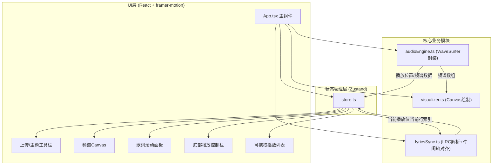

## 1. 架构设计



## 2. 技术说明

- **前端框架**：React 18 + TypeScript
- **构建工具**：Vite 5 + @vitejs/plugin-react
- **状态管理**：Zustand 4
- **动画库**：framer-motion 11
- **音频处理**：wavesurfer.js 7
- **UI 绘制**：HTML5 Canvas API（频谱可视化）
- **样式方案**：CSS 变量 + 内联样式（主题切换）

## 3. 文件结构与调用关系

| 文件路径 | 职责 | 依赖/被调用 |
|----------|------|-------------|
| `src/audioEngine.ts` | 封装 WaveSurfer.js，提供音频加载/播放/跳转，输出频谱数据与播放位置 | 被 App.tsx 调用，依赖 wavesurfer.js |
| `src/visualizer.ts` | 接收频谱数组，在 Canvas 上绘制256条渐变柱状图，支持暂停静态波形 | 被 App.tsx 调用，接收 audioEngine 输出 |
| `src/lyricsSync.ts` | 解析 LRC 歌词文件，时间轴对齐算法，提供 getCurrentLine 方法 | 被 App.tsx 调用，接收 audioEngine 当前时间 |
| `src/store.ts` | Zustand Store，管理播放状态、歌曲列表、歌词数据、主题配置 | 被所有组件读取/修改 |
| `src/App.tsx` | 主组件，组合所有模块，连接 Store，驱动数据流动 | 调用 audioEngine/visualizer/lyricsSync，读取 store |
| `src/main.tsx` | React 入口 | 渲染 App.tsx |

## 4. 核心数据模型

### 4.1 Zustand Store 状态定义

```typescript
interface Song {
  id: string;
  name: string;
  artist: string;
  duration: number;
  file: File;
  url: string;
}

interface LyricLine {
  time: number;
  text: string;
}

interface ThemeConfig {
  mode: 'dark' | 'light';
  bgPrimary: string;
  bgSecondary: string;
  accent: string;
  spectrumColors: [string, string];
}

interface PlayerStore {
  isPlaying: boolean;
  currentTime: number;
  duration: number;
  currentSong: Song | null;
  playlist: Song[];
  lyrics: LyricLine[];
  currentLyricIndex: number;
  theme: ThemeConfig;
  
  setPlaying: (v: boolean) => void;
  setCurrentTime: (t: number) => void;
  setDuration: (d: number) => void;
  setCurrentSong: (s: Song | null) => void;
  addSong: (s: Song) => void;
  reorderPlaylist: (fromIndex: number, toIndex: number) => void;
  setLyrics: (l: LyricLine[]) => void;
  setCurrentLyricIndex: (i: number) => void;
  toggleTheme: () => void;
}
```

## 5. 关键算法与实现要点

### 5.1 歌词时间轴对齐算法
```
1. 解析 LRC 每行 [mm:ss.xx] 格式时间戳，转换为秒
2. 按时间升序排序歌词行
3. getCurrentLine(currentTime):
   - 二分查找最后一个 time <= currentTime 的行索引
   - 时间复杂度 O(log n)，响应 < 100ms
```

### 5.2 频谱可视化性能优化
```
1. 使用 requestAnimationFrame 驱动渲染循环
2. 复用渐变对象，避免每帧重新创建
3. 柱状条宽度根据 Canvas 宽度 / 256 自适应计算
4. 暂停时缓存最后一帧频谱数据，绘制静态波形
5. 目标帧率 > 50fps
```

### 5.3 拖拽排序实现
- 使用原生 HTML5 Drag and Drop API + 触摸事件兼容
- 拖拽时使用 framer-motion AnimatePresence 实现抬起动效
- 移动端通过 touchstart/touchmove/touchend 模拟拖拽
