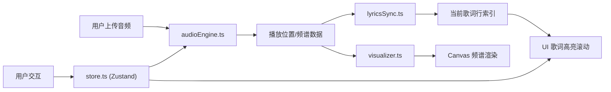

## 1. 产品概述

面向音乐爱好者的可视化音乐播放器，将音频波形、频谱与歌词滚动同步呈现，支持自定义主题皮肤和播放列表拖拽排序。

- 核心目的：提供沉浸式音乐体验，通过视觉化呈现让用户更直观地感受音乐节奏与情感
- 目标用户：音乐爱好者、前端开发者、音频可视化爱好者
- 产品价值：集音频播放、频谱可视化、歌词同步于一体的高品质音乐播放器

## 2. 核心功能

### 2.1 功能模块
1. **音频引擎模块**：音频文件上传、加载、播放/暂停/跳转，波形与频谱数据采集
2. **频谱可视化模块**：Canvas实时绘制256条频谱柱状图，支持暂停时静态波形显示
3. **歌词同步模块**：LRC歌词解析、时间轴对齐、当前行高亮与自动滚动
4. **播放列表模块**：歌曲列表管理、拖拽排序、双击切换播放、当前项标识
5. **主题皮肤模块**：深色/浅色主题切换，全局配色与频谱颜色联动变化

### 2.2 页面详情
| 页面名称 | 模块名称 | 功能描述 |
|-----------|-------------|---------------------|
| 主页面 | 左侧工具栏 | 音频上传按钮、LRC歌词上传按钮、深色/浅色主题切换按钮 |
| 主页面 | 频谱可视化区 | 占屏幕高度30%，Canvas绘制实时频谱柱状图，暖红到亮黄渐变 |
| 主页面 | 歌词滚动区 | 占屏幕高度60%，左右两列显示，当前行居中放大高亮并带入场动画 |
| 主页面 | 底部播放栏 | 占屏幕高度10%，播放/暂停按钮、进度条（可跳转）、时间显示、可拖拽播放列表 |

## 3. 核心流程

### 3.1 主要用户流程
1. 用户进入页面，看到默认深色主题的空状态
2. 用户点击上传按钮选择本地音频文件（mp3/wav/flac）
3. 音频加载完成后自动开始播放，频谱Canvas实时渲染
4. 用户可选择上传同名LRC歌词文件，歌词逐行高亮滚动
5. 用户可拖拽播放列表调整顺序，双击切换歌曲
6. 用户可切换深色/浅色主题，UI与频谱颜色平滑过渡

### 3.2 数据流向图

## 4. 用户界面设计

### 4.1 设计风格
- **主色调（深色）**：背景 #0D1117，控件 #1E1E2E，强调色 #00E5FF
- **主色调（浅色）**：背景 #F0F4F8，控件 #FFFFFF，强调色 #FF6B6B
- **频谱颜色**：深色主题暖红 #FF5733 → 亮黄 #FFC300，浅色主题冷色系渐变
- **按钮风格**：圆角 8px，悬停时背景亮度变化 10%
- **布局风格**：全屏三栏布局（左工具栏/中主区域/右留白），固定底部播放栏
- **动效**：framer-motion 驱动，歌词入场 0.3s ease-out，主题切换 0.5s 渐变过渡

### 4.2 页面设计概述
| 页面名称 | 模块名称 | UI元素 |
|-----------|-------------|-------------|
| 主页面 | 左侧工具栏 | 窄栏，上传按钮（带图标）、主题切换按钮组 |
| 主页面 | 频谱Canvas | 全屏宽度，30%高度，256条柱状图自适应宽度，颜色渐变 |
| 主页面 | 歌词区域 | 左右两列滚动列表，已播放行 #A0A0A0，待播放行 #FFFFFF，当前行 1.2倍字号 #00E5FF |
| 主页面 | 底部播放栏 | 播放/暂停按钮、可拖拽进度条、时间显示、可排序列表（每项背景 #1E1E2E，圆角 8px） |
| 主页面 | 播放列表项 | 歌曲名+时长+歌手占位符，拖拽时抬起 4px，阴影 0 4px 12px rgba(0,0,0,0.3)，当前项左侧脉动音符图标 #FFC300 |

### 4.3 响应式设计
- 桌面端优先，全屏布局
- 移动端适配触摸事件（拖拽排序）
- 频谱与歌词区域在小屏幕上自适应高度比例
