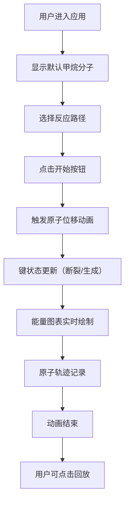

## 1. 产品概述
分子反应可视化模拟器是一款面向化学研究人员和科普爱好者的Web应用，通过三维可视化技术直观展示分子在不同催化条件下的原子键断裂与重组过程。
- 主要用途：在浏览器中模拟三维空间中分子结构动态重组与能量变化可视化
- 目标用户：化学研究人员、科普爱好者、学生
- 产品价值：解决难以同时呈现原子位移轨迹、键能变化曲线和反应能量势垒的痛点

## 2. 核心功能

### 2.1 功能模块
1. **三维分子结构展示与编辑**：球棍模型展示甲烷分子，支持反应路径选择，自动触发原子位移动画
2. **能量变化实时图表**：实时绘制总势能变化曲线，波峰高亮及脉冲动画
3. **原子轨迹记录与回放**：记录原子运动轨迹，支持回放功能

### 2.2 页面详情
| 页面名称 | 模块名称 | 功能描述 |
|-----------|-------------|---------------------|
| 主页面 | 左侧控制面板 | 分子名称显示、反应选择器、控制按钮（开始/暂停/回放）、原子能量指示灯 |
| 主页面 | 右侧3D场景 | 三维分子球棍模型展示、原子轨迹线、OrbitControls镜头控制、半透明网格地面 |
| 主页面 | 右下角能量图表 | 实时能量折线图，320px×200px，深色背景，颜色渐变曲线 |

## 3. 核心流程
用户选择反应路径 → 点击开始按钮 → 触发原子位移动画（5秒）→ 键连接状态实时更新（断裂/生成动画0.8秒）→ 能量图表实时更新 → 原子轨迹同步记录 → 用户可点击回放按钮重新演示

## 4. 用户界面设计

### 4.1 设计风格
- 主题：深色科技风格
- 主背景色：#0F172A
- 面板背景色：#1E293B（深蓝灰）
- 面板圆角：12px
- 主色调：青蓝色 #00B4D8、红色 #FF6B6B、金色 #FFD700
- 原子颜色：碳 #444444（深灰）、氢 #FFFFFF（白色）
- 稳定指示灯：#22C55E（绿色），高能指示灯：#EF4444（红色）
- 轨迹线颜色：#4ECDC4，透明度0.3
- 按钮样式：悬停背景变亮（#1E293B → #334155），点击缩放0.95倍（0.1秒）

### 4.2 页面设计概述
| 页面名称 | 模块名称 | UI元素 |
|-----------|-------------|-------------|
| 主页面 | 左侧控制面板 | 320px宽度，圆角12px，内边距20px，深色背景，控制按钮组，反应选择下拉框，能量指示灯列表 |
| 主页面 | 3D场景区域 | 占剩余宽度，半透明网格地面（#334155，透明度0.15），环境光+方向光照明，球棍模型分子 |
| 主页面 | 能量图表 | 右下角固定位置，320px×200px，背景#1E1E2E，折线图带渐变颜色和高亮动画 |

### 4.3 响应式设计
- 适配桌面端，最小宽度1024px
- 3D场景区域随窗口大小变化自动重设宽高
- 控制面板固定宽度320px

### 4.4 3D场景设计
- 地面：半透明网格，网格线颜色#334155，透明度0.15
- 照明：环境光强度0.6，方向光角度45°，强度0.8
- 镜头：初始朝向正Z轴，OrbitControls交互
- 原子：球体，半径0.5-0.8单位
- 键：球棍模型连接，断裂时键消失，新键渐现动画0.8秒
- 动画：原子位移5秒，帧率稳定50fps+
